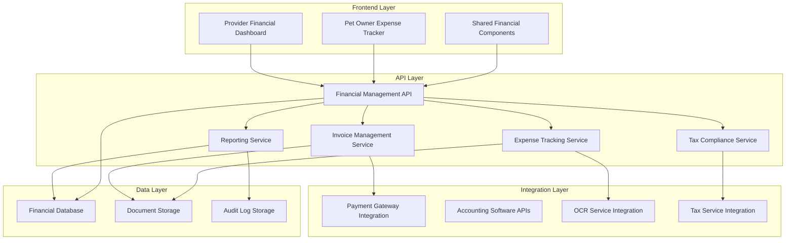
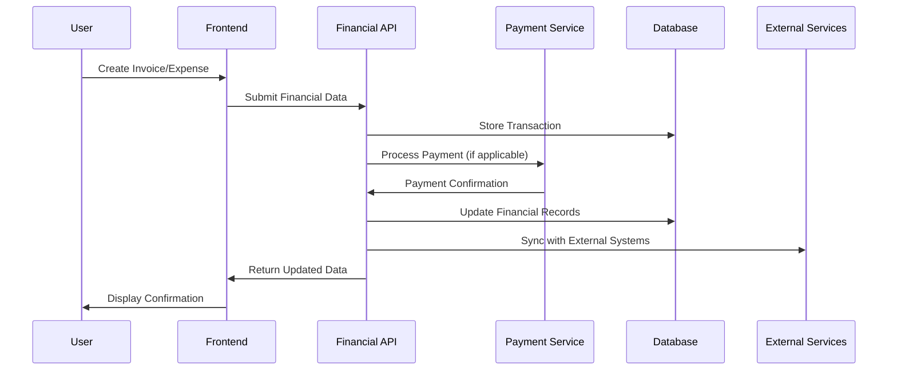

# Financial Management System - Design Document

## Overview

The Financial Management System is designed as a comprehensive financial hub that integrates seamlessly with the existing MeAndMyDog platform architecture. The system provides dual interfaces - one optimized for service providers managing their business finances, and another for pet owners tracking their pet-related expenses. The design emphasizes automation, user experience, and compliance while maintaining the platform's mobile-first approach and golden theme.

## Architecture

### System Architecture



### Data Flow Architecture



## Components and Interfaces

### 1. Service Provider Financial Dashboard

#### Invoice Management Interface
- **Invoice Creation Wizard**: Multi-step form with service details, pricing, and customer information
- **Invoice List View**: Sortable table with status indicators, search, and bulk actions
- **Invoice Detail View**: Comprehensive invoice display with payment tracking and action buttons
- **Invoice Templates**: Customizable templates with branding and layout options
- **Payment Tracking**: Real-time payment status with automated follow-up capabilities

#### Financial Analytics Dashboard
- **Revenue Overview**: Key metrics cards showing total revenue, pending payments, and growth trends
- **Interactive Charts**: Revenue trends, payment methods breakdown, and customer analytics
- **Performance Metrics**: Service-wise revenue analysis and profitability calculations
- **Comparative Reports**: Period-over-period analysis with visual trend indicators
- **Export Tools**: One-click report generation in multiple formats

#### Payment Reconciliation Center
- **Transaction Timeline**: Chronological view of all financial transactions
- **Reconciliation Tools**: Automated matching with manual override capabilities
- **Dispute Management**: Interface for handling payment disputes and chargebacks
- **Payout Tracking**: Detailed view of platform payouts and fee breakdowns
- **Audit Trail**: Complete transaction history with modification logs

### 2. Pet Owner Expense Tracking Interface

#### Expense Entry System
- **Quick Add Expense**: Streamlined form for rapid expense entry
- **Receipt Scanner**: Mobile-optimized OCR interface for receipt processing
- **Bulk Import**: CSV/Excel import with field mapping and validation
- **Recurring Expenses**: Setup and management of recurring pet expenses
- **Multi-Dog Allocation**: Expense distribution across multiple pets

#### Budget Management Dashboard
- **Budget Overview**: Visual progress indicators for all budget categories
- **Spending Analysis**: Interactive charts showing spending patterns and trends
- **Budget Alerts**: Notification center for budget warnings and recommendations
- **Goal Setting**: Interface for setting and tracking financial goals
- **Forecast Tools**: Predictive spending analysis based on historical data

#### Expense Reporting Center
- **Report Builder**: Customizable report generation with multiple filters
- **Visual Analytics**: Charts and graphs for expense analysis
- **Export Options**: Multiple format support for tax and insurance purposes
- **Category Management**: Custom category creation and organization
- **Historical Analysis**: Long-term spending trend analysis

### 3. Shared Financial Components

#### Tax Compliance Module
- **Tax Document Generator**: Automated creation of tax-compliant reports
- **Compliance Dashboard**: Overview of tax obligations and deadlines
- **Document Vault**: Secure storage for tax-related documents
- **Audit Support**: Tools for providing audit-ready financial records
- **Multi-Jurisdiction Support**: Handling of different tax requirements

#### Integration Management
- **API Configuration**: Setup and management of external integrations
- **Sync Status Dashboard**: Real-time status of all financial integrations
- **Data Mapping Tools**: Field mapping for external system synchronization
- **Error Handling**: Comprehensive error reporting and resolution tools
- **Webhook Management**: Configuration and monitoring of webhook endpoints

## Data Models

### Core Financial Entities

#### Invoice Entity
```typescript
interface Invoice {
  id: string;
  invoiceNumber: string;
  serviceProviderId: string;
  customerId: string;
  bookingId?: string;
  status: InvoiceStatus;
  issueDate: Date;
  dueDate: Date;
  paidDate?: Date;
  subtotal: number;
  taxAmount: number;
  discountAmount: number;
  totalAmount: number;
  currency: string;
  lineItems: InvoiceLineItem[];
  paymentTerms: string;
  notes?: string;
  metadata: Record<string, any>;
  createdAt: Date;
  updatedAt: Date;
}

interface InvoiceLineItem {
  id: string;
  description: string;
  quantity: number;
  unitPrice: number;
  totalPrice: number;
  taxRate: number;
  category: string;
}

enum InvoiceStatus {
  DRAFT = 'draft',
  SENT = 'sent',
  VIEWED = 'viewed',
  PAID = 'paid',
  OVERDUE = 'overdue',
  CANCELLED = 'cancelled'
}
```

#### Expense Entity
```typescript
interface Expense {
  id: string;
  userId: string;
  dogIds: string[];
  amount: number;
  currency: string;
  category: ExpenseCategory;
  subcategory?: string;
  description: string;
  vendor?: string;
  expenseDate: Date;
  paymentMethod: PaymentMethod;
  receiptUrl?: string;
  isRecurring: boolean;
  recurringPattern?: RecurringPattern;
  budgetId?: string;
  tags: string[];
  metadata: Record<string, any>;
  createdAt: Date;
  updatedAt: Date;
}

enum ExpenseCategory {
  VETERINARY = 'veterinary',
  GROOMING = 'grooming',
  FOOD = 'food',
  TOYS = 'toys',
  TRAINING = 'training',
  BOARDING = 'boarding',
  INSURANCE = 'insurance',
  SUPPLIES = 'supplies',
  OTHER = 'other'
}
```

#### Budget Entity
```typescript
interface Budget {
  id: string;
  userId: string;
  name: string;
  budgetType: BudgetType;
  period: BudgetPeriod;
  startDate: Date;
  endDate: Date;
  totalLimit: number;
  categoryLimits: CategoryLimit[];
  dogIds?: string[];
  isActive: boolean;
  notifications: BudgetNotification[];
  createdAt: Date;
  updatedAt: Date;
}

interface CategoryLimit {
  category: ExpenseCategory;
  limit: number;
  spent: number;
  remaining: number;
}

enum BudgetType {
  OVERALL = 'overall',
  PER_DOG = 'per_dog',
  CATEGORY = 'category'
}

enum BudgetPeriod {
  MONTHLY = 'monthly',
  QUARTERLY = 'quarterly',
  YEARLY = 'yearly'
}
```

#### Financial Transaction Entity
```typescript
interface FinancialTransaction {
  id: string;
  type: TransactionType;
  relatedEntityId: string;
  relatedEntityType: string;
  amount: number;
  currency: string;
  status: TransactionStatus;
  paymentMethod: PaymentMethod;
  paymentGateway: string;
  gatewayTransactionId: string;
  fees: TransactionFee[];
  netAmount: number;
  processedAt?: Date;
  settledAt?: Date;
  metadata: Record<string, any>;
  createdAt: Date;
  updatedAt: Date;
}

enum TransactionType {
  PAYMENT = 'payment',
  REFUND = 'refund',
  PAYOUT = 'payout',
  FEE = 'fee',
  ADJUSTMENT = 'adjustment'
}

enum TransactionStatus {
  PENDING = 'pending',
  PROCESSING = 'processing',
  COMPLETED = 'completed',
  FAILED = 'failed',
  CANCELLED = 'cancelled'
}
```

## Error Handling

### Financial Data Validation
- **Amount Validation**: Ensure positive amounts with proper decimal precision
- **Currency Validation**: Validate currency codes and conversion rates
- **Date Validation**: Ensure logical date relationships (due dates after issue dates)
- **Tax Calculation Validation**: Verify tax calculations and rates
- **Budget Limit Validation**: Check spending against budget constraints

### Payment Processing Errors
- **Gateway Timeout Handling**: Retry logic with exponential backoff
- **Payment Failure Recovery**: Automated retry with user notification
- **Reconciliation Error Handling**: Flagging and manual resolution workflows
- **Duplicate Transaction Prevention**: Idempotency keys and duplicate detection
- **Refund Processing Errors**: Comprehensive error logging and manual intervention

### Integration Error Management
- **API Failure Handling**: Graceful degradation when external services are unavailable
- **Data Sync Errors**: Conflict resolution and manual override capabilities
- **OCR Processing Errors**: Fallback to manual entry with error reporting
- **Export Failures**: Retry mechanisms and alternative format options
- **Webhook Delivery Failures**: Retry queues with exponential backoff

## Testing Strategy

### Unit Testing
- **Financial Calculations**: Comprehensive testing of all mathematical operations
- **Tax Calculations**: Validation of tax computation across different jurisdictions
- **Budget Logic**: Testing of budget tracking and alert mechanisms
- **Data Validation**: Input validation and sanitization testing
- **Currency Handling**: Multi-currency support and conversion testing

### Integration Testing
- **Payment Gateway Integration**: End-to-end payment processing tests
- **External API Integration**: Testing of accounting software connections
- **Database Operations**: Transaction integrity and rollback testing
- **OCR Service Integration**: Receipt processing accuracy testing
- **Webhook Delivery**: Event notification and delivery testing

### Financial Compliance Testing
- **Tax Calculation Accuracy**: Verification against known tax scenarios
- **Audit Trail Integrity**: Ensuring complete and tamper-proof audit logs
- **Data Privacy Compliance**: GDPR and financial data protection testing
- **Regulatory Compliance**: Testing against financial regulations
- **Security Testing**: Financial data encryption and access control testing

### Performance Testing
- **Large Dataset Handling**: Testing with high volumes of financial transactions
- **Report Generation Performance**: Optimization of complex financial reports
- **Real-time Updates**: Testing of live financial data synchronization
- **Concurrent User Testing**: Multi-user financial operations testing
- **Database Performance**: Query optimization for financial analytics

### User Acceptance Testing
- **Service Provider Workflows**: Complete invoice and payment management flows
- **Pet Owner Expense Tracking**: End-to-end expense management testing
- **Mobile Responsiveness**: Financial interfaces on various mobile devices
- **Accessibility Testing**: Financial tools accessibility compliance
- **Cross-browser Compatibility**: Financial dashboard functionality across browsers