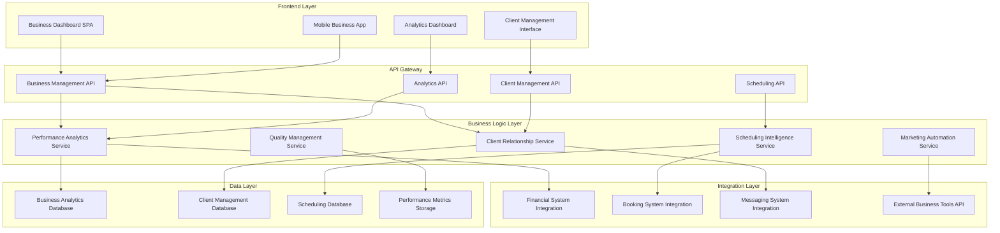
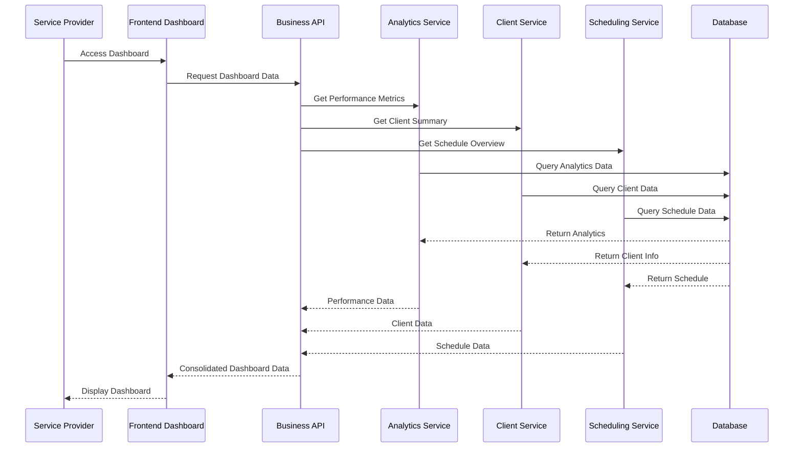

# Service Provider Business Dashboard - Design Document

## Overview

The Service Provider Business Dashboard is designed as a comprehensive business management platform that transforms how pet service professionals operate their businesses on the MeAndMyDog platform. The design emphasizes data-driven decision making, operational efficiency, and client relationship management while maintaining the platform's mobile-first approach and professional aesthetic. The dashboard serves as a unified workspace that integrates all aspects of service provider operations from analytics and scheduling to client management and financial tracking.

## Architecture

### System Architecture



### Data Flow Architecture



## Components and Interfaces

### 1. Business Performance Analytics Dashboard

#### Key Performance Indicators (KPI) Panel
- **Revenue Metrics**: Total revenue, average booking value, revenue growth trends
- **Booking Analytics**: Total bookings, booking conversion rates, cancellation rates
- **Customer Metrics**: New customers, customer retention, satisfaction scores
- **Efficiency Indicators**: Schedule utilization, service completion rates, response times
- **Growth Tracking**: Period-over-period comparisons with visual trend indicators

#### Interactive Analytics Charts
- **Revenue Trends**: Line charts showing revenue patterns over time with forecasting
- **Booking Patterns**: Heat maps displaying peak booking times and seasonal trends
- **Service Performance**: Bar charts comparing different service types and profitability
- **Geographic Analysis**: Maps showing service area performance and expansion opportunities
- **Customer Segmentation**: Pie charts and scatter plots for customer analysis

#### Competitive Intelligence Panel
- **Market Positioning**: Comparative analysis with anonymized competitor data
- **Pricing Benchmarks**: Market rate comparisons and pricing optimization suggestions
- **Service Demand**: Market demand trends and opportunity identification
- **Performance Benchmarking**: Industry standard comparisons and improvement areas

### 2. Advanced Client Management System

#### Client Portfolio Dashboard
- **Client Overview**: Comprehensive list with search, filtering, and sorting capabilities
- **Client Segmentation**: Automated grouping by value, frequency, and service preferences
- **Relationship Timeline**: Visual timeline of all client interactions and service history
- **Client Health Scores**: Automated scoring based on engagement and satisfaction metrics
- **Opportunity Tracking**: Upselling and cross-selling opportunity identification

#### Individual Client Profiles
- **Complete Service History**: Chronological view of all services provided with outcomes
- **Communication Log**: Integrated messaging history, notes, and interaction tracking
- **Pet Information**: Detailed pet profiles with medical notes, preferences, and special needs
- **Payment History**: Complete financial relationship including payment patterns and outstanding amounts
- **Preference Management**: Service preferences, scheduling constraints, and special requirements

#### Client Communication Hub
- **Integrated Messaging**: Seamless communication with message templates and automation
- **Email Campaign Management**: Targeted email campaigns with personalization and tracking
- **Appointment Reminders**: Automated reminder system with customizable templates
- **Follow-up Scheduling**: Systematic follow-up management with task tracking
- **Feedback Collection**: Automated satisfaction surveys and review request management

### 3. Intelligent Scheduling and Calendar Management

#### Smart Calendar Interface
- **Multi-view Calendar**: Day, week, month, and agenda views with drag-and-drop functionality
- **Availability Management**: Flexible availability setting with recurring patterns and exceptions
- **Conflict Detection**: Real-time conflict identification with resolution suggestions
- **Buffer Time Management**: Automatic travel time and preparation time calculations
- **Capacity Optimization**: Visual capacity indicators and utilization tracking

#### Advanced Scheduling Tools
- **Route Optimization**: Intelligent scheduling based on geographic proximity and travel time
- **Demand Forecasting**: Predictive scheduling based on historical patterns and trends
- **Waitlist Management**: Automated waitlist handling with priority-based notifications
- **Recurring Appointment Management**: Flexible recurring appointment patterns with easy modifications
- **Emergency Scheduling**: Priority booking system for urgent service requests

#### Schedule Analytics and Optimization
- **Utilization Reports**: Detailed analysis of schedule efficiency and capacity usage
- **Peak Time Analysis**: Identification of high-demand periods and optimization opportunities
- **No-show Tracking**: Pattern analysis and prevention strategies for missed appointments
- **Revenue Optimization**: Schedule optimization for maximum revenue potential
- **Client Preference Analysis**: Scheduling pattern analysis for improved client satisfaction

### 4. Service and Pricing Management

#### Service Portfolio Management
- **Service Catalog**: Comprehensive service listing with detailed descriptions and requirements
- **Pricing Strategy Tools**: Dynamic pricing models with demand-based adjustments
- **Package Creation**: Service bundling tools with flexible pricing and terms
- **Seasonal Offerings**: Time-based service availability and promotional pricing
- **Service Performance Tracking**: Individual service profitability and demand analysis

#### Dynamic Pricing Engine
- **Market-based Pricing**: Real-time pricing adjustments based on market conditions
- **Demand-responsive Pricing**: Automatic price optimization based on booking patterns
- **Competitor Price Monitoring**: Automated tracking of competitor pricing with alerts
- **Promotional Campaign Management**: Discount and promotion creation with performance tracking
- **Revenue Impact Analysis**: Pricing change impact assessment and optimization recommendations

#### Service Quality Management
- **Service Standards Documentation**: Detailed service protocols and quality checklists
- **Performance Monitoring**: Real-time tracking of service delivery and quality metrics
- **Customer Feedback Integration**: Automated collection and analysis of service feedback
- **Continuous Improvement Tools**: Quality improvement tracking and implementation management
- **Certification and Compliance**: Professional certification tracking and compliance monitoring

### 5. Marketing and Business Growth Tools

#### Marketing Campaign Management
- **Email Marketing Platform**: Drag-and-drop email builder with automation workflows
- **Social Media Integration**: Automated posting and engagement tracking across platforms
- **Referral Program Management**: Comprehensive referral tracking and reward distribution
- **Review Management**: Review monitoring, response management, and reputation tracking
- **Content Marketing Tools**: Blog post creation, SEO optimization, and content scheduling

#### Lead Generation and Conversion
- **Lead Tracking**: Comprehensive lead management from initial contact to conversion
- **Conversion Funnel Analysis**: Detailed analysis of customer acquisition process
- **A/B Testing Platform**: Marketing campaign testing and optimization tools
- **Landing Page Builder**: Custom landing page creation for marketing campaigns
- **Analytics Integration**: Marketing performance tracking with ROI analysis

#### Customer Retention Tools
- **Loyalty Program Management**: Points-based loyalty system with reward tracking
- **Churn Prediction**: AI-powered identification of at-risk customers
- **Win-back Campaigns**: Automated campaigns for inactive customers
- **Personalization Engine**: Customized marketing messages based on customer behavior
- **Engagement Scoring**: Customer engagement tracking and improvement strategies

### 6. Financial Dashboard and Business Intelligence

#### Financial Performance Overview
- **Revenue Dashboard**: Real-time revenue tracking with trend analysis and forecasting
- **Profit Margin Analysis**: Service-level profitability with cost allocation and optimization
- **Cash Flow Management**: Payment tracking, outstanding invoices, and cash flow projections
- **Expense Tracking**: Business expense categorization and tax-deductible expense management
- **Financial Goal Tracking**: Business target setting and progress monitoring

#### Business Intelligence Analytics
- **Predictive Analytics**: AI-powered business forecasting and trend prediction
- **Customer Lifetime Value**: CLV calculation and optimization strategies
- **Market Analysis**: Competitive positioning and market opportunity identification
- **Scenario Planning**: What-if analysis for business decisions and strategy planning
- **Performance Benchmarking**: Industry comparison and best practice identification

## Data Models

### Business Analytics Entities

#### Service Provider Business Profile
```typescript
interface ServiceProviderBusinessProfile {
  id: string;
  serviceProviderId: string;
  businessName: string;
  businessType: BusinessType;
  establishedDate: Date;
  serviceAreas: ServiceArea[];
  specializations: string[];
  certifications: Certification[];
  businessHours: BusinessHours[];
  contactInformation: BusinessContact;
  marketingPreferences: MarketingPreferences;
  performanceMetrics: PerformanceMetrics;
  createdAt: Date;
  updatedAt: Date;
}

interface PerformanceMetrics {
  totalRevenue: number;
  totalBookings: number;
  averageRating: number;
  customerRetentionRate: number;
  bookingConversionRate: number;
  averageResponseTime: number;
  serviceCompletionRate: number;
  customerSatisfactionScore: number;
}
```

#### Client Relationship Management
```typescript
interface ClientProfile {
  id: string;
  serviceProviderId: string;
  userId: string;
  relationshipStatus: RelationshipStatus;
  clientValue: ClientValue;
  communicationPreferences: CommunicationPreferences;
  serviceHistory: ServiceHistoryEntry[];
  paymentHistory: PaymentHistoryEntry[];
  notes: ClientNote[];
  tags: string[];
  lastContactDate: Date;
  nextFollowUpDate?: Date;
  createdAt: Date;
  updatedAt: Date;
}

interface ClientValue {
  totalSpent: number;
  averageBookingValue: number;
  bookingFrequency: number;
  lifetimeValue: number;
  riskScore: number;
  loyaltyScore: number;
}

enum RelationshipStatus {
  NEW = 'new',
  ACTIVE = 'active',
  INACTIVE = 'inactive',
  AT_RISK = 'at_risk',
  CHURNED = 'churned'
}
```

#### Business Analytics Data
```typescript
interface BusinessAnalytics {
  id: string;
  serviceProviderId: string;
  periodStart: Date;
  periodEnd: Date;
  revenueMetrics: RevenueMetrics;
  bookingMetrics: BookingMetrics;
  customerMetrics: CustomerMetrics;
  serviceMetrics: ServiceMetrics[];
  marketMetrics: MarketMetrics;
  createdAt: Date;
}

interface RevenueMetrics {
  totalRevenue: number;
  recurringRevenue: number;
  averageBookingValue: number;
  revenueGrowthRate: number;
  profitMargin: number;
  revenueByService: ServiceRevenue[];
  revenueByPeriod: PeriodRevenue[];
}

interface BookingMetrics {
  totalBookings: number;
  newBookings: number;
  repeatBookings: number;
  cancelledBookings: number;
  noShowRate: number;
  bookingConversionRate: number;
  averageLeadTime: number;
}
```

#### Marketing Campaign Management
```typescript
interface MarketingCampaign {
  id: string;
  serviceProviderId: string;
  name: string;
  type: CampaignType;
  status: CampaignStatus;
  startDate: Date;
  endDate?: Date;
  targetAudience: TargetAudience;
  content: CampaignContent;
  budget: number;
  performance: CampaignPerformance;
  createdAt: Date;
  updatedAt: Date;
}

interface CampaignPerformance {
  impressions: number;
  clicks: number;
  conversions: number;
  clickThroughRate: number;
  conversionRate: number;
  costPerClick: number;
  costPerConversion: number;
  returnOnInvestment: number;
}

enum CampaignType {
  EMAIL = 'email',
  SOCIAL_MEDIA = 'social_media',
  REFERRAL = 'referral',
  PROMOTIONAL = 'promotional',
  RETENTION = 'retention'
}
```

## Error Handling

### Business Data Validation
- **Analytics Data Integrity**: Validation of performance metrics and calculations
- **Client Data Consistency**: Ensuring client information accuracy and completeness
- **Schedule Conflict Resolution**: Automated detection and resolution of scheduling conflicts
- **Financial Data Accuracy**: Validation of revenue calculations and financial metrics
- **Marketing Campaign Validation**: Campaign setup validation and performance tracking

### Integration Error Management
- **External System Failures**: Graceful handling of third-party service outages
- **Data Synchronization Errors**: Conflict resolution for data sync issues
- **API Rate Limiting**: Intelligent retry mechanisms for external API calls
- **Real-time Update Failures**: Fallback mechanisms for live data updates
- **Mobile Connectivity Issues**: Offline capability with sync when reconnected

### Performance and Scalability
- **Large Dataset Handling**: Efficient processing of extensive business analytics
- **Real-time Dashboard Updates**: Optimized data streaming for live dashboards
- **Concurrent User Management**: Multi-user access to business data
- **Report Generation Performance**: Optimized complex report generation
- **Mobile Performance**: Lightweight mobile interfaces with essential data

## Testing Strategy

### Business Logic Testing
- **Analytics Calculation Testing**: Comprehensive testing of all business metrics
- **Client Relationship Logic**: Testing of client scoring and segmentation algorithms
- **Scheduling Intelligence**: Testing of smart scheduling and optimization features
- **Marketing Automation**: Testing of campaign automation and performance tracking
- **Financial Integration**: Testing of financial data accuracy and synchronization

### User Experience Testing
- **Dashboard Usability**: Comprehensive UX testing for business dashboard interfaces
- **Mobile Business Management**: Testing of mobile-optimized business tools
- **Cross-platform Consistency**: Ensuring consistent experience across devices
- **Performance Testing**: Load testing for business analytics and reporting
- **Accessibility Compliance**: WCAG compliance testing for business interfaces

### Integration Testing
- **Business System Integration**: Testing of all business system integrations
- **Real-time Data Synchronization**: Testing of live data updates and consistency
- **External Tool Integration**: Testing of third-party business tool connections
- **API Performance**: Testing of business API performance and reliability
- **Security Testing**: Comprehensive security testing for business data protection