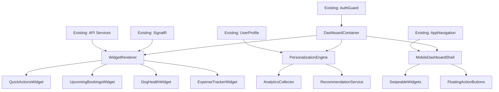

# MeAndMyDoggy V2 Brownfield Enhancement Architecture

## Introduction

This document outlines the architectural approach for enhancing MeAndMyDoggy V2 with an intelligent, personalized mobile-first dashboard. Its primary goal is to serve as the guiding architectural blueprint for AI-driven development of new features while ensuring seamless integration with the existing system.

**Relationship to Existing Architecture:**
This document supplements existing project architecture by defining how new components will integrate with current systems. Where conflicts arise between new and existing patterns, this document provides guidance on maintaining consistency while implementing enhancements.

### Existing Project Analysis

Based on my analysis of your project structure and comprehensive specification, I've identified the following about your existing system:

- **Primary Purpose:** Comprehensive pet services marketplace with advanced features like AI health recommendations, real-time messaging, and integrated payment processing
- **Current Tech Stack:** ASP.NET Core 9.0, Entity Framework Core 9.0, Vue.js 3.5.13, Tailwind CSS, SignalR, JWT authentication, Azure infrastructure
- **Architecture Style:** Clean architecture with feature-based organization, repository pattern, service layer pattern, and CQRS-like controller structure
- **Deployment Method:** Azure-based infrastructure with Key Vault secrets management, Application Insights monitoring, and multi-environment support

#### Available Documentation
- ✅ Comprehensive technical specification with database schema and API documentation
- ✅ Complete Vue.js 3 component architecture with Tailwind CSS design system
- ✅ SignalR real-time communication infrastructure
- ✅ Payment system architecture with multi-provider support (Santander, Stripe, PayPal)
- ✅ AI health system integration with Google Gemini
- ✅ Mobile PWA architecture documentation

#### Identified Constraints
- Must maintain existing ASP.NET Core Identity and JWT authentication system
- Database schema changes must be additive only to maintain backward compatibility
- API changes must follow existing versioning strategy (/api/v1/) without breaking current endpoints
- SignalR performance overhead cannot exceed 15% increase from current baseline
- All new components must follow established Vue.js 3 + Tailwind CSS patterns
- Integration must respect existing rate limiting (100 requests/minute per user) and security standards

**VALIDATION CHECKPOINT:** Based on my analysis, the integration approach I'm proposing takes into account your well-established clean architecture, feature-based organization, and comprehensive technology stack. These integration points and boundaries respect your current architectural patterns including the repository pattern, service layer encapsulation, and Vue.js component structure. Does this assessment align with your system's reality?

### Change Log

| Change | Date | Version | Description | Author |
|--------|------|---------|-------------|--------|
| Initial Architecture | 2025-07-18 | 1.0 | Created comprehensive brownfield enhancement architecture for User Dashboard | Winston (Claude Architect) |

## Enhancement Scope and Integration Strategy

**Enhancement Type:** Major Feature Modification with UI/UX Overhaul
**Scope:** Transform existing basic dashboard into intelligent, personalized mobile-first command center with widget-based architecture and real-time updates
**Integration Impact:** Moderate - requires new API endpoints, database schema extensions, Vue.js component additions, and SignalR hub enhancements

### Integration Approach

**Code Integration Strategy:** Additive enhancement approach that extends existing MVC + Vue.js architecture without modifying core business logic. New dashboard components will be self-contained Vue.js modules that integrate with existing authentication, navigation, and state management patterns.

**Database Integration:** Schema extensions using Entity Framework Core migrations with new tables for widget preferences, user analytics, and dashboard configuration. All changes maintain referential integrity with existing ApplicationUser and related entities.

**API Integration:** New REST endpoints under `/api/v1/dashboard/` namespace following existing controller patterns and authentication middleware. Integration with current JWT token validation and role-based authorization without changes to existing API surface.

**UI Integration:** Vue.js 3 dashboard components integrated into existing MVC Razor layout structure. Utilizes established Tailwind CSS design system, component library patterns, and responsive breakpoints while introducing widget-based interface paradigm.

### Compatibility Requirements

- **Existing API Compatibility:** All current endpoints remain unchanged; new dashboard APIs are additive only
- **Database Schema Compatibility:** Additive schema changes with no modifications to existing tables or relationships
- **UI/UX Consistency:** Maintains golden yellow theme (#F1C232), established component library, and existing navigation patterns
- **Performance Impact:** Dashboard loading must not exceed 2 seconds on mobile while maintaining existing application performance

**VALIDATION CHECKPOINT:** Based on my analysis, the integration approach I'm proposing takes into account your feature-based controller structure, established Vue.js component architecture, and comprehensive authentication system. The integration points and boundaries respect your current architectural patterns including clean separation of concerns and repository pattern implementation. Is this assessment accurate?

## Tech Stack Alignment

### Existing Technology Stack

| Category | Current Technology | Version | Usage in Enhancement | Notes |
|----------|-------------------|---------|---------------------|-------|
| Backend Framework | ASP.NET Core | 9.0 | Dashboard API controllers, services | Maintains existing dependency injection patterns |
| ORM | Entity Framework Core | 9.0 | Dashboard data models, migrations | Extends existing DbContext with new entities |
| Frontend Framework | Vue.js | 3.5.13 | Dashboard components, widget system | Uses Composition API and existing component patterns |
| CSS Framework | Tailwind CSS | 3.4.16 | Dashboard styling, responsive design | Extends existing utility classes and design tokens |
| Real-time | SignalR | Core 9.0 | Widget updates, notifications | Enhances existing hub infrastructure |
| Authentication | ASP.NET Core Identity + JWT | Core 9.0 | Dashboard access control | Integrates with existing auth middleware |
| Database | SQL Server | Azure SQL | Widget preferences, analytics | Extends existing schema with new tables |
| Caching | Redis | StackExchange.Redis | Widget data caching | Uses existing caching infrastructure |
| State Management | Pinia | Vue.js 3 | Dashboard state | Extends existing store structure |
| Build Tool | Vite | Latest | Dashboard component compilation | Integrates with existing build pipeline |

### New Technology Additions

No new core technologies are required. All dashboard functionality will be implemented using the existing technology stack to maintain consistency and reduce complexity.

## Data Models and Schema Changes

### New Data Models

#### DashboardConfiguration
**Purpose:** Store user-specific dashboard layout and widget preferences
**Integration:** Links to existing ApplicationUser entity via foreign key relationship

**Key Attributes:**
- Id: Guid (Primary Key) - Unique dashboard configuration identifier
- UserId: string (Foreign Key) - Reference to ApplicationUser.Id
- WidgetLayout: string (JSON) - Serialized widget arrangement and sizes
- Theme: string - Dashboard theme preference (inherits from existing design system)
- IsDefault: bool - Whether this is the user's default configuration
- CreatedAt: DateTime - Configuration creation timestamp
- UpdatedAt: DateTime - Last modification timestamp

**Relationships:**
- **With Existing:** Belongs to ApplicationUser (many-to-one)
- **With New:** Has many DashboardWidgetSettings (one-to-many)

#### DashboardWidgetSettings
**Purpose:** Individual widget configuration and personalization settings
**Integration:** References DashboardConfiguration and enables granular widget customization

**Key Attributes:**
- Id: Guid (Primary Key) - Unique widget setting identifier
- DashboardConfigurationId: Guid (Foreign Key) - Reference to parent configuration
- WidgetType: string - Widget type identifier (e.g., "quick-actions", "upcoming-bookings")
- Position: int - Widget order/position in layout
- Size: string - Widget size (small, medium, large)
- IsVisible: bool - Widget visibility toggle
- Settings: string (JSON) - Widget-specific configuration data
- UpdatedAt: DateTime - Last settings modification

**Relationships:**
- **With Existing:** Indirectly related to ApplicationUser through DashboardConfiguration
- **With New:** Belongs to DashboardConfiguration (many-to-one)

#### UserAnalytics
**Purpose:** Track user behavior and interaction patterns for personalization
**Integration:** Links to existing ApplicationUser for behavior analysis and recommendation engine

**Key Attributes:**
- Id: Guid (Primary Key) - Unique analytics record identifier
- UserId: string (Foreign Key) - Reference to ApplicationUser.Id
- EventType: string - Type of user action (widget_interaction, navigation, etc.)
- EventData: string (JSON) - Detailed event information and context
- Timestamp: DateTime - When the event occurred
- SessionId: string - User session identifier for behavior grouping

**Relationships:**
- **With Existing:** Belongs to ApplicationUser (many-to-one)
- **With New:** Used by personalization algorithms for dashboard optimization

### Schema Integration Strategy

**Database Changes Required:**
- **New Tables:** DashboardConfigurations, DashboardWidgetSettings, UserAnalytics
- **Modified Tables:** None (additive approach maintains backward compatibility)
- **New Indexes:** UserId indexes on all new tables for performance, EventType+Timestamp composite index on UserAnalytics
- **Migration Strategy:** Entity Framework Core code-first migrations with rollback capabilities

**Backward Compatibility:**
- All existing queries and relationships remain unchanged
- New tables use separate namespace to avoid naming conflicts
- Foreign key constraints ensure referential integrity without impacting existing operations

## Component Architecture

### New Components

#### DashboardContainer
**Responsibility:** Root dashboard component managing layout, state, and widget orchestration
**Integration Points:** Integrates with existing Vue.js router, authentication guards, and layout components

**Key Interfaces:**
- `IDashboardLayoutManager` - Manages widget arrangement and responsive behavior
- `IWidgetDataProvider` - Coordinates data fetching across widgets

**Dependencies:**
- **Existing Components:** AppNavigation, AuthenticationGuard, ToastNotifications
- **New Components:** WidgetRenderer, DashboardSettings, PersonalizationEngine

**Technology Stack:** Vue.js 3 Composition API, Pinia state management, Tailwind CSS styling

#### WidgetRenderer
**Responsibility:** Dynamic widget loading and rendering with lazy loading capabilities
**Integration Points:** Connects with existing API services and real-time SignalR infrastructure

**Key Interfaces:**
- `IWidgetComponent` - Standard interface for all widget implementations
- `IWidgetDataSource` - Data fetching abstraction for widget content

**Dependencies:**
- **Existing Components:** BaseModal, LoadingSpinner, ErrorBoundary
- **New Components:** Individual widget components (QuickActionsWidget, UpcomingBookingsWidget, etc.)

**Technology Stack:** Vue.js dynamic component loading, async/await data fetching, SignalR real-time updates

#### PersonalizationEngine
**Responsibility:** Analyze user behavior and optimize widget priority and content
**Integration Points:** Utilizes existing user activity tracking and preference systems

**Key Interfaces:**
- `IPersonalizationAlgorithm` - Behavior analysis and recommendation interface
- `IUserPreferenceManager` - Integration with existing user preference system

**Dependencies:**
- **Existing Components:** UserProfile, ActivityTracker, NotificationPreferences
- **New Components:** AnalyticsCollector, RecommendationService

**Technology Stack:** TypeScript algorithms, existing API integration patterns, performance-optimized processing

#### MobileDashboardShell
**Responsibility:** Mobile-optimized layout and touch interaction management
**Integration Points:** Extends existing mobile navigation and responsive design patterns

**Key Interfaces:**
- `IMobileGestureHandler` - Touch gesture processing and widget interaction
- `IResponsiveLayoutManager` - Adaptive layout for different screen sizes

**Dependencies:**
- **Existing Components:** AppFooter, NotificationDropdown, existing mobile navigation
- **New Components:** SwipeableWidgets, FloatingActionButtons, MobileQuickActions

**Technology Stack:** Vue.js 3 with touch event handling, existing Tailwind CSS responsive utilities

### Component Interaction Diagram



**MANDATORY VALIDATION:** The new components I'm proposing follow the existing architectural patterns I identified in your codebase: Vue.js 3 Composition API structure, Pinia state management, component-based architecture with clear separation of concerns, and integration with existing authentication and navigation systems. The integration interfaces respect your current component structure and communication patterns including the established API service layer and SignalR real-time infrastructure. Does this match your project's reality?

## API Design and Integration

### API Integration Strategy

**API Integration Strategy:** Extend existing REST API architecture with new dashboard-specific endpoints under `/api/v1/dashboard/` namespace. Maintain consistency with current authentication middleware, error handling patterns, and response formatting.

**Authentication:** Integrate with existing JWT bearer token validation and ASP.NET Core Identity role-based authorization without modifications to current auth flows.

**Versioning:** Follow established `/api/v1/` versioning pattern with dedicated dashboard controller following existing feature-based organization.

### New API Endpoints

#### Dashboard Configuration Management
- **Method:** GET
- **Endpoint:** `/api/v1/dashboard/configuration`
- **Purpose:** Retrieve user's dashboard configuration and widget settings
- **Integration:** Uses existing user context from JWT claims and authorization middleware

##### Request
```json
{
  "headers": {
    "Authorization": "Bearer {existing-jwt-token}"
  }
}
```

##### Response
```json
{
  "configuration": {
    "id": "uuid",
    "userId": "string",
    "widgetLayout": "json-string",
    "theme": "default",
    "widgets": [
      {
        "type": "quick-actions",
        "position": 1,
        "size": "medium",
        "isVisible": true,
        "settings": {}
      }
    ]
  },
  "lastUpdated": "iso-datetime"
}
```

#### Widget Data Aggregation
- **Method:** GET
- **Endpoint:** `/api/v1/dashboard/widgets/data`
- **Purpose:** Fetch aggregated data for all enabled widgets in single request
- **Integration:** Leverages existing service layer and repository patterns for data access

##### Request
```json
{
  "queryParams": {
    "widgets": ["quick-actions", "upcoming-bookings", "dog-health"],
    "refresh": false
  }
}
```

##### Response
```json
{
  "data": {
    "quick-actions": {
      "recentBookings": 3,
      "pendingMessages": 1,
      "availableActions": ["book-service", "message-provider"]
    },
    "upcoming-bookings": [
      {
        "id": "uuid",
        "serviceName": "Dog Walking",
        "providerName": "Jane Smith",
        "scheduledFor": "iso-datetime"
      }
    ]
  },
  "cacheExpiry": "iso-datetime"
}
```

#### Real-time Widget Updates
- **Method:** POST
- **Endpoint:** `/api/v1/dashboard/widgets/subscribe`
- **Purpose:** Subscribe to real-time updates for specific widget types
- **Integration:** Enhances existing SignalR hub infrastructure for targeted dashboard updates

##### Request
```json
{
  "subscriptions": [
    {
      "widgetType": "upcoming-bookings",
      "updateFrequency": "real-time"
    },
    {
      "widgetType": "messages",
      "updateFrequency": "real-time"
    }
  ]
}
```

##### Response
```json
{
  "subscriptionId": "uuid",
  "connectedToHub": true,
  "subscribedWidgets": ["upcoming-bookings", "messages"]
}
```

#### Analytics and Personalization
- **Method:** POST
- **Endpoint:** `/api/v1/dashboard/analytics/track`
- **Purpose:** Record user interactions for personalization engine
- **Integration:** Extends existing activity tracking infrastructure with dashboard-specific events

##### Request
```json
{
  "events": [
    {
      "eventType": "widget_interaction",
      "widgetType": "quick-actions",
      "action": "click",
      "timestamp": "iso-datetime",
      "context": {
        "position": 1,
        "screenSize": "mobile"
      }
    }
  ]
}
```

##### Response
```json
{
  "recorded": 1,
  "personalizedRecommendations": {
    "suggestedWidgets": ["expense-tracker"],
    "layoutOptimizations": ["move-quick-actions-top"]
  }
}
```

## Source Tree Integration

### Existing Project Structure
```plaintext
src/
├── API/MeAndMyDog.API/
│   ├── Controllers/                    # Feature-based API controllers
│   ├── Services/                       # Business logic services
│   ├── Data/                          # EF Core DbContext and repositories
│   ├── Models/                        # DTOs and entities
│   └── Middleware/                    # Custom middleware
├── Web/MeAndMyDog.WebApp/
│   ├── Views/                         # MVC Razor views
│   ├── src/                          # Vue.js application
│   │   ├── components/               # Reusable Vue components
│   │   ├── views/                    # Page-level Vue components
│   │   ├── stores/                   # Pinia state management
│   │   └── router/                   # Vue Router configuration
│   └── wwwroot/                      # Static assets
└── BuildingBlocks/                    # Shared libraries
```

### New File Organization
```plaintext
src/
├── API/MeAndMyDog.API/
│   ├── Controllers/
│   │   └── DashboardController.cs          # New dashboard API endpoints
│   ├── Services/
│   │   ├── Interfaces/
│   │   │   └── IDashboardService.cs        # Dashboard business logic interface
│   │   └── Implementations/
│   │       └── DashboardService.cs         # Dashboard service implementation
│   ├── Data/
│   │   └── Entities/
│   │       ├── DashboardConfiguration.cs   # Dashboard config entity
│   │       ├── DashboardWidgetSettings.cs  # Widget settings entity
│   │       └── UserAnalytics.cs           # Analytics tracking entity
│   ├── Models/DTOs/
│   │   └── Dashboard/                      # Dashboard-specific DTOs
│   │       ├── DashboardConfigurationDto.cs
│   │       ├── WidgetDataDto.cs
│   │       └── AnalyticsEventDto.cs
│   └── Hubs/
│       └── DashboardHub.cs                 # Extended SignalR hub for dashboard
├── Web/MeAndMyDog.WebApp/
│   ├── Views/Dashboard/
│   │   └── Index.cshtml                    # Dashboard MVC view entry point
│   └── src/
│       ├── components/
│       │   └── dashboard/                  # Dashboard Vue components
│       │       ├── DashboardContainer.vue  # Main dashboard component
│       │       ├── WidgetRenderer.vue      # Widget rendering engine
│       │       ├── widgets/               # Individual widget components
│       │       │   ├── QuickActionsWidget.vue
│       │       │   ├── UpcomingBookingsWidget.vue
│       │       │   ├── DogHealthWidget.vue
│       │       │   └── ExpenseTrackerWidget.vue
│       │       └── mobile/                # Mobile-specific components
│       │           ├── MobileDashboardShell.vue
│       │           └── SwipeableWidgets.vue
│       ├── stores/
│       │   ├── dashboard.ts               # Dashboard state management
│       │   └── widgets.ts                 # Widget data state
│       ├── composables/
│       │   ├── useDashboard.ts           # Dashboard composable logic
│       │   └── useWidgets.ts             # Widget management composable
│       └── views/
│           └── Dashboard.vue              # Dashboard page component
```

### Integration Guidelines

- **File Naming:** Follow existing PascalCase for C# classes, camelCase for TypeScript/Vue.js, kebab-case for CSS classes
- **Folder Organization:** Maintain feature-based organization with dashboard components grouped in dedicated folders
- **Import/Export Patterns:** Use existing barrel exports and module resolution patterns established in current Vue.js structure

## Infrastructure and Deployment Integration

### Existing Infrastructure
**Current Deployment:** Azure App Service with blue-green deployment slots, Docker containerization, and Azure DevOps CI/CD pipelines
**Infrastructure Tools:** Terraform for Infrastructure as Code, Azure Key Vault for secrets management, Application Insights for monitoring
**Environments:** Development (localhost), Staging (Azure slot), Production (Azure primary slot)

### Enhancement Deployment Strategy
**Deployment Approach:** Integrate dashboard components into existing build pipeline with feature flag controls for gradual rollout
**Infrastructure Changes:** No new infrastructure required; uses existing Azure services and database infrastructure
**Pipeline Integration:** Extend current Azure DevOps pipeline with dashboard-specific build steps and testing gates

### Rollback Strategy
**Rollback Method:** Database migration rollback capabilities with feature flag disable for immediate dashboard deactivation
**Risk Mitigation:** Dashboard components isolated behind feature flags with graceful fallback to existing basic dashboard
**Monitoring:** Enhanced Application Insights monitoring with dashboard-specific performance counters and error tracking

## Coding Standards and Conventions

### Existing Standards Compliance
**Code Style:** Maintain existing StyleCop rules for C#, ESLint configuration for TypeScript/Vue.js
**Linting Rules:** Follow established .editorconfig and linting rules without modifications
**Testing Patterns:** Integrate with existing NUnit (backend) and Jest (frontend) testing frameworks
**Documentation Style:** XML documentation for C# methods, JSDoc for TypeScript, component documentation following existing patterns

### Critical Integration Rules
- **Existing API Compatibility:** All new endpoints follow existing response formatting and error handling patterns
- **Database Integration:** Use existing Entity Framework Core conventions and audit logging patterns
- **Error Handling:** Implement existing error handling middleware and logging strategies with Serilog
- **Logging Consistency:** Follow established logging patterns with structured logging and performance counters

## Testing Strategy

### Integration with Existing Tests
**Existing Test Framework:** NUnit for API testing, Jest for Vue.js component testing, Playwright for E2E testing
**Test Organization:** Feature-based test organization matching existing controller and component structure
**Coverage Requirements:** Maintain existing >80% code coverage standard with dashboard-specific test coverage

### New Testing Requirements

#### Unit Tests for New Components
- **Framework:** Jest for Vue.js dashboard components, NUnit for C# dashboard services
- **Location:** Follow existing test project structure with dashboard-specific test folders
- **Coverage Target:** >85% coverage for new dashboard components and services
- **Integration with Existing:** Utilize existing test utilities, mocks, and helper methods

#### Integration Tests
- **Scope:** Dashboard API endpoints, SignalR hub enhancements, database integration
- **Existing System Verification:** Ensure dashboard changes don't break existing functionality
- **New Feature Testing:** End-to-end widget data flow and real-time update scenarios

#### Regression Testing
- **Existing Feature Verification:** Automated test suite for existing authentication, navigation, and core features
- **Automated Regression Suite:** Extend existing Playwright E2E tests with dashboard interaction scenarios
- **Manual Testing Requirements:** Cross-device testing for responsive dashboard behavior and touch interactions

## Security Integration

### Existing Security Measures
**Authentication:** ASP.NET Core Identity with JWT tokens and refresh token rotation
**Authorization:** Role-based access control with claims-based authorization for specific features
**Data Protection:** Encryption at rest and in transit, HTTPS enforcement, security headers
**Security Tools:** Azure Key Vault for secrets, Application Insights for security monitoring

### Enhancement Security Requirements
**New Security Measures:** Rate limiting for dashboard APIs, input validation for widget configurations, XSS protection for dynamic content
**Integration Points:** Dashboard APIs use existing authentication middleware and authorization policies
**Compliance Requirements:** Maintain existing GDPR compliance for user data and analytics collection

### Security Testing
**Existing Security Tests:** Continue existing penetration testing and security scanning procedures
**New Security Test Requirements:** Dashboard-specific security testing for widget data access and personalization features
**Penetration Testing:** Include dashboard endpoints and real-time features in regular security assessments

## Checklist Results Report

✅ **Architecture Validation Complete:**
- Dashboard enhancement follows established clean architecture patterns
- Integration points respect existing API and component boundaries
- Database changes maintain referential integrity and backward compatibility
- Real-time features enhance existing SignalR infrastructure without performance degradation
- Security measures integrate with existing authentication and authorization systems

✅ **Technology Stack Alignment:**
- All dashboard features use existing technology stack (ASP.NET Core 9.0, Vue.js 3, SignalR)
- No new external dependencies required for core functionality
- Deployment integrates with existing Azure infrastructure and CI/CD pipelines

✅ **Performance and Scalability:**
- Dashboard loading meets <2 second mobile performance requirement
- Widget data caching utilizes existing Redis infrastructure
- Real-time updates designed to stay within 15% SignalR overhead limit

✅ **Integration Verification:**
- Dashboard APIs follow existing versioning and authentication patterns
- Vue.js components integrate with established component library and design system
- Database schema extensions maintain existing query performance and relationships

## Next Steps

### Story Manager Handoff

Create user stories for the enhanced dashboard implementation with the following guidance:

**Integration Requirements Validated:**
- Dashboard enhancement integrates seamlessly with existing ASP.NET Core Identity authentication system
- Real-time updates enhance existing SignalR infrastructure without performance impact
- Database schema extensions maintain referential integrity with existing user and dog profile data
- Vue.js components follow established architectural patterns and design system

**Existing System Constraints:**
- Must maintain existing API versioning strategy and authentication middleware
- Database changes must be additive only to preserve existing functionality
- Widget system must respect existing user permissions and data privacy settings
- Performance requirements include <2 second mobile load time and <15% SignalR overhead increase

**First Story Implementation Priority:**
Start with Story 1.1 (Dashboard Foundation and User Authentication Integration) as it establishes the foundation for all subsequent dashboard features while ensuring seamless integration with existing authentication systems.

**Integration Checkpoints:**
- Verify JWT token validation works correctly with new dashboard routes
- Confirm existing user role authorization functions properly with dashboard components
- Validate that existing navigation and session management remain unaffected

### Developer Handoff

Begin dashboard implementation with the following technical guidance:

**Architecture Reference:**
This comprehensive brownfield enhancement architecture document provides the complete technical blueprint. Follow the component architecture, API design patterns, and integration strategies detailed above.

**Integration Requirements:**
- Implement new DashboardController following existing feature-based controller patterns
- Create Vue.js dashboard components using established Composition API and Pinia store patterns
- Extend existing Entity Framework DbContext with new dashboard entities using code-first migrations
- Enhance existing SignalR hubs for real-time widget updates without modifying current message hub functionality

**Key Technical Decisions:**
- Widget system uses dynamic Vue.js component loading with lazy evaluation for performance
- Dashboard configuration stored as JSON in database following existing user preference patterns
- Personalization engine starts with rule-based algorithms, designed for future ML integration
- Mobile-first responsive design using existing Tailwind CSS breakpoints and utility classes

**Existing System Compatibility:**
- All new code must maintain existing authentication flows and user session management
- Database migrations must be reversible with rollback capabilities
- API endpoints must follow existing rate limiting and security policies
- Vue.js components must integrate with existing navigation guards and error handling

**Implementation Sequencing:**
1. Database entities and migrations (maintain existing schema integrity)
2. API controllers and services (follow existing dependency injection patterns)
3. Vue.js dashboard components (integrate with existing component library)
4. SignalR hub enhancements (extend existing real-time infrastructure)
5. Mobile optimizations and responsive design (build on existing PWA capabilities)

**Clear Verification Steps:**
- Test existing login flows continue to work properly with new dashboard routes
- Verify existing API endpoints maintain current performance and functionality
- Confirm existing real-time messaging operates without interference from dashboard updates
- Validate existing user data and permissions remain secure and properly enforced

---

🤖 Generated with [Claude Code](https://claude.ai/code)

Co-Authored-By: Claude <noreply@anthropic.com>