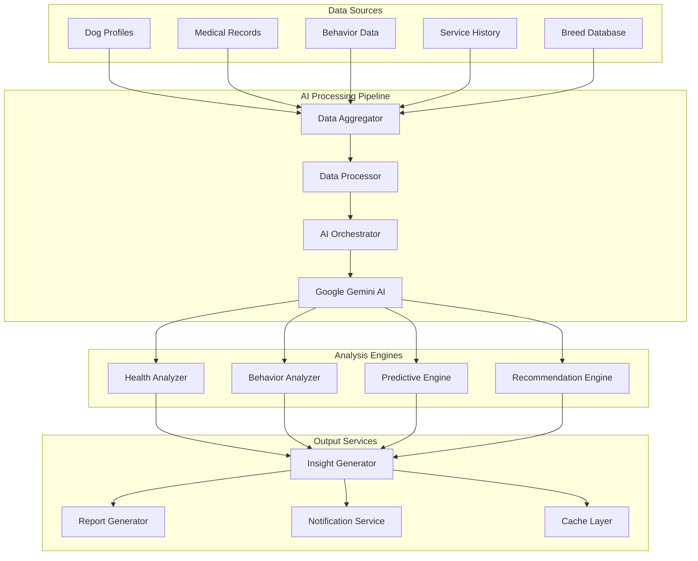

# AI Health Recommendations System Architecture

## System Overview

The MeAndMyDoggy AI Health Recommendations system integrates Google Gemini AI to provide personalized health insights, predictive analytics, and recommendations based on dog profiles, medical history, and behavioral data.

## Architecture Diagram



## Core Components

### AI Service Integration

```csharp
public interface IAIHealthService
{
    Task<HealthInsights> GenerateHealthInsightsAsync(string dogId);
    Task<BehaviorAnalysis> AnalyzeBehaviorAsync(string dogId);
    Task<List<HealthRecommendation>> GetRecommendationsAsync(string dogId);
    Task<PredictiveHealthReport> GeneratePredictiveReportAsync(string dogId);
}

public class AIHealthService : IAIHealthService
{
    private readonly IGeminiAIClient _geminiClient;
    private readonly IDogDataService _dogDataService;
    private readonly IBreedDataService _breedDataService;
    private readonly IMemoryCache _cache;
    private readonly ILogger<AIHealthService> _logger;

    public async Task<HealthInsights> GenerateHealthInsightsAsync(string dogId)
    {
        var cacheKey = $"health_insights_{dogId}";
        if (_cache.TryGetValue(cacheKey, out HealthInsights cachedInsights))
        {
            return cachedInsights;
        }

        var dogData = await _dogDataService.GetComprehensiveDogDataAsync(dogId);
        var breedInfo = await _breedDataService.GetBreedInfoAsync(dogData.Breed);
        
        var prompt = BuildHealthAnalysisPrompt(dogData, breedInfo);
        var aiResponse = await _geminiClient.GenerateContentAsync(prompt);
        
        var insights = ParseHealthInsights(aiResponse);
        
        _cache.Set(cacheKey, insights, TimeSpan.FromHours(6));
        
        return insights;
    }
}
```### 
Gemini AI Client Implementation

```csharp
public interface IGeminiAIClient
{
    Task<string> GenerateContentAsync(string prompt);
    Task<string> AnalyzeImageAsync(byte[] imageData, string prompt);
    Task<BatchResponse> ProcessBatchRequestAsync(List<AIRequest> requests);
}

public class GeminiAIClient : IGeminiAIClient
{
    private readonly HttpClient _httpClient;
    private readonly IConfiguration _configuration;
    private readonly ILogger<GeminiAIClient> _logger;
    private readonly SemaphoreSlim _rateLimitSemaphore;

    public GeminiAIClient(HttpClient httpClient, IConfiguration configuration, ILogger<GeminiAIClient> logger)
    {
        _httpClient = httpClient;
        _configuration = configuration;
        _logger = logger;
        _rateLimitSemaphore = new SemaphoreSlim(10, 10); // Rate limiting
        
        var apiKey = _configuration["AI:Gemini:ApiKey"];
        _httpClient.DefaultRequestHeaders.Add("Authorization", $"Bearer {apiKey}");
    }

    public async Task<string> GenerateContentAsync(string prompt)
    {
        await _rateLimitSemaphore.WaitAsync();
        
        try
        {
            var request = new
            {
                contents = new[]
                {
                    new
                    {
                        parts = new[]
                        {
                            new { text = prompt }
                        }
                    }
                },
                generationConfig = new
                {
                    temperature = 0.7,
                    topK = 40,
                    topP = 0.95,
                    maxOutputTokens = 2048
                }
            };

            var json = JsonSerializer.Serialize(request);
            var content = new StringContent(json, Encoding.UTF8, "application/json");
            
            var response = await _httpClient.PostAsync("v1/models/gemini-1.5-flash:generateContent", content);
            response.EnsureSuccessStatusCode();
            
            var responseJson = await response.Content.ReadAsStringAsync();
            var result = JsonSerializer.Deserialize<GeminiResponse>(responseJson);
            
            return result.Candidates.FirstOrDefault()?.Content?.Parts?.FirstOrDefault()?.Text ?? "";
        }
        catch (Exception ex)
        {
            _logger.LogError(ex, "Error calling Gemini AI API");
            throw;
        }
        finally
        {
            _rateLimitSemaphore.Release();
        }
    }
}
```

### Data Processing Pipeline

```csharp
public class DogDataAggregator : IDogDataAggregator
{
    public async Task<ComprehensiveDogData> GetComprehensiveDogDataAsync(string dogId)
    {
        var tasks = new[]
        {
            GetDogProfileAsync(dogId),
            GetMedicalHistoryAsync(dogId),
            GetBehaviorDataAsync(dogId),
            GetServiceHistoryAsync(dogId),
            GetActivityDataAsync(dogId)
        };

        await Task.WhenAll(tasks);

        return new ComprehensiveDogData
        {
            Profile = await tasks[0],
            MedicalHistory = await tasks[1],
            BehaviorData = await tasks[2],
            ServiceHistory = await tasks[3],
            ActivityData = await tasks[4],
            AggregatedAt = DateTime.UtcNow
        };
    }

    private string BuildHealthAnalysisPrompt(ComprehensiveDogData dogData, BreedInfo breedInfo)
    {
        var promptBuilder = new StringBuilder();
        
        promptBuilder.AppendLine("You are a veterinary AI assistant specializing in dog health analysis.");
        promptBuilder.AppendLine("Analyze the following dog's health data and provide insights:");
        promptBuilder.AppendLine();
        
        // Dog basic info
        promptBuilder.AppendLine($"Dog Information:");
        promptBuilder.AppendLine($"- Name: {dogData.Profile.Name}");
        promptBuilder.AppendLine($"- Breed: {dogData.Profile.Breed}");
        promptBuilder.AppendLine($"- Age: {CalculateAge(dogData.Profile.DateOfBirth)} years");
        promptBuilder.AppendLine($"- Weight: {dogData.Profile.Weight}kg");
        promptBuilder.AppendLine($"- Gender: {dogData.Profile.Gender}");
        promptBuilder.AppendLine();
        
        // Breed-specific information
        promptBuilder.AppendLine($"Breed Information:");
        promptBuilder.AppendLine($"- Common Health Issues: {string.Join(", ", breedInfo.CommonHealthIssues)}");
        promptBuilder.AppendLine($"- Life Expectancy: {breedInfo.LifeExpectancy}");
        promptBuilder.AppendLine($"- Exercise Needs: {breedInfo.ExerciseNeeds}");
        promptBuilder.AppendLine();
        
        // Medical history
        if (dogData.MedicalHistory.Any())
        {
            promptBuilder.AppendLine("Medical History:");
            foreach (var record in dogData.MedicalHistory.OrderByDescending(r => r.Date).Take(10))
            {
                promptBuilder.AppendLine($"- {record.Date:yyyy-MM-dd}: {record.Type} - {record.Description}");
            }
            promptBuilder.AppendLine();
        }
        
        // Current health status
        promptBuilder.AppendLine($"Current Health Status:");
        promptBuilder.AppendLine($"- Vaccinated: {dogData.Profile.IsVaccinated}");
        promptBuilder.AppendLine($"- Neutered: {dogData.Profile.IsNeutered}");
        promptBuilder.AppendLine($"- Last Vet Visit: {dogData.MedicalHistory.OrderByDescending(r => r.Date).FirstOrDefault()?.Date:yyyy-MM-dd}");
        promptBuilder.AppendLine();
        
        // Behavior data
        if (dogData.BehaviorData != null)
        {
            promptBuilder.AppendLine($"Behavior Profile:");
            promptBuilder.AppendLine($"- Energy Level: {dogData.BehaviorData.EnergyLevel}/5");
            promptBuilder.AppendLine($"- Friendliness with Dogs: {dogData.BehaviorData.FriendlinessWithDogs}/5");
            promptBuilder.AppendLine($"- Friendliness with People: {dogData.BehaviorData.FriendlinessWithPeople}/5");
            promptBuilder.AppendLine($"- Exercise Needs: {dogData.BehaviorData.ExerciseNeeds}/5");
            promptBuilder.AppendLine();
        }
        
        promptBuilder.AppendLine("Please provide:");
        promptBuilder.AppendLine("1. Overall health assessment");
        promptBuilder.AppendLine("2. Potential health risks based on breed and current data");
        promptBuilder.AppendLine("3. Preventive care recommendations");
        promptBuilder.AppendLine("4. Lifestyle recommendations");
        promptBuilder.AppendLine("5. When to schedule next vet visit");
        promptBuilder.AppendLine("6. Any red flags or concerns");
        promptBuilder.AppendLine();
        promptBuilder.AppendLine("Format your response as structured JSON with the following schema:");
        promptBuilder.AppendLine(GetHealthInsightsJsonSchema());
        
        return promptBuilder.ToString();
    }
}
```

### Health Insights Models

```csharp
public class HealthInsights
{
    public string DogId { get; set; }
    public DateTime GeneratedAt { get; set; }
    public OverallHealthAssessment OverallHealth { get; set; }
    public List<HealthRisk> PotentialRisks { get; set; }
    public List<HealthRecommendation> Recommendations { get; set; }
    public List<PreventiveCare> PreventiveCareSchedule { get; set; }
    public List<string> RedFlags { get; set; }
    public DateTime NextVetVisitRecommended { get; set; }
    public double ConfidenceScore { get; set; }
}

public class OverallHealthAssessment
{
    public string Status { get; set; } // Excellent, Good, Fair, Poor, Critical
    public string Summary { get; set; }
    public List<string> PositiveIndicators { get; set; }
    public List<string> ConcernAreas { get; set; }
    public int HealthScore { get; set; } // 1-100
}

public class HealthRisk
{
    public string RiskType { get; set; }
    public string Description { get; set; }
    public string Severity { get; set; } // Low, Medium, High, Critical
    public double Probability { get; set; } // 0-1
    public List<string> PreventionMeasures { get; set; }
    public List<string> EarlyWarningSigns { get; set; }
}

public class HealthRecommendation
{
    public string Category { get; set; } // Diet, Exercise, Medical, Grooming, etc.
    public string Title { get; set; }
    public string Description { get; set; }
    public string Priority { get; set; } // High, Medium, Low
    public string Timeline { get; set; } // Immediate, This Week, This Month, etc.
    public List<string> ActionSteps { get; set; }
    public string Reasoning { get; set; }
}
```