# Mobile PWA & Performance Architecture

## System Overview

The MeAndMyDoggy Progressive Web App (PWA) provides native app-like experience with offline functionality, push notifications, and optimized performance for mobile devices.

## PWA Architecture Diagram

```mermaid
graph TB
    subgraph "Client Layer"
        PWAShell[PWA App Shell]
        ServiceWorker[Service Worker]
        CacheAPI[Cache API]
        IndexedDB[IndexedDB]
    end
    
    subgraph "Network Layer"
        NetworkFirst[Network First Strategy]
        CacheFirst[Cache First Strategy]
        StaleWhileRevalidate[Stale While Revalidate]
        BackgroundSync[Background Sync]
    end
    
    subgraph "Performance Layer"
        LazyLoading[Lazy Loading]
        CodeSplitting[Code Splitting]
        ImageOptimization[Image Optimization]
        Preloading[Resource Preloading]
    end
    
    subgraph "Offline Layer"
        OfflineStorage[Offline Storage]
        SyncQueue[Sync Queue]
        ConflictResolution[Conflict Resolution]
        OfflineFallback[Offline Fallback]
    end
    
    subgraph "Push Notifications"
        PushManager[Push Manager]
        NotificationAPI[Notification API]
        VAPIDKeys[VAPID Keys]
        PushService[Push Service]
    end
    
    PWAShell --> ServiceWorker
    ServiceWorker --> CacheAPI
    ServiceWorker --> IndexedDB
    
    ServiceWorker --> NetworkFirst
    ServiceWorker --> CacheFirst
    ServiceWorker --> StaleWhileRevalidate
    ServiceWorker --> BackgroundSync
    
    PWAShell --> LazyLoading
    PWAShell --> CodeSplitting
    PWAShell --> ImageOptimization
    PWAShell --> Preloading
    
    ServiceWorker --> OfflineStorage
    ServiceWorker --> SyncQueue
    ServiceWorker --> ConflictResolution
    ServiceWorker --> OfflineFallback
    
    ServiceWorker --> PushManager
    PushManager --> NotificationAPI
    PushManager --> VAPIDKeys
    PushManager --> PushService
```



## Service Worker Implementation

```javascript
// sw.js - Service Worker
const CACHE_NAME = 'meandmydoggy-v1.0.0';
const STATIC_CACHE = 'static-v1.0.0';
const DYNAMIC_CACHE = 'dynamic-v1.0.0';
const API_CACHE = 'api-v1.0.0';

// Static assets to cache
const STATIC_ASSETS = [
  '/',
  '/manifest.json',
  '/offline.html',
  '/assets/css/app.css',
  '/assets/js/app.js',
  '/assets/images/logo.png',
  '/assets/images/offline-dog.svg'
];

// API endpoints to cache
const API_ENDPOINTS = [
  '/api/v1/dogs',
  '/api/v1/bookings',
  '/api/v1/messages'
];

// Install event - cache static assets
self.addEventListener('install', event => {
  console.log('Service Worker installing...');
  
  event.waitUntil(
    Promise.all([
      caches.open(STATIC_CACHE).then(cache => {
        return cache.addAll(STATIC_ASSETS);
      }),
      self.skipWaiting()
    ])
  );
});

// Activate event - clean up old caches
self.addEventListener('activate', event => {
  console.log('Service Worker activating...');
  
  event.waitUntil(
    Promise.all([
      caches.keys().then(cacheNames => {
        return Promise.all(
          cacheNames.map(cacheName => {
            if (cacheName !== STATIC_CACHE && 
                cacheName !== DYNAMIC_CACHE && 
                cacheName !== API_CACHE) {
              return caches.delete(cacheName);
            }
          })
        );
      }),
      self.clients.claim()
    ])
  );
});

// Fetch event - implement caching strategies
self.addEventListener('fetch', event => {
  const { request } = event;
  const url = new URL(request.url);
  
  // Handle different types of requests
  if (request.method === 'GET') {
    if (url.pathname.startsWith('/api/')) {
      // API requests - Network first with cache fallback
      event.respondWith(handleAPIRequest(request));
    } else if (STATIC_ASSETS.includes(url.pathname)) {
      // Static assets - Cache first
      event.respondWith(handleStaticRequest(request));
    } else if (url.pathname.match(/\.(js|css|png|jpg|jpeg|svg|woff2?)$/)) {
      // Other assets - Stale while revalidate
      event.respondWith(handleAssetRequest(request));
    } else {
      // HTML pages - Network first with offline fallback
      event.respondWith(handlePageRequest(request));
    }
  } else if (request.method === 'POST' || request.method === 'PUT') {
    // Handle form submissions and API updates
    event.respondWith(handleMutationRequest(request));
  }
});

// Network first strategy for API requests
async function handleAPIRequest(request) {
  try {
    const networkResponse = await fetch(request);
    
    if (networkResponse.ok) {
      const cache = await caches.open(API_CACHE);
      cache.put(request, networkResponse.clone());
    }
    
    return networkResponse;
  } catch (error) {
    console.log('Network failed, trying cache...', error);
    
    const cachedResponse = await caches.match(request);
    if (cachedResponse) {
      return cachedResponse;
    }
    
    // Return offline response for critical API calls
    return new Response(
      JSON.stringify({ 
        error: 'Offline', 
        message: 'This data is not available offline' 
      }),
      { 
        status: 503,
        headers: { 'Content-Type': 'application/json' }
      }
    );
  }
}

// Cache first strategy for static assets
async function handleStaticRequest(request) {
  const cachedResponse = await caches.match(request);
  
  if (cachedResponse) {
    return cachedResponse;
  }
  
  try {
    const networkResponse = await fetch(request);
    const cache = await caches.open(STATIC_CACHE);
    cache.put(request, networkResponse.clone());
    return networkResponse;
  } catch (error) {
    console.log('Failed to fetch static asset:', error);
    throw error;
  }
}

// Stale while revalidate for other assets
async function handleAssetRequest(request) {
  const cache = await caches.open(DYNAMIC_CACHE);
  const cachedResponse = await cache.match(request);
  
  const fetchPromise = fetch(request).then(networkResponse => {
    cache.put(request, networkResponse.clone());
    return networkResponse;
  });
  
  return cachedResponse || fetchPromise;
}

// Network first with offline fallback for pages
async function handlePageRequest(request) {
  try {
    const networkResponse = await fetch(request);
    
    if (networkResponse.ok) {
      const cache = await caches.open(DYNAMIC_CACHE);
      cache.put(request, networkResponse.clone());
    }
    
    return networkResponse;
  } catch (error) {
    const cachedResponse = await caches.match(request);
    
    if (cachedResponse) {
      return cachedResponse;
    }
    
    // Return offline page
    return caches.match('/offline.html');
  }
}

// Handle mutations with background sync
async function handleMutationRequest(request) {
  try {
    return await fetch(request);
  } catch (error) {
    // Queue for background sync
    await queueBackgroundSync(request);
    
    return new Response(
      JSON.stringify({ 
        success: true, 
        message: 'Request queued for when you\'re back online' 
      }),
      { 
        status: 202,
        headers: { 'Content-Type': 'application/json' }
      }
    );
  }
}

// Background sync for offline actions
self.addEventListener('sync', event => {
  if (event.tag === 'background-sync') {
    event.waitUntil(processBackgroundSync());
  }
});

async function queueBackgroundSync(request) {
  const db = await openDB();
  const transaction = db.transaction(['sync-queue'], 'readwrite');
  const store = transaction.objectStore('sync-queue');
  
  const requestData = {
    url: request.url,
    method: request.method,
    headers: Object.fromEntries(request.headers.entries()),
    body: await request.text(),
    timestamp: Date.now()
  };
  
  await store.add(requestData);
  
  // Register for background sync
  self.registration.sync.register('background-sync');
}

async function processBackgroundSync() {
  const db = await openDB();
  const transaction = db.transaction(['sync-queue'], 'readwrite');
  const store = transaction.objectStore('sync-queue');
  const requests = await store.getAll();
  
  for (const requestData of requests) {
    try {
      const response = await fetch(requestData.url, {
        method: requestData.method,
        headers: requestData.headers,
        body: requestData.body
      });
      
      if (response.ok) {
        await store.delete(requestData.id);
      }
    } catch (error) {
      console.log('Background sync failed for request:', requestData.url);
    }
  }
}

// Push notification handling
self.addEventListener('push', event => {
  if (!event.data) return;
  
  const data = event.data.json();
  
  const options = {
    body: data.body,
    icon: '/assets/images/notification-icon.png',
    badge: '/assets/images/badge-icon.png',
    image: data.image,
    data: data.data,
    actions: data.actions || [],
    requireInteraction: data.requireInteraction || false,
    silent: data.silent || false,
    vibrate: data.vibrate || [200, 100, 200]
  };
  
  event.waitUntil(
    self.registration.showNotification(data.title, options)
  );
});

// Notification click handling
self.addEventListener('notificationclick', event => {
  event.notification.close();
  
  const data = event.notification.data;
  
  if (event.action) {
    // Handle action button clicks
    handleNotificationAction(event.action, data);
  } else {
    // Handle notification click
    event.waitUntil(
      clients.openWindow(data.url || '/')
    );
  }
});

// IndexedDB helper
async function openDB() {
  return new Promise((resolve, reject) => {
    const request = indexedDB.open('MeAndMyDoggyDB', 1);
    
    request.onerror = () => reject(request.error);
    request.onsuccess = () => resolve(request.result);
    
    request.onupgradeneeded = event => {
      const db = event.target.result;
      
      if (!db.objectStoreNames.contains('sync-queue')) {
        const store = db.createObjectStore('sync-queue', { 
          keyPath: 'id', 
          autoIncrement: true 
        });
        store.createIndex('timestamp', 'timestamp');
      }
      
      if (!db.objectStoreNames.contains('offline-data')) {
        const store = db.createObjectStore('offline-data', { keyPath: 'key' });
      }
    };
  });
}
```

## Vue.js PWA Integration

```typescript
// composables/usePWA.ts
import { ref, onMounted } from 'vue'

export function usePWA() {
  const isInstallable = ref(false)
  const isInstalled = ref(false)
  const isOnline = ref(navigator.onLine)
  const updateAvailable = ref(false)
  
  let deferredPrompt: any = null
  let registration: ServiceWorkerRegistration | null = null

  onMounted(async () => {
    // Register service worker
    if ('serviceWorker' in navigator) {
      try {
        registration = await navigator.serviceWorker.register('/sw.js')
        console.log('Service Worker registered successfully')
        
        // Check for updates
        registration.addEventListener('updatefound', () => {
          const newWorker = registration!.installing
          if (newWorker) {
            newWorker.addEventListener('statechange', () => {
              if (newWorker.state === 'installed' && navigator.serviceWorker.controller) {
                updateAvailable.value = true
              }
            })
          }
        })
      } catch (error) {
        console.error('Service Worker registration failed:', error)
      }
    }

    // Handle install prompt
    window.addEventListener('beforeinstallprompt', (e) => {
      e.preventDefault()
      deferredPrompt = e
      isInstallable.value = true
    })

    // Handle app installed
    window.addEventListener('appinstalled', () => {
      isInstalled.value = true
      isInstallable.value = false
      deferredPrompt = null
    })

    // Handle online/offline status
    window.addEventListener('online', () => {
      isOnline.value = true
    })

    window.addEventListener('offline', () => {
      isOnline.value = false
    })

    // Check if already installed
    if (window.matchMedia('(display-mode: standalone)').matches) {
      isInstalled.value = true
    }
  })

  const installApp = async () => {
    if (!deferredPrompt) return false

    deferredPrompt.prompt()
    const { outcome } = await deferredPrompt.userChoice
    
    if (outcome === 'accepted') {
      isInstallable.value = false
      deferredPrompt = null
      return true
    }
    
    return false
  }

  const updateApp = async () => {
    if (!registration || !registration.waiting) return

    registration.waiting.postMessage({ type: 'SKIP_WAITING' })
    window.location.reload()
  }

  const requestNotificationPermission = async () => {
    if (!('Notification' in window)) return false

    const permission = await Notification.requestPermission()
    return permission === 'granted'
  }

  const subscribeToPush = async () => {
    if (!registration) return null

    try {
      const subscription = await registration.pushManager.subscribe({
        userVisibleOnly: true,
        applicationServerKey: urlBase64ToUint8Array(import.meta.env.VITE_VAPID_PUBLIC_KEY)
      })

      // Send subscription to server
      await fetch('/api/v1/push/subscribe', {
        method: 'POST',
        headers: {
          'Content-Type': 'application/json',
          'Authorization': `Bearer ${useAuthStore().token}`
        },
        body: JSON.stringify(subscription)
      })

      return subscription
    } catch (error) {
      console.error('Push subscription failed:', error)
      return null
    }
  }

  return {
    isInstallable,
    isInstalled,
    isOnline,
    updateAvailable,
    installApp,
    updateApp,
    requestNotificationPermission,
    subscribeToPush
  }
}

function urlBase64ToUint8Array(base64String: string) {
  const padding = '='.repeat((4 - base64String.length % 4) % 4)
  const base64 = (base64String + padding)
    .replace(/-/g, '+')
    .replace(/_/g, '/')

  const rawData = window.atob(base64)
  const outputArray = new Uint8Array(rawData.length)

  for (let i = 0; i < rawData.length; ++i) {
    outputArray[i] = rawData.charCodeAt(i)
  }
  return outputArray
}
```