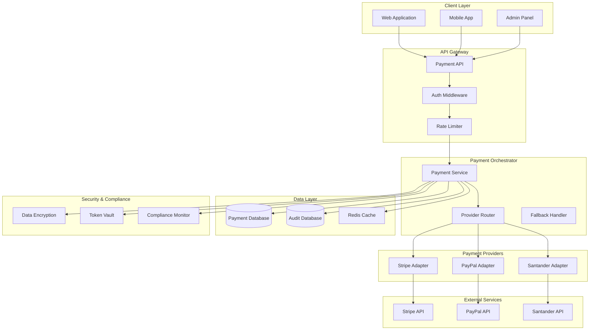

# Multi-Provider Payment Integration Architecture

## System Overview

The MeAndMyDoggy payment system integrates multiple payment providers (Stripe, PayPal, Santander) through a unified interface, providing secure payment processing, subscription management, and PCI DSS compliance.

## Architecture Diagram



## Core Payment Service

```csharp
public interface IPaymentService
{
    Task<PaymentResult> ProcessPaymentAsync(PaymentRequest request);
    Task<SubscriptionResult> CreateSubscriptionAsync(SubscriptionRequest request);
    Task<RefundResult> ProcessRefundAsync(RefundRequest request);
    Task<PaymentMethod> SavePaymentMethodAsync(SavePaymentMethodRequest request);
    Task<List<PaymentMethod>> GetPaymentMethodsAsync(string userId);
}

public class PaymentService : IPaymentService
{
    private readonly IPaymentProviderFactory _providerFactory;
    private readonly IPaymentRepository _paymentRepository;
    private readonly IEncryptionService _encryptionService;
    private readonly IComplianceService _complianceService;
    private readonly ILogger<PaymentService> _logger;

    public async Task<PaymentResult> ProcessPaymentAsync(PaymentRequest request)
    {
        // Validate request
        var validationResult = await ValidatePaymentRequestAsync(request);
        if (!validationResult.IsValid)
        {
            return PaymentResult.Failed(validationResult.Errors);
        }

        // Determine best provider
        var provider = await _providerFactory.GetOptimalProviderAsync(request);
        
        try
        {
            // Process payment
            var result = await provider.ProcessPaymentAsync(request);
            
            // Store transaction record
            await _paymentRepository.SaveTransactionAsync(new PaymentTransaction
            {
                Id = Guid.NewGuid().ToString(),
                UserId = request.UserId,
                Amount = request.Amount,
                Currency = request.Currency,
                Provider = provider.Name,
                Status = result.Status,
                ExternalTransactionId = result.TransactionId,
                CreatedAt = DateTime.UtcNow
            });

            // Compliance logging
            await _complianceService.LogPaymentEventAsync(request, result);

            return result;
        }
        catch (PaymentProviderException ex)
        {
            _logger.LogError(ex, "Payment processing failed for provider {Provider}", provider.Name);
            
            // Try fallback provider
            var fallbackProvider = await _providerFactory.GetFallbackProviderAsync(request, provider.Name);
            if (fallbackProvider != null)
            {
                return await fallbackProvider.ProcessPaymentAsync(request);
            }
            
            throw;
        }
    }
}
```

## Provider Adapters

### Stripe Adapter

```csharp
public class StripePaymentAdapter : IPaymentProvider
{
    private readonly StripeClient _stripeClient;
    private readonly IConfiguration _configuration;
    private readonly ILogger<StripePaymentAdapter> _logger;

    public string Name => "Stripe";
    public bool IsAvailable => true;

    public async Task<PaymentResult> ProcessPaymentAsync(PaymentRequest request)
    {
        try
        {
            var paymentIntentService = new PaymentIntentService(_stripeClient);
            
            var createOptions = new PaymentIntentCreateOptions
            {
                Amount = (long)(request.Amount * 100), // Convert to pence
                Currency = request.Currency.ToLower(),
                PaymentMethod = request.PaymentMethodId,
                ConfirmationMethod = "manual",
                Confirm = true,
                Metadata = new Dictionary<string, string>
                {
                    ["user_id"] = request.UserId,
                    ["booking_id"] = request.BookingId,
                    ["platform"] = "MeAndMyDoggy"
                }
            };

            var paymentIntent = await paymentIntentService.CreateAsync(createOptions);

            return new PaymentResult
            {
                IsSuccess = paymentIntent.Status == "succeeded",
                TransactionId = paymentIntent.Id,
                Status = MapStripeStatus(paymentIntent.Status),
                Amount = request.Amount,
                Currency = request.Currency,
                ProcessedAt = DateTime.UtcNow,
                ProviderResponse = paymentIntent.ToJson()
            };
        }
        catch (StripeException ex)
        {
            _logger.LogError(ex, "Stripe payment failed: {Error}", ex.Message);
            
            return new PaymentResult
            {
                IsSuccess = false,
                ErrorCode = ex.StripeError.Code,
                ErrorMessage = ex.StripeError.Message,
                Status = PaymentStatus.Failed
            };
        }
    }

    public async Task<SubscriptionResult> CreateSubscriptionAsync(SubscriptionRequest request)
    {
        var subscriptionService = new SubscriptionService(_stripeClient);
        
        var createOptions = new SubscriptionCreateOptions
        {
            Customer = request.CustomerId,
            Items = new List<SubscriptionItemOptions>
            {
                new SubscriptionItemOptions
                {
                    Price = request.PriceId
                }
            },
            PaymentBehavior = "default_incomplete",
            PaymentSettings = new SubscriptionPaymentSettingsOptions
            {
                SaveDefaultPaymentMethod = "on_subscription"
            },
            Metadata = new Dictionary<string, string>
            {
                ["user_id"] = request.UserId,
                ["plan"] = request.PlanType
            }
        };

        var subscription = await subscriptionService.CreateAsync(createOptions);
        
        return new SubscriptionResult
        {
            IsSuccess = true,
            SubscriptionId = subscription.Id,
            Status = MapSubscriptionStatus(subscription.Status),
            ClientSecret = subscription.LatestInvoice?.PaymentIntent?.ClientSecret
        };
    }
}
```

### PayPal Adapter

```csharp
public class PayPalPaymentAdapter : IPaymentProvider
{
    private readonly PayPalHttpClient _paypalClient;
    private readonly IConfiguration _configuration;
    private readonly ILogger<PayPalPaymentAdapter> _logger;

    public string Name => "PayPal";
    public bool IsAvailable => true;

    public async Task<PaymentResult> ProcessPaymentAsync(PaymentRequest request)
    {
        try
        {
            var orderRequest = new OrdersCreateRequest();
            orderRequest.Prefer("return=representation");
            orderRequest.RequestBody(new OrderRequest()
            {
                CheckoutPaymentIntent = "CAPTURE",
                PurchaseUnits = new List<PurchaseUnitRequest>()
                {
                    new PurchaseUnitRequest()
                    {
                        AmountWithBreakdown = new AmountWithBreakdown()
                        {
                            CurrencyCode = request.Currency,
                            Value = request.Amount.ToString("F2")
                        },
                        Description = $"MeAndMyDoggy Service Payment",
                        CustomId = request.BookingId
                    }
                },
                ApplicationContext = new ApplicationContext()
                {
                    ReturnUrl = $"{_configuration["BaseUrl"]}/payment/success",
                    CancelUrl = $"{_configuration["BaseUrl"]}/payment/cancel"
                }
            });

            var response = await _paypalClient.Execute(orderRequest);
            var order = response.Result<Order>();

            return new PaymentResult
            {
                IsSuccess = true,
                TransactionId = order.Id,
                Status = PaymentStatus.Pending,
                Amount = request.Amount,
                Currency = request.Currency,
                ProcessedAt = DateTime.UtcNow,
                RedirectUrl = order.Links.FirstOrDefault(l => l.Rel == "approve")?.Href
            };
        }
        catch (Exception ex)
        {
            _logger.LogError(ex, "PayPal payment creation failed");
            
            return new PaymentResult
            {
                IsSuccess = false,
                ErrorMessage = ex.Message,
                Status = PaymentStatus.Failed
            };
        }
    }
}
```

## Security Implementation

### PCI DSS Compliance

```csharp
public class PCIComplianceService : IPCIComplianceService
{
    private readonly IAuditLogger _auditLogger;
    private readonly IEncryptionService _encryptionService;

    public async Task<bool> ValidateCardDataAsync(CardData cardData)
    {
        // Never store full PAN
        if (ContainsFullPAN(cardData))
        {
            throw new SecurityException("Full PAN detected in card data");
        }

        // Validate card number format
        if (!IsValidCardNumber(cardData.MaskedNumber))
        {
            return false;
        }

        // Log access attempt
        await _auditLogger.LogCardDataAccessAsync(cardData.TokenId);

        return true;
    }

    public async Task<string> TokenizeCardAsync(CardData cardData)
    {
        // Generate secure token
        var token = GenerateSecureToken();
        
        // Store encrypted card data with token reference
        var encryptedData = await _encryptionService.EncryptAsync(cardData.ToJson());
        
        await StoreTokenizedCardAsync(token, encryptedData);
        
        // Audit log
        await _auditLogger.LogTokenizationAsync(token, cardData.UserId);
        
        return token;
    }
}
```

### Data Encryption

```csharp
public class PaymentEncryptionService : IEncryptionService
{
    private readonly IDataProtector _protector;
    private readonly IKeyVaultService _keyVault;

    public async Task<string> EncryptAsync(string data)
    {
        var key = await _keyVault.GetEncryptionKeyAsync("payment-data");
        return _protector.Protect(data);
    }

    public async Task<string> DecryptAsync(string encryptedData)
    {
        return _protector.Unprotect(encryptedData);
    }
}
```