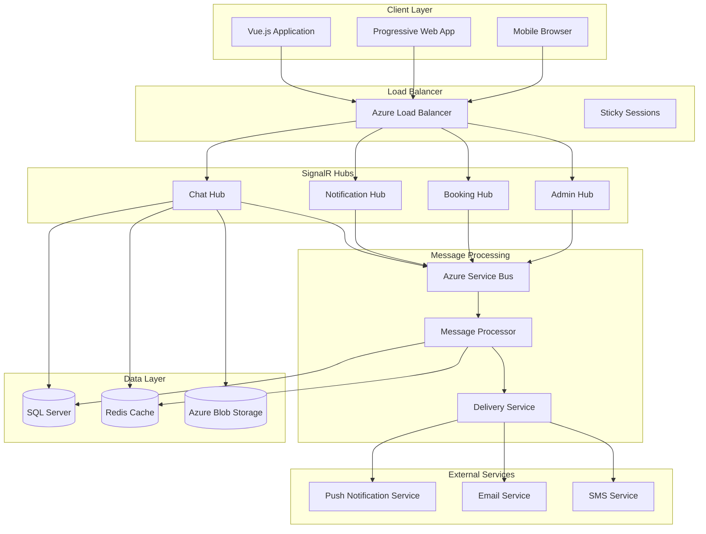

# SignalR Real-time Messaging Architecture

## System Overview

The MeAndMyDoggy real-time messaging system uses ASP.NET Core SignalR with Vue.js frontend integration to provide instant messaging, notifications, and live updates across the platform.

## Architecture Diagram



## SignalR Hub Implementation

### Core Hub Structure

```csharp
[Authorize]
public class ChatHub : Hub
{
    private readonly IMessageService _messageService;
    private readonly IUserConnectionManager _connectionManager;
    private readonly INotificationService _notificationService;
    private readonly ILogger<ChatHub> _logger;

    public ChatHub(
        IMessageService messageService,
        IUserConnectionManager connectionManager,
        INotificationService notificationService,
        ILogger<ChatHub> logger)
    {
        _messageService = messageService;
        _connectionManager = connectionManager;
        _notificationService = notificationService;
        _logger = logger;
    }

    public override async Task OnConnectedAsync()
    {
        var userId = Context.UserIdentifier;
        await _connectionManager.AddConnectionAsync(userId, Context.ConnectionId);
        
        // Join user-specific group for notifications
        await Groups.AddToGroupAsync(Context.ConnectionId, $"user_{userId}");
        
        // Update user online status
        await Clients.All.SendAsync("UserOnline", userId);
        
        _logger.LogInformation("User {UserId} connected with connection {ConnectionId}", 
            userId, Context.ConnectionId);
        
        await base.OnConnectedAsync();
    }

    public override async Task OnDisconnectedAsync(Exception exception)
    {
        var userId = Context.UserIdentifier;
        await _connectionManager.RemoveConnectionAsync(userId, Context.ConnectionId);
        
        // Check if user has other active connections
        var hasOtherConnections = await _connectionManager.HasActiveConnectionsAsync(userId);
        if (!hasOtherConnections)
        {
            await Clients.All.SendAsync("UserOffline", userId);
        }
        
        _logger.LogInformation("User {UserId} disconnected from connection {ConnectionId}", 
            userId, Context.ConnectionId);
        
        await base.OnDisconnectedAsync(exception);
    }

    [HubMethodName("SendMessage")]
    public async Task SendMessageAsync(string recipientId, string content, string messageType = "Text")
    {
        var senderId = Context.UserIdentifier;
        
        try
        {
            // Validate message
            if (string.IsNullOrWhiteSpace(content) || content.Length > 4000)
            {
                await Clients.Caller.SendAsync("MessageError", "Invalid message content");
                return;
            }

            // Create message
            var message = await _messageService.CreateMessageAsync(new CreateMessageRequest
            {
                SenderId = senderId,
                RecipientId = recipientId,
                Content = content,
                MessageType = messageType
            });

            // Send to recipient if online
            var recipientConnections = await _connectionManager.GetConnectionsAsync(recipientId);
            if (recipientConnections.Any())
            {
                await Clients.Clients(recipientConnections).SendAsync("ReceiveMessage", message);
            }

            // Send confirmation to sender
            await Clients.Caller.SendAsync("MessageSent", message);

            // Send push notification if recipient is offline
            if (!recipientConnections.Any())
            {
                await _notificationService.SendPushNotificationAsync(recipientId, 
                    "New Message", content, message.Id);
            }

            _logger.LogInformation("Message sent from {SenderId} to {RecipientId}", 
                senderId, recipientId);
        }
        catch (Exception ex)
        {
            _logger.LogError(ex, "Error sending message from {SenderId} to {RecipientId}", 
                senderId, recipientId);
            await Clients.Caller.SendAsync("MessageError", "Failed to send message");
        }
    }

    [HubMethodName("JoinConversation")]
    public async Task JoinConversationAsync(string conversationId)
    {
        var userId = Context.UserIdentifier;
        
        // Verify user has access to conversation
        var hasAccess = await _messageService.HasConversationAccessAsync(userId, conversationId);
        if (!hasAccess)
        {
            await Clients.Caller.SendAsync("ConversationError", "Access denied");
            return;
        }

        await Groups.AddToGroupAsync(Context.ConnectionId, $"conversation_{conversationId}");
        
        // Mark messages as read
        await _messageService.MarkMessagesAsReadAsync(conversationId, userId);
        
        // Notify other participants
        await Clients.Group($"conversation_{conversationId}")
            .SendAsync("UserJoinedConversation", conversationId, userId);
    }

    [HubMethodName("LeaveConversation")]
    public async Task LeaveConversationAsync(string conversationId)
    {
        var userId = Context.UserIdentifier;
        
        await Groups.RemoveFromGroupAsync(Context.ConnectionId, $"conversation_{conversationId}");
        
        // Notify other participants
        await Clients.Group($"conversation_{conversationId}")
            .SendAsync("UserLeftConversation", conversationId, userId);
    }

    [HubMethodName("StartTyping")]
    public async Task StartTypingAsync(string conversationId)
    {
        var userId = Context.UserIdentifier;
        
        await Clients.Group($"conversation_{conversationId}")
            .SendAsync("UserStartedTyping", conversationId, userId);
    }

    [HubMethodName("StopTyping")]
    public async Task StopTypingAsync(string conversationId)
    {
        var userId = Context.UserIdentifier;
        
        await Clients.Group($"conversation_{conversationId}")
            .SendAsync("UserStoppedTyping", conversationId, userId);
    }
}
```

### Connection Management Service

```csharp
public interface IUserConnectionManager
{
    Task AddConnectionAsync(string userId, string connectionId);
    Task RemoveConnectionAsync(string userId, string connectionId);
    Task<IEnumerable<string>> GetConnectionsAsync(string userId);
    Task<bool> HasActiveConnectionsAsync(string userId);
    Task<IEnumerable<string>> GetOnlineUsersAsync();
}

public class UserConnectionManager : IUserConnectionManager
{
    private readonly IDistributedCache _cache;
    private readonly ILogger<UserConnectionManager> _logger;
    private const int ConnectionExpiryMinutes = 30;

    public UserConnectionManager(IDistributedCache cache, ILogger<UserConnectionManager> logger)
    {
        _cache = cache;
        _logger = logger;
    }

    public async Task AddConnectionAsync(string userId, string connectionId)
    {
        var key = $"user_connections:{userId}";
        var connections = await GetUserConnectionsAsync(userId);
        
        connections.Add(new UserConnection
        {
            ConnectionId = connectionId,
            ConnectedAt = DateTime.UtcNow,
            LastActivity = DateTime.UtcNow
        });

        await SetUserConnectionsAsync(userId, connections);
        
        _logger.LogDebug("Added connection {ConnectionId} for user {UserId}", 
            connectionId, userId);
    }

    public async Task RemoveConnectionAsync(string userId, string connectionId)
    {
        var connections = await GetUserConnectionsAsync(userId);
        connections.RemoveAll(c => c.ConnectionId == connectionId);
        
        await SetUserConnectionsAsync(userId, connections);
        
        _logger.LogDebug("Removed connection {ConnectionId} for user {UserId}", 
            connectionId, userId);
    }

    public async Task<IEnumerable<string>> GetConnectionsAsync(string userId)
    {
        var connections = await GetUserConnectionsAsync(userId);
        return connections.Select(c => c.ConnectionId);
    }

    public async Task<bool> HasActiveConnectionsAsync(string userId)
    {
        var connections = await GetUserConnectionsAsync(userId);
        return connections.Any();
    }

    private async Task<List<UserConnection>> GetUserConnectionsAsync(string userId)
    {
        var key = $"user_connections:{userId}";
        var connectionsJson = await _cache.GetStringAsync(key);
        
        if (string.IsNullOrEmpty(connectionsJson))
            return new List<UserConnection>();
        
        var connections = JsonSerializer.Deserialize<List<UserConnection>>(connectionsJson);
        
        // Remove expired connections
        var activeConnections = connections
            .Where(c => c.LastActivity > DateTime.UtcNow.AddMinutes(-ConnectionExpiryMinutes))
            .ToList();
        
        if (activeConnections.Count != connections.Count)
        {
            await SetUserConnectionsAsync(userId, activeConnections);
        }
        
        return activeConnections;
    }

    private async Task SetUserConnectionsAsync(string userId, List<UserConnection> connections)
    {
        var key = $"user_connections:{userId}";
        var connectionsJson = JsonSerializer.Serialize(connections);
        
        var options = new DistributedCacheEntryOptions
        {
            SlidingExpiration = TimeSpan.FromMinutes(ConnectionExpiryMinutes)
        };
        
        await _cache.SetStringAsync(key, connectionsJson, options);
    }
}

public class UserConnection
{
    public string ConnectionId { get; set; }
    public DateTime ConnectedAt { get; set; }
    public DateTime LastActivity { get; set; }
}
```

## Vue.js SignalR Integration

### SignalR Store (Pinia)

```typescript
// stores/signalr.ts
import { defineStore } from 'pinia'
import { ref, computed } from 'vue'
import * as signalR from '@microsoft/signalr'
import { useAuthStore } from './auth'
import type { Message, Conversation, NotificationMessage } from '@types/messaging'

export const useSignalRStore = defineStore('signalr', () => {
  // State
  const connection = ref<signalR.HubConnection | null>(null)
  const isConnected = ref(false)
  const isConnecting = ref(false)
  const connectionError = ref<string | null>(null)
  const messages = ref<Message[]>([])
  const conversations = ref<Conversation[]>([])
  const notifications = ref<NotificationMessage[]>([])
  const onlineUsers = ref<Set<string>>(new Set())
  const typingUsers = ref<Map<string, Set<string>>>(new Map())

  // Getters
  const connectionState = computed(() => {
    if (!connection.value) return 'Disconnected'
    return signalR.HubConnectionState[connection.value.state]
  })

  const unreadNotifications = computed(() => 
    notifications.value.filter(n => !n.isRead).length
  )

  // Actions
  async function connect(): Promise<void> {
    const authStore = useAuthStore()
    
    if (!authStore.isAuthenticated || isConnected.value || isConnecting.value) {
      return
    }

    try {
      isConnecting.value = true
      connectionError.value = null

      connection.value = new signalR.HubConnectionBuilder()
        .withUrl('/hubs/chat', {
          accessTokenFactory: () => authStore.token || '',
          transport: signalR.HttpTransportType.WebSockets
        })
        .withAutomaticReconnect({
          nextRetryDelayInMilliseconds: (retryContext) => {
            // Exponential backoff: 0, 2, 10, 30 seconds, then 30 seconds
            if (retryContext.previousRetryCount === 0) return 0
            if (retryContext.previousRetryCount === 1) return 2000
            if (retryContext.previousRetryCount === 2) return 10000
            return 30000
          }
        })
        .configureLogging(signalR.LogLevel.Information)
        .build()

      // Set up event handlers
      setupEventHandlers()

      // Start connection
      await connection.value.start()
      isConnected.value = true

      console.log('SignalR connected successfully')
    } catch (error: any) {
      connectionError.value = error.message || 'Failed to connect to SignalR'
      console.error('SignalR connection error:', error)
    } finally {
      isConnecting.value = false
    }
  }

  async function disconnect(): Promise<void> {
    if (connection.value) {
      try {
        await connection.value.stop()
      } catch (error) {
        console.error('Error stopping SignalR connection:', error)
      } finally {
        connection.value = null
        isConnected.value = false
        isConnecting.value = false
        connectionError.value = null
      }
    }
  }

  function setupEventHandlers(): void {
    if (!connection.value) return

    // Message events
    connection.value.on('ReceiveMessage', (message: Message) => {
      messages.value.push(message)
      updateConversationLastMessage(message)
      
      // Show notification if not in active conversation
      if (!isConversationActive(message.conversationId)) {
        showMessageNotification(message)
      }
    })

    connection.value.on('MessageSent', (message: Message) => {
      // Update local message with server response
      const localMessage = messages.value.find(m => m.tempId === message.tempId)
      if (localMessage) {
        Object.assign(localMessage, message)
      } else {
        messages.value.push(message)
      }
      updateConversationLastMessage(message)
    })

    connection.value.on('MessageError', (error: string) => {
      console.error('Message error:', error)
      // Handle message send failure
    })

    // Typing events
    connection.value.on('UserStartedTyping', (conversationId: string, userId: string) => {
      if (!typingUsers.value.has(conversationId)) {
        typingUsers.value.set(conversationId, new Set())
      }
      typingUsers.value.get(conversationId)?.add(userId)
    })

    connection.value.on('UserStoppedTyping', (conversationId: string, userId: string) => {
      typingUsers.value.get(conversationId)?.delete(userId)
    })

    // Presence events
    connection.value.on('UserOnline', (userId: string) => {
      onlineUsers.value.add(userId)
    })

    connection.value.on('UserOffline', (userId: string) => {
      onlineUsers.value.delete(userId)
    })

    // Notification events
    connection.value.on('ReceiveNotification', (notification: NotificationMessage) => {
      notifications.value.unshift(notification)
      showPushNotification(notification)
    })

    // Connection state events
    connection.value.onreconnecting((error) => {
      isConnected.value = false
      connectionError.value = error?.message || 'Reconnecting...'
      console.log('SignalR reconnecting:', error)
    })

    connection.value.onreconnected((connectionId) => {
      isConnected.value = true
      connectionError.value = null
      console.log('SignalR reconnected:', connectionId)
      
      // Rejoin active conversations
      rejoinActiveConversations()
    })

    connection.value.onclose((error) => {
      isConnected.value = false
      connectionError.value = error?.message || 'Connection closed'
      console.log('SignalR connection closed:', error)
    })
  }

  // Message methods
  async function sendMessage(
    recipientId: string, 
    content: string, 
    messageType: string = 'Text'
  ): Promise<boolean> {
    if (!connection.value || !isConnected.value) {
      throw new Error('Not connected to SignalR')
    }

    try {
      // Create optimistic message
      const tempMessage: Message = {
        id: '',
        tempId: generateTempId(),
        conversationId: getOrCreateConversationId(recipientId),
        senderId: useAuthStore().user?.id || '',
        recipientId,
        content,
        messageType,
        timestamp: new Date().toISOString(),
        deliveryStatus: 'sending',
        isRead: false
      }

      messages.value.push(tempMessage)

      await connection.value.invoke('SendMessage', recipientId, content, messageType)
      return true
    } catch (error) {
      console.error('Error sending message:', error)
      return false
    }
  }

  async function joinConversation(conversationId: string): Promise<void> {
    if (!connection.value || !isConnected.value) return

    try {
      await connection.value.invoke('JoinConversation', conversationId)
    } catch (error) {
      console.error('Error joining conversation:', error)
    }
  }

  async function leaveConversation(conversationId: string): Promise<void> {
    if (!connection.value || !isConnected.value) return

    try {
      await connection.value.invoke('LeaveConversation', conversationId)
    } catch (error) {
      console.error('Error leaving conversation:', error)
    }
  }

  async function startTyping(conversationId: string): Promise<void> {
    if (!connection.value || !isConnected.value) return

    try {
      await connection.value.invoke('StartTyping', conversationId)
    } catch (error) {
      console.error('Error starting typing:', error)
    }
  }

  async function stopTyping(conversationId: string): Promise<void> {
    if (!connection.value || !isConnected.value) return

    try {
      await connection.value.invoke('StopTyping', conversationId)
    } catch (error) {
      console.error('Error stopping typing:', error)
    }
  }

  // Helper functions
  function updateConversationLastMessage(message: Message): void {
    const conversation = conversations.value.find(c => c.id === message.conversationId)
    if (conversation) {
      conversation.lastMessage = message
      conversation.updatedAt = message.timestamp
    }
  }

  function isConversationActive(conversationId: string): boolean {
    // Check if user is currently viewing this conversation
    return window.location.pathname.includes(`/messages/${conversationId}`)
  }

  function showMessageNotification(message: Message): void {
    // Show browser notification or toast
    if ('Notification' in window && Notification.permission === 'granted') {
      new Notification('New Message', {
        body: message.content,
        icon: '/images/logo.png'
      })
    }
  }

  function showPushNotification(notification: NotificationMessage): void {
    // Handle push notification display
    window.toast?.info(notification.message, {
      title: notification.title,
      duration: 5000
    })
  }

  function generateTempId(): string {
    return `temp_${Date.now()}_${Math.random().toString(36).substr(2, 9)}`
  }

  function getOrCreateConversationId(recipientId: string): string {
    const authStore = useAuthStore()
    const currentUserId = authStore.user?.id || ''
    
    // Find existing conversation
    const existingConversation = conversations.value.find(c => 
      c.participants.some(p => p.userId === recipientId) &&
      c.participants.some(p => p.userId === currentUserId)
    )
    
    if (existingConversation) {
      return existingConversation.id
    }
    
    // Create temporary conversation ID
    return `temp_${[currentUserId, recipientId].sort().join('_')}`
  }

  async function rejoinActiveConversations(): Promise<void> {
    // Rejoin conversations that were active before disconnection
    const activeConversations = conversations.value.filter(c => c.isActive)
    for (const conversation of activeConversations) {
      await joinConversation(conversation.id)
    }
  }

  function isUserOnline(userId: string): boolean {
    return onlineUsers.value.has(userId)
  }

  function getTypingUsers(conversationId: string): string[] {
    return Array.from(typingUsers.value.get(conversationId) || [])
  }

  function markNotificationAsRead(notificationId: string): void {
    const notification = notifications.value.find(n => n.id === notificationId)
    if (notification) {
      notification.isRead = true
    }
  }

  function clearNotifications(): void {
    notifications.value = []
  }

  return {
    // State
    connection,
    isConnected,
    isConnecting,
    connectionError,
    messages,
    conversations,
    notifications,
    onlineUsers,
    typingUsers,

    // Getters
    connectionState,
    unreadNotifications,

    // Actions
    connect,
    disconnect,
    sendMessage,
    joinConversation,
    leaveConversation,
    startTyping,
    stopTyping,
    isUserOnline,
    getTypingUsers,
    markNotificationAsRead,
    clearNotifications
  }
})
```

## Scaling and Performance

### Redis Backplane Configuration

```csharp
// Program.cs
services.AddSignalR(options =>
{
    options.EnableDetailedErrors = builder.Environment.IsDevelopment();
    options.MaximumReceiveMessageSize = 1024 * 1024; // 1MB
    options.StreamBufferCapacity = 10;
})
.AddStackExchangeRedis(connectionString, options =>
{
    options.Configuration.ChannelPrefix = "MeAndMyDog_SignalR";
});

// Redis connection configuration
services.AddStackExchangeRedisCache(options =>
{
    options.Configuration = builder.Configuration.GetConnectionString("Redis");
    options.InstanceName = "MeAndMyDog";
});
```

### Message Queue Integration

```csharp
public class MessageQueueService : IMessageQueueService
{
    private readonly ServiceBusClient _serviceBusClient;
    private readonly ServiceBusSender _messageSender;
    private readonly ILogger<MessageQueueService> _logger;

    public MessageQueueService(
        ServiceBusClient serviceBusClient,
        ILogger<MessageQueueService> logger)
    {
        _serviceBusClient = serviceBusClient;
        _messageSender = _serviceBusClient.CreateSender("messages");
        _logger = logger;
    }

    public async Task QueueMessageAsync(Message message)
    {
        try
        {
            var messageBody = JsonSerializer.Serialize(message);
            var serviceBusMessage = new ServiceBusMessage(messageBody)
            {
                MessageId = message.Id,
                CorrelationId = message.ConversationId,
                Subject = "NewMessage"
            };

            await _messageSender.SendMessageAsync(serviceBusMessage);
            
            _logger.LogInformation("Message {MessageId} queued successfully", message.Id);
        }
        catch (Exception ex)
        {
            _logger.LogError(ex, "Failed to queue message {MessageId}", message.Id);
            throw;
        }
    }
}
```

## Security Implementation

### JWT Authentication for SignalR

```csharp
// SignalR JWT Authentication
services.AddAuthentication(JwtBearerDefaults.AuthenticationScheme)
    .AddJwtBearer(options =>
    {
        options.Events = new JwtBearerEvents
        {
            OnMessageReceived = context =>
            {
                var accessToken = context.Request.Query["access_token"];
                var path = context.HttpContext.Request.Path;
                
                if (!string.IsNullOrEmpty(accessToken) && path.StartsWithSegments("/hubs"))
                {
                    context.Token = accessToken;
                }
                
                return Task.CompletedTask;
            }
        };
    });
```

### Message Encryption

```csharp
public class MessageEncryptionService : IMessageEncryptionService
{
    private readonly IDataProtector _protector;

    public MessageEncryptionService(IDataProtectionProvider provider)
    {
        _protector = provider.CreateProtector("MessageEncryption");
    }

    public string EncryptMessage(string content)
    {
        return _protector.Protect(content);
    }

    public string DecryptMessage(string encryptedContent)
    {
        return _protector.Unprotect(encryptedContent);
    }
}
```

## Monitoring and Diagnostics

### Performance Counters

```csharp
public class SignalRMetrics
{
    private readonly IMetrics _metrics;
    private readonly Counter<int> _connectionsCounter;
    private readonly Counter<int> _messagesCounter;
    private readonly Histogram<double> _messageLatency;

    public SignalRMetrics(IMetrics metrics)
    {
        _metrics = metrics;
        _connectionsCounter = _metrics.CreateCounter<int>("signalr_connections");
        _messagesCounter = _metrics.CreateCounter<int>("signalr_messages");
        _messageLatency = _metrics.CreateHistogram<double>("signalr_message_latency");
    }

    public void RecordConnection() => _connectionsCounter.Add(1);
    public void RecordMessage() => _messagesCounter.Add(1);
    public void RecordMessageLatency(double latency) => _messageLatency.Record(latency);
}
```

This completes the comprehensive SignalR architecture specification. The system provides:

1. **Scalable Architecture** with Redis backplane and message queuing
2. **Real-time Communication** with typing indicators and presence
3. **Vue.js Integration** with reactive state management
4. **Security** with JWT authentication and message encryption
5. **Performance Monitoring** with metrics and diagnostics
6. **Error Handling** with automatic reconnection and fallback
7. **Mobile Optimization** with efficient connection management

The architecture supports horizontal scaling, handles network interruptions gracefully, and provides a seamless real-time experience across all devices.