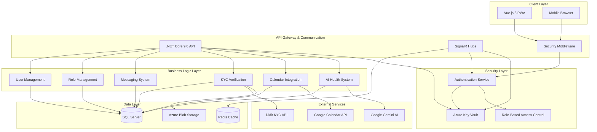
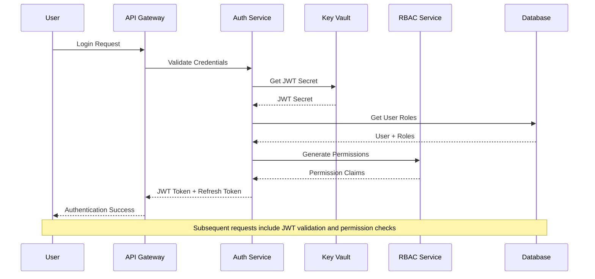

# MeAndMyDoggyV2 Unified Architecture Document

## Introduction

This document outlines the complete system architecture for **MeAndMyDoggyV2**, consolidating all technical specifications into a unified blueprint for AI-driven development. It serves as the definitive architectural guide ensuring consistency and adherence to chosen patterns and technologies across all platform features.

**Document Purpose:**
This unified architecture consolidates 8 comprehensive technical specifications: Azure Key Vault Integration, Infrastructure Security, Role Management System, SignalR Real-time Communication, KYC Verification System, Comprehensive Messaging Platform, Calendar Integration & Availability Management, and Gemini AI Integration.

### Project Foundation Analysis

**Status: BROWNFIELD PROJECT WITH CRITICAL ENHANCEMENTS**

This is a comprehensive enhancement of an existing .NET Core 9.0 pet services platform requiring immediate security fixes and feature consolidation:

**Existing Infrastructure:**
- Complete .NET Core 9.0 API with Entity Framework Core
- Vue.js 3 frontend with Tailwind CSS and Vite build system
- SQL Server database with migration infrastructure
- Basic Azure integration (requires Key Vault migration)
- Initial SignalR messaging implementation
- Foundational authentication system

**Critical Security Requirements:**
- **URGENT**: Migrate exposed credentials from appsettings.json to Azure Key Vault
- Implement comprehensive role-based access control
- Establish secure secrets management across all services
- Ensure KYC verification gates all provider interactions

**Business Model Integration:**
- Subscription-based platform (Free/Premium tiers)
- KYC verification required for all service providers
- Real-time messaging with video calling capabilities
- AI-powered health recommendations
- Manual peer-to-peer payments (no platform payment processing for bookings)

### Change Log

| Date | Version | Description | Author |
|------|---------|-------------|---------|
| 2025-07-19 | 1.0 | Unified architecture consolidating 8 technical specifications | Winston (Architect) |

## High Level Architecture

### Technical Summary

MeAndMyDoggyV2 employs a **secure monolithic architecture with microservices-ready structure** using .NET Core 9.0 and Vue.js 3. The system prioritizes security-first design with Azure Key Vault integration, comprehensive role-based access control, and KYC-gated provider interactions. Core features include real-time SignalR communication, AI-powered health recommendations via Google Gemini, integrated calendar management, and subscription-based business model. The architecture supports immediate security remediation while enabling scalable feature development through clean separation of concerns and established integration patterns.

### High Level Overview

**1. Architectural Style**
- **Secure Monolithic Architecture** with clear domain boundaries
- Clean Architecture with security-first design principles
- Feature-based organization enabling future microservices extraction
- Azure-native security and secrets management

**2. Repository Structure**
- **Monorepo** approach with secure configuration management
- Clear separation between API, Web, Shared, and Infrastructure layers
- Centralized secrets management via Azure Key Vault

**3. Service Architecture**
- Single deployable unit with modular security boundaries
- Role-based access control across all service interactions
- KYC verification workflow with manual admin fallback
- Real-time communication via secured SignalR hubs

**4. Security-First User Flow**
- User registration → KYC verification → Role assignment → Feature access
- Continuous authentication validation and permission checking
- Secure real-time messaging and AI-assisted interactions

**5. Key Architectural Decisions**
- **Security Priority**: Azure Key Vault for all secrets and credentials
- **Access Control**: Comprehensive RBAC with 4-tier role system
- **Real-Time Communication**: SignalR with authentication and authorization
- **AI Integration**: Google Gemini with cost tracking and rate limiting
- **Verification Workflow**: Didit KYC with manual admin review fallback

### System Architecture Diagram



### Architectural Patterns

**Security Patterns:**
- **Zero Trust Architecture:** Every request authenticated and authorized - _Rationale:_ Critical for protecting user data and preventing unauthorized access
- **Secrets Management Pattern:** Centralized Azure Key Vault for all credentials - _Rationale:_ Eliminates hardcoded secrets and provides audit trail
- **Role-Based Access Control (RBAC):** Granular permissions with role hierarchy - _Rationale:_ Supports complex business rules and compliance requirements

**Communication Patterns:**
- **Real-Time Messaging:** SignalR with authentication integration - _Rationale:_ Enables instant communication while maintaining security
- **API Gateway Pattern:** Centralized authentication and routing - _Rationale:_ Provides security boundary and cross-cutting concerns
- **Event-Driven Updates:** SignalR for real-time notifications - _Rationale:_ Supports responsive user experience

**Integration Patterns:**
- **External Service Wrapper:** Abstracted third-party integrations - _Rationale:_ Enables testing and provides fallback mechanisms
- **Repository Pattern:** Data access abstraction with caching - _Rationale:_ Improves performance and enables future database migrations
- **Command Query Responsibility Segregation (CQRS):** Separate read/write operations - _Rationale:_ Optimizes performance for complex queries

## Tech Stack

### Cloud Infrastructure
- **Provider:** Microsoft Azure
- **Key Services:** App Service, SQL Database, Key Vault, SignalR Service, Redis Cache, Blob Storage, Application Insights
- **Security Services:** Azure Active Directory, Key Vault, Application Gateway
- **Deployment Regions:** Primary: East US, Secondary: West US

### Technology Stack Table

| Category | Technology | Version | Purpose | Rationale |
|----------|------------|---------|---------|-----------|
| **Language** | C# | 12.0 | Primary backend language | Strong typing, mature ecosystem, Azure integration |
| **Runtime** | .NET Core | 9.0 | Application runtime | Latest LTS, high performance, Azure-native |
| **Framework** | ASP.NET Core | 9.0 | Web API framework | Built-in security, middleware pipeline, Azure integration |
| **ORM** | Entity Framework Core | 9.0 | Data access layer | Code-first migrations, strong typing, performance |
| **Database** | SQL Server | 2022 | Primary database | ACID compliance, advanced security features |
| **Cache** | Redis | 7.0 | Distributed caching | High performance, SignalR scaling, session storage |
| **Real-time** | SignalR | 9.0 | Real-time communication | Native .NET integration, authentication support |
| **Frontend** | Vue.js | 3.5+ | Client application | Composition API, TypeScript support, progressive enhancement |
| **UI Framework** | Tailwind CSS | 3.4+ | Styling framework | Utility-first, responsive design, rapid development |
| **Build Tool** | Vite | 5.0+ | Frontend build system | Fast HMR, modern bundling, Vue.js optimized |
| **Authentication** | ASP.NET Core Identity | 9.0 | User authentication | Integrated security, RBAC, JWT support |
| **Secrets** | Azure Key Vault | 2024-04-01 | Secrets management | Secure credential storage, audit logging, Azure integration |
| **AI Service** | Google Gemini | 1.5 | AI/ML capabilities | Advanced language model, image analysis, content moderation |
| **KYC Service** | Didit API | v1 | Identity verification | Document verification, compliance, global coverage |
| **File Storage** | Azure Blob Storage | 2023-11-03 | Document storage | Secure file storage, CDN integration, scalability |
| **Monitoring** | Application Insights | Latest | Application monitoring | Performance tracking, error logging, custom metrics |
| **Testing** | xUnit | 2.6+ | Unit testing framework | .NET standard, parameterized tests, parallel execution |

## Security Architecture

### Azure Key Vault Integration

**Purpose:** Centralized secrets management for all application credentials and configuration

**Key Vault Configuration:**
```csharp
// Service Registration
services.AddAzureKeyVault(configuration, hostEnvironment);

// Usage Pattern
public class SecureService
{
    private readonly IConfiguration _config;
    
    public SecureService(IConfiguration config)
    {
        _config = config;
    }
    
    public async Task<string> GetSecretAsync(string secretName)
    {
        return _config[secretName]; // Automatically resolved from Key Vault
    }
}
```

**Secrets Structure:**
- `ConnectionStrings--DefaultConnection`: SQL Server connection string
- `Didit--ApiKey`: KYC verification API key
- `Gemini--ApiKey`: Google Gemini AI API key
- `Google--Calendar--ClientId`: Calendar integration credentials
- `SignalR--ConnectionString`: SignalR service connection
- `JWT--SecretKey`: Token signing key
- `JWT--RefreshKey`: Refresh token signing key

### Role-Based Access Control (RBAC)

**Role Hierarchy:**
1. **User** - Basic platform access, profile management
2. **PetOwner** - Pet management, service booking, messaging
3. **ServiceProvider** - Service offering, calendar management, customer interaction
4. **Admin** - System administration, KYC review, user management

**Permission System:**
```csharp
public static class Permissions
{
    public const string ViewUsers = "users.view";
    public const string ManageUsers = "users.manage";
    public const string ViewKYC = "kyc.view";
    public const string ReviewKYC = "kyc.review";
    public const string ProvideServices = "services.provide";
    public const string BookServices = "services.book";
    public const string AccessMessaging = "messaging.access";
    public const string AccessAI = "ai.access";
    public const string ManageCalendar = "calendar.manage";
    public const string SystemAdmin = "system.admin";
}

// Role-Permission Mapping
public static class RolePermissions
{
    public static readonly Dictionary<string, string[]> Permissions = new()
    {
        ["User"] = new[] { "users.view" },
        ["PetOwner"] = new[] { "users.view", "services.book", "messaging.access", "ai.access" },
        ["ServiceProvider"] = new[] { "users.view", "services.provide", "messaging.access", "calendar.manage", "ai.access" },
        ["Admin"] = new[] { "users.view", "users.manage", "kyc.view", "kyc.review", "system.admin" }
    };
}
```

### Authentication & Authorization Flow



## Data Models & Database Schema

### Core Security Entities

```sql
-- Enhanced User Management with RBAC
CREATE TABLE Users (
    Id UNIQUEIDENTIFIER PRIMARY KEY DEFAULT NEWID(),
    Email NVARCHAR(256) NOT NULL UNIQUE,
    EmailConfirmed BIT NOT NULL DEFAULT 0,
    PasswordHash NVARCHAR(MAX) NOT NULL,
    SecurityStamp NVARCHAR(MAX),
    PhoneNumber NVARCHAR(50),
    PhoneNumberConfirmed BIT NOT NULL DEFAULT 0,
    TwoFactorEnabled BIT NOT NULL DEFAULT 0,
    LockoutEnd DATETIMEOFFSET NULL,
    LockoutEnabled BIT NOT NULL DEFAULT 1,
    AccessFailedCount INT NOT NULL DEFAULT 0,
    CreatedAt DATETIMEOFFSET NOT NULL DEFAULT GETUTCDATE(),
    UpdatedAt DATETIMEOFFSET NOT NULL DEFAULT GETUTCDATE(),
    IsKYCVerified BIT NOT NULL DEFAULT 0,
    KYCCompletedAt DATETIMEOFFSET NULL,
    SubscriptionType NVARCHAR(20) NOT NULL DEFAULT 'Free',
    LastLoginAt DATETIMEOFFSET NULL,
    IsActive BIT NOT NULL DEFAULT 1,
    
    INDEX IX_Users_Email (Email),
    INDEX IX_Users_KYCVerified (IsKYCVerified),
    INDEX IX_Users_SubscriptionType (SubscriptionType),
    INDEX IX_Users_IsActive (IsActive)
);

CREATE TABLE Roles (
    Id INT IDENTITY(1,1) PRIMARY KEY,
    Name NVARCHAR(256) NOT NULL UNIQUE,
    NormalizedName NVARCHAR(256) NOT NULL,
    Description NVARCHAR(500),
    Level INT NOT NULL DEFAULT 1, -- Role hierarchy level
    CreatedAt DATETIMEOFFSET NOT NULL DEFAULT GETUTCDATE(),
    IsActive BIT NOT NULL DEFAULT 1
);

CREATE TABLE Permissions (
    Id INT IDENTITY(1,1) PRIMARY KEY,
    Name NVARCHAR(256) NOT NULL UNIQUE,
    Description NVARCHAR(500),
    Category NVARCHAR(100) NOT NULL, -- users, kyc, messaging, etc.
    CreatedAt DATETIMEOFFSET NOT NULL DEFAULT GETUTCDATE()
);

CREATE TABLE RolePermissions (
    RoleId INT NOT NULL,
    PermissionId INT NOT NULL,
    GrantedAt DATETIMEOFFSET NOT NULL DEFAULT GETUTCDATE(),
    
    PRIMARY KEY (RoleId, PermissionId),
    FOREIGN KEY (RoleId) REFERENCES Roles(Id) ON DELETE CASCADE,
    FOREIGN KEY (PermissionId) REFERENCES Permissions(Id) ON DELETE CASCADE
);

CREATE TABLE UserRoles (
    UserId UNIQUEIDENTIFIER NOT NULL,
    RoleId INT NOT NULL,
    AssignedAt DATETIMEOFFSET NOT NULL DEFAULT GETUTCDATE(),
    AssignedBy UNIQUEIDENTIFIER NOT NULL,
    IsActive BIT NOT NULL DEFAULT 1,
    ExpiresAt DATETIMEOFFSET NULL, -- For temporary role assignments
    
    PRIMARY KEY (UserId, RoleId),
    FOREIGN KEY (UserId) REFERENCES Users(Id) ON DELETE CASCADE,
    FOREIGN KEY (RoleId) REFERENCES Roles(Id) ON DELETE CASCADE,
    FOREIGN KEY (AssignedBy) REFERENCES Users(Id)
);
```

### KYC Verification System

```sql
CREATE TABLE KYCVerifications (
    Id UNIQUEIDENTIFIER PRIMARY KEY DEFAULT NEWID(),
    UserId UNIQUEIDENTIFIER NOT NULL,
    VerificationProvider NVARCHAR(50) NOT NULL DEFAULT 'Didit',
    ExternalVerificationId NVARCHAR(200),
    Status NVARCHAR(20) NOT NULL DEFAULT 'Pending', -- Pending, InProgress, Approved, Rejected, ManualReview
    DocumentType NVARCHAR(50) NOT NULL,
    SubmittedAt DATETIMEOFFSET NOT NULL DEFAULT GETUTCDATE(),
    CompletedAt DATETIMEOFFSET NULL,
    RejectionReason NVARCHAR(500),
    ReviewedBy UNIQUEIDENTIFIER NULL,
    AdminNotes NVARCHAR(1000),
    AutoApproved BIT NOT NULL DEFAULT 0,
    ComplianceScore DECIMAL(5,2) NULL, -- 0-100 compliance score
    DocumentPath NVARCHAR(500), -- Azure Blob Storage path
    
    FOREIGN KEY (UserId) REFERENCES Users(Id) ON DELETE CASCADE,
    FOREIGN KEY (ReviewedBy) REFERENCES Users(Id),
    
    INDEX IX_KYC_User (UserId),
    INDEX IX_KYC_Status (Status),
    INDEX IX_KYC_SubmittedAt (SubmittedAt DESC),
    INDEX IX_KYC_Provider (VerificationProvider)
);

CREATE TABLE KYCDocuments (
    Id UNIQUEIDENTIFIER PRIMARY KEY DEFAULT NEWID(),
    KYCVerificationId UNIQUEIDENTIFIER NOT NULL,
    DocumentType NVARCHAR(50) NOT NULL, -- DriversLicense, Passport, BusinessLicense
    FileName NVARCHAR(255) NOT NULL,
    FilePath NVARCHAR(500) NOT NULL, -- Azure Blob Storage path
    FileSize BIGINT NOT NULL,
    MimeType NVARCHAR(100) NOT NULL,
    UploadedAt DATETIMEOFFSET NOT NULL DEFAULT GETUTCDATE(),
    IsVerified BIT NOT NULL DEFAULT 0,
    VerificationNotes NVARCHAR(1000),
    
    FOREIGN KEY (KYCVerificationId) REFERENCES KYCVerifications(Id) ON DELETE CASCADE,
    
    INDEX IX_KYCDocuments_Verification (KYCVerificationId),
    INDEX IX_KYCDocuments_Type (DocumentType)
);
```

### Messaging System with Real-time Support

```sql
CREATE TABLE Conversations (
    Id UNIQUEIDENTIFIER PRIMARY KEY DEFAULT NEWID(),
    Type NVARCHAR(20) NOT NULL DEFAULT 'Direct', -- Direct, Group, Service, Support
    Title NVARCHAR(200),
    CreatedBy UNIQUEIDENTIFIER NOT NULL,
    CreatedAt DATETIMEOFFSET NOT NULL DEFAULT GETUTCDATE(),
    LastActivity DATETIMEOFFSET NOT NULL DEFAULT GETUTCDATE(),
    IsActive BIT NOT NULL DEFAULT 1,
    IsArchived BIT NOT NULL DEFAULT 0,
    Priority NVARCHAR(20) NOT NULL DEFAULT 'Normal', -- Low, Normal, High, Urgent
    
    FOREIGN KEY (CreatedBy) REFERENCES Users(Id),
    
    INDEX IX_Conversations_LastActivity (LastActivity DESC),
    INDEX IX_Conversations_Type (Type),
    INDEX IX_Conversations_CreatedBy (CreatedBy)
);

CREATE TABLE ConversationParticipants (
    ConversationId UNIQUEIDENTIFIER NOT NULL,
    UserId UNIQUEIDENTIFIER NOT NULL,
    JoinedAt DATETIMEOFFSET NOT NULL DEFAULT GETUTCDATE(),
    Role NVARCHAR(20) NOT NULL DEFAULT 'Member', -- Owner, Admin, Member, Guest
    LastReadAt DATETIMEOFFSET,
    IsActive BIT NOT NULL DEFAULT 1,
    
    PRIMARY KEY (ConversationId, UserId),
    FOREIGN KEY (ConversationId) REFERENCES Conversations(Id) ON DELETE CASCADE,
    FOREIGN KEY (UserId) REFERENCES Users(Id) ON DELETE CASCADE,
    
    INDEX IX_ConversationParticipants_User (UserId),
    INDEX IX_ConversationParticipants_JoinedAt (JoinedAt)
);

CREATE TABLE Messages (
    Id UNIQUEIDENTIFIER PRIMARY KEY DEFAULT NEWID(),
    ConversationId UNIQUEIDENTIFIER NOT NULL,
    SenderId UNIQUEIDENTIFIER NOT NULL,
    Content NVARCHAR(MAX),
    MessageType NVARCHAR(20) NOT NULL DEFAULT 'Text', -- Text, Image, Video, File, System, AI
    Timestamp DATETIMEOFFSET NOT NULL DEFAULT GETUTCDATE(),
    EditedAt DATETIMEOFFSET NULL,
    IsDeleted BIT NOT NULL DEFAULT 0,
    ReplyToMessageId UNIQUEIDENTIFIER NULL,
    IsAIModerated BIT NOT NULL DEFAULT 0,
    ModerationResult NVARCHAR(20), -- Approved, Flagged, Rejected
    DeliveryStatus NVARCHAR(20) NOT NULL DEFAULT 'Sent', -- Sent, Delivered, Read
    
    FOREIGN KEY (ConversationId) REFERENCES Conversations(Id) ON DELETE CASCADE,
    FOREIGN KEY (SenderId) REFERENCES Users(Id),
    FOREIGN KEY (ReplyToMessageId) REFERENCES Messages(Id),
    
    INDEX IX_Messages_Conversation_Timestamp (ConversationId, Timestamp DESC),
    INDEX IX_Messages_Sender (SenderId),
    INDEX IX_Messages_Type (MessageType),
    INDEX IX_Messages_Moderation (IsAIModerated, ModerationResult)
);

CREATE TABLE MessageAttachments (
    Id UNIQUEIDENTIFIER PRIMARY KEY DEFAULT NEWID(),
    MessageId UNIQUEIDENTIFIER NOT NULL,
    FileName NVARCHAR(255) NOT NULL,
    FilePath NVARCHAR(500) NOT NULL, -- Azure Blob Storage path
    FileSize BIGINT NOT NULL,
    MimeType NVARCHAR(100) NOT NULL,
    UploadedAt DATETIMEOFFSET NOT NULL DEFAULT GETUTCDATE(),
    
    FOREIGN KEY (MessageId) REFERENCES Messages(Id) ON DELETE CASCADE,
    
    INDEX IX_MessageAttachments_Message (MessageId)
);
```

### Calendar Integration & Availability

```sql
CREATE TABLE ServiceProviders (
    Id UNIQUEIDENTIFIER PRIMARY KEY DEFAULT NEWID(),
    UserId UNIQUEIDENTIFIER NOT NULL UNIQUE,
    BusinessName NVARCHAR(200) NOT NULL,
    BusinessAddress NVARCHAR(500),
    BusinessPhone NVARCHAR(50),
    BusinessEmail NVARCHAR(256),
    BusinessLicense NVARCHAR(100),
    Description NVARCHAR(2000),
    ServiceRadius INT NOT NULL DEFAULT 25, -- miles
    HourlyRate DECIMAL(10,2),
    Rating DECIMAL(3,2) DEFAULT 0.0,
    TotalReviews INT NOT NULL DEFAULT 0,
    IsActive BIT NOT NULL DEFAULT 1,
    GoogleCalendarId NVARCHAR(200), -- Google Calendar integration
    TimeZone NVARCHAR(50) NOT NULL DEFAULT 'UTC',
    AutoAcceptBookings BIT NOT NULL DEFAULT 0,
    AdvanceBookingDays INT NOT NULL DEFAULT 30,
    CreatedAt DATETIMEOFFSET NOT NULL DEFAULT GETUTCDATE(),
    UpdatedAt DATETIMEOFFSET NOT NULL DEFAULT GETUTCDATE(),
    
    FOREIGN KEY (UserId) REFERENCES Users(Id) ON DELETE CASCADE,
    
    INDEX IX_ServiceProviders_Rating (Rating DESC),
    INDEX IX_ServiceProviders_ServiceRadius (ServiceRadius),
    INDEX IX_ServiceProviders_Active (IsActive)
);

CREATE TABLE Appointments (
    Id UNIQUEIDENTIFIER PRIMARY KEY DEFAULT NEWID(),
    ServiceProviderId UNIQUEIDENTIFIER NOT NULL,
    PetOwnerId UNIQUEIDENTIFIER NOT NULL,
    ServiceType NVARCHAR(100) NOT NULL,
    StartTime DATETIMEOFFSET NOT NULL,
    EndTime DATETIMEOFFSET NOT NULL,
    Status NVARCHAR(20) NOT NULL DEFAULT 'Scheduled', -- Scheduled, Confirmed, InProgress, Completed, Cancelled
    Location NVARCHAR(500),
    Notes NVARCHAR(1000),
    Price DECIMAL(10,2),
    GoogleCalendarEventId NVARCHAR(200),
    ConversationId UNIQUEIDENTIFIER, -- Link to messaging
    CreatedAt DATETIMEOFFSET NOT NULL DEFAULT GETUTCDATE(),
    UpdatedAt DATETIMEOFFSET NOT NULL DEFAULT GETUTCDATE(),
    CancelledAt DATETIMEOFFSET NULL,
    CancellationReason NVARCHAR(500),
    
    FOREIGN KEY (ServiceProviderId) REFERENCES ServiceProviders(Id),
    FOREIGN KEY (PetOwnerId) REFERENCES Users(Id),
    FOREIGN KEY (ConversationId) REFERENCES Conversations(Id),
    
    INDEX IX_Appointments_Provider_Date (ServiceProviderId, StartTime),
    INDEX IX_Appointments_PetOwner_Date (PetOwnerId, StartTime),
    INDEX IX_Appointments_Status (Status),
    INDEX IX_Appointments_GoogleCalendar (GoogleCalendarEventId)
);

CREATE TABLE AvailabilitySlots (
    Id UNIQUEIDENTIFIER PRIMARY KEY DEFAULT NEWID(),
    ServiceProviderId UNIQUEIDENTIFIER NOT NULL,
    DayOfWeek INT NOT NULL, -- 0=Sunday, 1=Monday, etc.
    StartTime TIME NOT NULL,
    EndTime TIME NOT NULL,
    IsAvailable BIT NOT NULL DEFAULT 1,
    RecurrencePattern NVARCHAR(100), -- Weekly, BiWeekly, etc.
    EffectiveFrom DATE NOT NULL,
    EffectiveTo DATE NULL,
    CreatedAt DATETIMEOFFSET NOT NULL DEFAULT GETUTCDATE(),
    
    FOREIGN KEY (ServiceProviderId) REFERENCES ServiceProviders(Id) ON DELETE CASCADE,
    
    INDEX IX_AvailabilitySlots_Provider (ServiceProviderId),
    INDEX IX_AvailabilitySlots_DayTime (DayOfWeek, StartTime)
);
```

### AI Integration & Health System

```sql
CREATE TABLE AIHealthRecommendations (
    Id UNIQUEIDENTIFIER PRIMARY KEY DEFAULT NEWID(),
    UserId UNIQUEIDENTIFIER NOT NULL,
    PetId UNIQUEIDENTIFIER NULL, -- Reference to Pet entity (if implemented)
    RecommendationType NVARCHAR(50) NOT NULL, -- Health, Nutrition, Exercise, Veterinary, Behavioral
    Prompt NVARCHAR(MAX) NOT NULL,
    Content NVARCHAR(MAX) NOT NULL,
    Confidence DECIMAL(5,4) NOT NULL,
    ModelUsed NVARCHAR(50) NOT NULL DEFAULT 'gemini-1.5-flash',
    TokensUsed INT NOT NULL DEFAULT 0,
    Cost DECIMAL(10,6) NOT NULL DEFAULT 0.0,
    CreatedAt DATETIMEOFFSET NOT NULL DEFAULT GETUTCDATE(),
    IsAccepted BIT NULL,
    UserFeedback NVARCHAR(1000),
    ImplementationStatus NVARCHAR(20) DEFAULT 'Pending', -- Pending, InProgress, Completed, Dismissed
    
    FOREIGN KEY (UserId) REFERENCES Users(Id) ON DELETE CASCADE,
    
    INDEX IX_AIRecommendations_User_Date (UserId, CreatedAt DESC),
    INDEX IX_AIRecommendations_Type (RecommendationType),
    INDEX IX_AIRecommendations_Confidence (Confidence DESC)
);

CREATE TABLE AIContentModeration (
    Id UNIQUEIDENTIFIER PRIMARY KEY DEFAULT NEWID(),
    ContentType NVARCHAR(20) NOT NULL, -- Message, Image, Profile, Comment
    ContentId UNIQUEIDENTIFIER NOT NULL,
    UserId UNIQUEIDENTIFIER NOT NULL,
    ModerationResult NVARCHAR(20) NOT NULL, -- Approved, Flagged, Rejected
    Confidence DECIMAL(5,4) NOT NULL,
    Reasons NVARCHAR(500),
    ModelUsed NVARCHAR(50) NOT NULL DEFAULT 'gemini-1.5-flash',
    ProcessedAt DATETIMEOFFSET NOT NULL DEFAULT GETUTCDATE(),
    ReviewedBy UNIQUEIDENTIFIER NULL,
    ReviewNotes NVARCHAR(1000),
    AutoAction NVARCHAR(50), -- AutoApprove, AutoReject, RequireReview
    
    FOREIGN KEY (UserId) REFERENCES Users(Id),
    FOREIGN KEY (ReviewedBy) REFERENCES Users(Id),
    
    INDEX IX_AIModeration_Content (ContentType, ContentId),
    INDEX IX_AIModeration_Result (ModerationResult),
    INDEX IX_AIModeration_ProcessedAt (ProcessedAt DESC)
);

CREATE TABLE AIUsageTracking (
    Id UNIQUEIDENTIFIER PRIMARY KEY DEFAULT NEWID(),
    UserId UNIQUEIDENTIFIER NOT NULL,
    ServiceType NVARCHAR(50) NOT NULL, -- HealthRecommendation, ContentModeration, ImageAnalysis
    RequestType NVARCHAR(50) NOT NULL,
    TokensUsed INT NOT NULL,
    Cost DECIMAL(10,6) NOT NULL,
    ResponseTime INT NOT NULL, -- milliseconds
    Success BIT NOT NULL,
    ErrorMessage NVARCHAR(500),
    Timestamp DATETIMEOFFSET NOT NULL DEFAULT GETUTCDATE(),
    
    FOREIGN KEY (UserId) REFERENCES Users(Id),
    
    INDEX IX_AIUsage_User_Date (UserId, Timestamp DESC),
    INDEX IX_AIUsage_Service (ServiceType),
    INDEX IX_AIUsage_Cost (Cost DESC)
);
```

## Service Architecture

### Core Services Implementation

#### Authentication Service
```csharp
public interface IAuthenticationService
{
    Task<AuthenticationResult> LoginAsync(LoginRequest request);
    Task<AuthenticationResult> RefreshTokenAsync(string refreshToken);
    Task<bool> LogoutAsync(string userId);
    Task<bool> ValidateTokenAsync(string token);
    Task<ClaimsPrincipal> GetUserClaimsAsync(string userId);
}

public class AuthenticationService : IAuthenticationService
{
    private readonly UserManager<ApplicationUser> _userManager;
    private readonly SignInManager<ApplicationUser> _signInManager;
    private readonly IConfiguration _configuration;
    private readonly IRoleService _roleService;
    private readonly ILogger<AuthenticationService> _logger;

    public async Task<AuthenticationResult> LoginAsync(LoginRequest request)
    {
        var user = await _userManager.FindByEmailAsync(request.Email);
        if (user == null || !user.IsActive)
        {
            return AuthenticationResult.Failed("Invalid credentials");
        }

        var result = await _signInManager.CheckPasswordSignInAsync(user, request.Password, lockoutOnFailure: true);
        if (!result.Succeeded)
        {
            return AuthenticationResult.Failed("Invalid credentials");
        }

        var roles = await _userManager.GetRolesAsync(user);
        var permissions = await _roleService.GetUserPermissionsAsync(user.Id);
        
        var token = await GenerateJwtTokenAsync(user, roles, permissions);
        var refreshToken = GenerateRefreshToken();
        
        await StoreRefreshTokenAsync(user.Id, refreshToken);
        
        return AuthenticationResult.Success(token, refreshToken, user);
    }
    
    private async Task<string> GenerateJwtTokenAsync(ApplicationUser user, IList<string> roles, IList<string> permissions)
    {
        var jwtKey = _configuration["JWT--SecretKey"]; // From Azure Key Vault
        var key = Encoding.ASCII.GetBytes(jwtKey);
        
        var claims = new List<Claim>
        {
            new(ClaimTypes.NameIdentifier, user.Id),
            new(ClaimTypes.Email, user.Email),
            new("sub", user.Id),
            new("jti", Guid.NewGuid().ToString())
        };
        
        claims.AddRange(roles.Select(role => new Claim(ClaimTypes.Role, role)));
        claims.AddRange(permissions.Select(permission => new Claim("permission", permission)));
        
        var tokenDescriptor = new SecurityTokenDescriptor
        {
            Subject = new ClaimsIdentity(claims),
            Expires = DateTime.UtcNow.AddHours(1),
            SigningCredentials = new SigningCredentials(new SymmetricSecurityKey(key), SecurityAlgorithms.HmacSha256Signature)
        };
        
        var tokenHandler = new JwtSecurityTokenHandler();
        var token = tokenHandler.CreateToken(tokenDescriptor);
        
        return tokenHandler.WriteToken(token);
    }
}
```

#### Role Management Service
```csharp
public interface IRoleService
{
    Task<IEnumerable<Role>> GetAllRolesAsync();
    Task<IEnumerable<string>> GetUserRolesAsync(string userId);
    Task<IEnumerable<string>> GetUserPermissionsAsync(string userId);
    Task<bool> AssignRoleAsync(string userId, string roleName, string assignedBy);
    Task<bool> RemoveRoleAsync(string userId, string roleName);
    Task<bool> HasPermissionAsync(string userId, string permission);
}

public class RoleService : IRoleService
{
    private readonly ApplicationDbContext _context;
    private readonly UserManager<ApplicationUser> _userManager;
    private readonly IMemoryCache _cache;
    private readonly ILogger<RoleService> _logger;

    public async Task<IEnumerable<string>> GetUserPermissionsAsync(string userId)
    {
        var cacheKey = $"user_permissions_{userId}";
        
        if (_cache.TryGetValue(cacheKey, out List<string> cachedPermissions))
        {
            return cachedPermissions;
        }

        var permissions = await _context.UserRoles
            .Where(ur => ur.UserId == userId && ur.IsActive)
            .Join(_context.RolePermissions, ur => ur.RoleId, rp => rp.RoleId, (ur, rp) => rp)
            .Join(_context.Permissions, rp => rp.PermissionId, p => p.Id, (rp, p) => p.Name)
            .Distinct()
            .ToListAsync();

        _cache.Set(cacheKey, permissions, TimeSpan.FromMinutes(15));
        
        return permissions;
    }

    public async Task<bool> HasPermissionAsync(string userId, string permission)
    {
        var permissions = await GetUserPermissionsAsync(userId);
        return permissions.Contains(permission);
    }
}
```

#### KYC Verification Service
```csharp
public interface IKYCService
{
    Task<KYCInitiationResult> InitiateVerificationAsync(string userId, KYCRequest request);
    Task<KYCStatus> GetVerificationStatusAsync(string userId);
    Task<bool> SubmitDocumentAsync(string userId, IFormFile document, string documentType);
    Task<KYCReviewResult> ReviewVerificationAsync(string verificationId, KYCReview review);
    Task HandleWebhookAsync(DidItWebhookPayload payload);
}

public class KYCService : IKYCService
{
    private readonly IDidItApiClient _didItClient;
    private readonly ApplicationDbContext _context;
    private readonly IAzureBlobService _blobService;
    private readonly INotificationService _notificationService;
    private readonly IConfiguration _configuration;
    private readonly ILogger<KYCService> _logger;

    public async Task<KYCInitiationResult> InitiateVerificationAsync(string userId, KYCRequest request)
    {
        var user = await _context.Users.FindAsync(userId);
        if (user == null)
        {
            return KYCInitiationResult.Failed("User not found");
        }

        // Check for existing pending verification
        var existingVerification = await _context.KYCVerifications
            .Where(k => k.UserId == userId && k.Status == "Pending")
            .FirstOrDefaultAsync();

        if (existingVerification != null)
        {
            return KYCInitiationResult.Failed("Verification already in progress");
        }

        try
        {
            // Initiate with Didit API
            var didItRequest = new DidItVerificationRequest
            {
                CustomerReference = userId,
                DocumentType = request.DocumentType,
                CallbackUrl = _configuration["Didit--WebhookUrl"]
            };

            var didItResponse = await _didItClient.InitiateVerificationAsync(didItRequest);

            // Store verification record
            var verification = new KYCVerification
            {
                Id = Guid.NewGuid(),
                UserId = userId,
                VerificationProvider = "Didit",
                ExternalVerificationId = didItResponse.VerificationId,
                Status = "Pending",
                DocumentType = request.DocumentType,
                SubmittedAt = DateTimeOffset.UtcNow
            };

            _context.KYCVerifications.Add(verification);
            await _context.SaveChangesAsync();

            return KYCInitiationResult.Success(verification.Id, didItResponse.UploadUrl);
        }
        catch (Exception ex)
        {
            _logger.LogError(ex, "Failed to initiate KYC verification for user {UserId}", userId);
            return KYCInitiationResult.Failed("Failed to initiate verification");
        }
    }

    public async Task HandleWebhookAsync(DidItWebhookPayload payload)
    {
        var verification = await _context.KYCVerifications
            .FirstOrDefaultAsync(k => k.ExternalVerificationId == payload.VerificationId);

        if (verification == null)
        {
            _logger.LogWarning("Received webhook for unknown verification {VerificationId}", payload.VerificationId);
            return;
        }

        verification.Status = payload.Status;
        verification.ComplianceScore = payload.ComplianceScore;

        if (payload.Status == "Approved")
        {
            verification.CompletedAt = DateTimeOffset.UtcNow;
            verification.AutoApproved = true;

            // Update user KYC status
            var user = await _context.Users.FindAsync(verification.UserId);
            if (user != null)
            {
                user.IsKYCVerified = true;
                user.KYCCompletedAt = DateTimeOffset.UtcNow;
                
                // Auto-assign ServiceProvider role if requested
                await AssignServiceProviderRoleIfRequestedAsync(user.Id);
            }
        }
        else if (payload.Status == "ManualReview")
        {
            // Notify admin for manual review
            await _notificationService.NotifyAdminForKYCReviewAsync(verification.Id);
        }

        await _context.SaveChangesAsync();
        
        // Notify user of status change
        await _notificationService.NotifyKYCStatusChangeAsync(verification.UserId, verification.Status);
    }
}
```

#### SignalR Messaging Hub
```csharp
[Authorize]
public class MessagingHub : Hub
{
    private readonly IMessagingService _messagingService;
    private readonly IRoleService _roleService;
    private readonly IAIContentModerationService _contentModerationService;
    private readonly ILogger<MessagingHub> _logger;

    public async Task JoinConversation(string conversationId)
    {
        var userId = Context.UserIdentifier;
        
        // Verify user has access to conversation
        var hasAccess = await _messagingService.HasConversationAccessAsync(userId, conversationId);
        if (!hasAccess)
        {
            throw new HubException("Access denied to conversation");
        }

        await Groups.AddToGroupAsync(Context.ConnectionId, $"conversation_{conversationId}");
        
        // Update user presence
        await Clients.Group($"conversation_{conversationId}")
            .SendAsync("UserJoined", new { UserId = userId, Timestamp = DateTimeOffset.UtcNow });
    }

    public async Task SendMessage(string conversationId, string content, string messageType = "Text")
    {
        var userId = Context.UserIdentifier;
        
        try
        {
            // Content moderation check
            var moderationResult = await _contentModerationService.ModerateContentAsync(content, userId);
            if (moderationResult.Action == "Reject")
            {
                await Clients.Caller.SendAsync("MessageRejected", new { Reason = "Content policy violation" });
                return;
            }

            // Save message
            var message = await _messagingService.CreateMessageAsync(new CreateMessageRequest
            {
                ConversationId = conversationId,
                SenderId = userId,
                Content = content,
                MessageType = messageType
            });

            // Broadcast to conversation participants
            await Clients.Group($"conversation_{conversationId}")
                .SendAsync("MessageReceived", new
                {
                    MessageId = message.Id,
                    ConversationId = conversationId,
                    SenderId = userId,
                    Content = content,
                    MessageType = messageType,
                    Timestamp = message.Timestamp,
                    IsModerated = moderationResult.Action == "Flag"
                });

            // Send push notifications to offline users
            await _messagingService.SendPushNotificationsAsync(conversationId, message, userId);
        }
        catch (Exception ex)
        {
            _logger.LogError(ex, "Error sending message for user {UserId} in conversation {ConversationId}", userId, conversationId);
            await Clients.Caller.SendAsync("MessageError", new { Error = "Failed to send message" });
        }
    }

    public async Task StartVideoCall(string conversationId)
    {
        var userId = Context.UserIdentifier;
        
        // Verify user has video calling permission
        var hasPermission = await _roleService.HasPermissionAsync(userId, Permissions.AccessMessaging);
        if (!hasPermission)
        {
            throw new HubException("Insufficient permissions for video calling");
        }

        var callId = Guid.NewGuid().ToString();
        
        // Notify conversation participants
        await Clients.Group($"conversation_{conversationId}")
            .SendAsync("VideoCallStarted", new
            {
                CallId = callId,
                InitiatedBy = userId,
                ConversationId = conversationId,
                Timestamp = DateTimeOffset.UtcNow
            });
    }

    public override async Task OnDisconnectedAsync(Exception exception)
    {
        var userId = Context.UserIdentifier;
        
        // Update user presence and notify conversations
        await _messagingService.UpdateUserPresenceAsync(userId, false);
        
        await base.OnDisconnectedAsync(exception);
    }
}
```

#### Google Gemini AI Service
```csharp
public interface IGeminiAIService
{
    Task<AIHealthRecommendation> GenerateHealthRecommendationAsync(HealthRecommendationRequest request);
    Task<ContentModerationResult> ModerateContentAsync(string content, string userId);
    Task<ImageAnalysisResult> AnalyzePetImageAsync(IFormFile image, string userId);
    Task<ChatbotResponse> ProcessChatbotQueryAsync(string query, string userId, string conversationContext);
}

public class GeminiAIService : IGeminiAIService
{
    private readonly HttpClient _httpClient;
    private readonly IConfiguration _configuration;
    private readonly ApplicationDbContext _context;
    private readonly IAIUsageTrackingService _usageTracker;
    private readonly ILogger<GeminiAIService> _logger;

    public async Task<AIHealthRecommendation> GenerateHealthRecommendationAsync(HealthRecommendationRequest request)
    {
        var apiKey = _configuration["Gemini--ApiKey"]; // From Azure Key Vault
        var startTime = DateTime.UtcNow;

        try
        {
            var prompt = BuildHealthRecommendationPrompt(request);
            
            var geminiRequest = new
            {
                contents = new[]
                {
                    new
                    {
                        parts = new[]
                        {
                            new { text = prompt }
                        }
                    }
                },
                generationConfig = new
                {
                    temperature = 0.7,
                    topK = 40,
                    topP = 0.95,
                    maxOutputTokens = 1024
                }
            };

            var response = await _httpClient.PostAsJsonAsync(
                $"https://generativelanguage.googleapis.com/v1/models/gemini-1.5-flash:generateContent?key={apiKey}",
                geminiRequest);

            response.EnsureSuccessStatusCode();
            var result = await response.Content.ReadFromJsonAsync<GeminiResponse>();

            var recommendation = new AIHealthRecommendation
            {
                Id = Guid.NewGuid(),
                UserId = request.UserId,
                PetId = request.PetId,
                RecommendationType = request.Type,
                Prompt = prompt,
                Content = result.Candidates[0].Content.Parts[0].Text,
                Confidence = CalculateConfidence(result),
                ModelUsed = "gemini-1.5-flash",
                TokensUsed = result.UsageMetadata.TotalTokenCount,
                Cost = CalculateCost(result.UsageMetadata.TotalTokenCount),
                CreatedAt = DateTimeOffset.UtcNow
            };

            // Save to database
            _context.AIHealthRecommendations.Add(recommendation);
            await _context.SaveChangesAsync();

            // Track usage
            await _usageTracker.TrackUsageAsync(request.UserId, "HealthRecommendation", 
                recommendation.TokensUsed, recommendation.Cost, true, 
                (DateTime.UtcNow - startTime).Milliseconds);

            return recommendation;
        }
        catch (Exception ex)
        {
            _logger.LogError(ex, "Failed to generate health recommendation for user {UserId}", request.UserId);
            
            await _usageTracker.TrackUsageAsync(request.UserId, "HealthRecommendation", 
                0, 0, false, (DateTime.UtcNow - startTime).Milliseconds, ex.Message);
            
            throw;
        }
    }

    private string BuildHealthRecommendationPrompt(HealthRecommendationRequest request)
    {
        return $@"
As a certified veterinary health advisor, provide personalized recommendations for the following pet:

Pet Information:
- Species: {request.PetSpecies}
- Breed: {request.PetBreed}
- Age: {request.PetAge}
- Weight: {request.PetWeight}
- Health Concerns: {string.Join(", ", request.HealthConcerns)}
- Current Symptoms: {request.CurrentSymptoms}
- Activity Level: {request.ActivityLevel}

Please provide:
1. Specific health recommendations based on the symptoms and concerns
2. Dietary suggestions appropriate for the breed and age
3. Exercise recommendations suitable for the pet's condition
4. When to seek veterinary care (if applicable)
5. Preventive measures for long-term health

Format your response with clear sections and actionable advice. Include confidence indicators for each recommendation.
";
    }

    public async Task<ContentModerationResult> ModerateContentAsync(string content, string userId)
    {
        var apiKey = _configuration["Gemini--ApiKey"];
        var startTime = DateTime.UtcNow;

        try
        {
            var prompt = $@"
Analyze the following content for safety and appropriateness in a pet services platform context:

Content: ""{content}""

Check for:
1. Inappropriate language or harassment
2. Spam or promotional content
3. Harmful advice about pet care
4. Personal information sharing
5. Off-topic content

Respond with JSON format:
{{
    ""action"": ""approve"" | ""flag"" | ""reject"",
    ""confidence"": 0.0-1.0,
    ""reasons"": [""reason1"", ""reason2""],
    ""category"": ""spam"" | ""inappropriate"" | ""harmful"" | ""safe""
}}
";

            var geminiRequest = new
            {
                contents = new[]
                {
                    new
                    {
                        parts = new[]
                        {
                            new { text = prompt }
                        }
                    }
                }
            };

            var response = await _httpClient.PostAsJsonAsync(
                $"https://generativelanguage.googleapis.com/v1/models/gemini-1.5-flash:generateContent?key={apiKey}",
                geminiRequest);

            response.EnsureSuccessStatusCode();
            var result = await response.Content.ReadFromJsonAsync<GeminiResponse>();
            
            var moderationText = result.Candidates[0].Content.Parts[0].Text;
            var moderationResult = JsonSerializer.Deserialize<ContentModerationResult>(moderationText);

            // Save moderation record
            var moderation = new AIContentModeration
            {
                Id = Guid.NewGuid(),
                ContentType = "Message",
                ContentId = Guid.NewGuid(), // This would be the actual content ID
                UserId = userId,
                ModerationResult = moderationResult.Action.ToTitleCase(),
                Confidence = (decimal)moderationResult.Confidence,
                Reasons = string.Join("; ", moderationResult.Reasons),
                ModelUsed = "gemini-1.5-flash",
                ProcessedAt = DateTimeOffset.UtcNow,
                AutoAction = moderationResult.Action.ToTitleCase()
            };

            _context.AIContentModeration.Add(moderation);
            await _context.SaveChangesAsync();

            return moderationResult;
        }
        catch (Exception ex)
        {
            _logger.LogError(ex, "Failed to moderate content for user {UserId}", userId);
            
            // Default to manual review on AI failure
            return new ContentModerationResult
            {
                Action = "flag",
                Confidence = 0.5,
                Reasons = new[] { "AI moderation failed - requires manual review" },
                Category = "error"
            };
        }
    }
}
```

## API Architecture

### RESTful API Design

**Base URL:** `https://api.meandmydoggyv2.com/api/v1`

**Authentication:** JWT Bearer tokens with Azure Key Vault secrets

#### Core API Controllers

```csharp
[ApiController]
[Route("api/v1/[controller]")]
[Authorize]
public class AuthController : ControllerBase
{
    private readonly IAuthenticationService _authService;
    private readonly ILogger<AuthController> _logger;

    [HttpPost("login")]
    [AllowAnonymous]
    public async Task<IActionResult> Login([FromBody] LoginRequest request)
    {
        var result = await _authService.LoginAsync(request);
        
        if (!result.Success)
        {
            return BadRequest(new ApiResponse<object> 
            { 
                Success = false, 
                Message = result.ErrorMessage 
            });
        }

        return Ok(new ApiResponse<AuthenticationResult> 
        { 
            Success = true, 
            Data = result 
        });
    }

    [HttpPost("refresh")]
    [AllowAnonymous]
    public async Task<IActionResult> RefreshToken([FromBody] RefreshTokenRequest request)
    {
        var result = await _authService.RefreshTokenAsync(request.RefreshToken);
        
        if (!result.Success)
        {
            return Unauthorized(new ApiResponse<object> 
            { 
                Success = false, 
                Message = "Invalid refresh token" 
            });
        }

        return Ok(new ApiResponse<AuthenticationResult> 
        { 
            Success = true, 
            Data = result 
        });
    }

    [HttpPost("logout")]
    public async Task<IActionResult> Logout()
    {
        var userId = User.FindFirst(ClaimTypes.NameIdentifier)?.Value;
        await _authService.LogoutAsync(userId);
        
        return Ok(new ApiResponse<object> 
        { 
            Success = true, 
            Message = "Logged out successfully" 
        });
    }
}

[ApiController]
[Route("api/v1/[controller]")]
[Authorize]
public class KYCController : ControllerBase
{
    private readonly IKYCService _kycService;
    private readonly IAuthorizationService _authorizationService;

    [HttpPost("initiate")]
    [Authorize(Policy = "RequireServiceProviderRole")]
    public async Task<IActionResult> InitiateVerification([FromBody] KYCRequest request)
    {
        var userId = User.FindFirst(ClaimTypes.NameIdentifier)?.Value;
        var result = await _kycService.InitiateVerificationAsync(userId, request);
        
        if (!result.Success)
        {
            return BadRequest(new ApiResponse<object> 
            { 
                Success = false, 
                Message = result.ErrorMessage 
            });
        }

        return Ok(new ApiResponse<KYCInitiationResult> 
        { 
            Success = true, 
            Data = result 
        });
    }

    [HttpPost("upload-document")]
    [Authorize(Policy = "RequireServiceProviderRole")]
    public async Task<IActionResult> UploadDocument([FromForm] DocumentUploadRequest request)
    {
        var userId = User.FindFirst(ClaimTypes.NameIdentifier)?.Value;
        
        if (request.Document == null || request.Document.Length == 0)
        {
            return BadRequest(new ApiResponse<object> 
            { 
                Success = false, 
                Message = "Document file is required" 
            });
        }

        var result = await _kycService.SubmitDocumentAsync(userId, request.Document, request.DocumentType);
        
        return Ok(new ApiResponse<bool> 
        { 
            Success = result, 
            Message = result ? "Document uploaded successfully" : "Failed to upload document" 
        });
    }

    [HttpGet("status")]
    public async Task<IActionResult> GetVerificationStatus()
    {
        var userId = User.FindFirst(ClaimTypes.NameIdentifier)?.Value;
        var status = await _kycService.GetVerificationStatusAsync(userId);
        
        return Ok(new ApiResponse<KYCStatus> 
        { 
            Success = true, 
            Data = status 
        });
    }

    [HttpPost("review/{verificationId}")]
    [Authorize(Policy = "RequireKYCReviewPermission")]
    public async Task<IActionResult> ReviewVerification(string verificationId, [FromBody] KYCReview review)
    {
        var result = await _kycService.ReviewVerificationAsync(verificationId, review);
        
        return Ok(new ApiResponse<KYCReviewResult> 
        { 
            Success = result.Success, 
            Data = result 
        });
    }

    [HttpPost("webhook")]
    [AllowAnonymous]
    public async Task<IActionResult> HandleWebhook([FromBody] DidItWebhookPayload payload)
    {
        // Verify webhook signature here
        await _kycService.HandleWebhookAsync(payload);
        return Ok();
    }
}

[ApiController]
[Route("api/v1/[controller]")]
[Authorize]
public class MessagingController : ControllerBase
{
    private readonly IMessagingService _messagingService;
    private readonly IRoleService _roleService;

    [HttpGet("conversations")]
    public async Task<IActionResult> GetConversations([FromQuery] int page = 1, [FromQuery] int pageSize = 20)
    {
        var userId = User.FindFirst(ClaimTypes.NameIdentifier)?.Value;
        var conversations = await _messagingService.GetUserConversationsAsync(userId, page, pageSize);
        
        return Ok(new ApiResponse<PagedResult<ConversationSummary>> 
        { 
            Success = true, 
            Data = conversations 
        });
    }

    [HttpPost("conversations")]
    public async Task<IActionResult> CreateConversation([FromBody] CreateConversationRequest request)
    {
        var userId = User.FindFirst(ClaimTypes.NameIdentifier)?.Value;
        
        // Verify user has messaging permission
        var hasPermission = await _roleService.HasPermissionAsync(userId, Permissions.AccessMessaging);
        if (!hasPermission)
        {
            return Forbid("Insufficient permissions for messaging");
        }

        var conversation = await _messagingService.CreateConversationAsync(userId, request);
        
        return CreatedAtAction(nameof(GetConversation), 
            new { conversationId = conversation.Id }, 
            new ApiResponse<Conversation> 
            { 
                Success = true, 
                Data = conversation 
            });
    }

    [HttpGet("conversations/{conversationId}")]
    public async Task<IActionResult> GetConversation(string conversationId)
    {
        var userId = User.FindFirst(ClaimTypes.NameIdentifier)?.Value;
        
        var hasAccess = await _messagingService.HasConversationAccessAsync(userId, conversationId);
        if (!hasAccess)
        {
            return Forbid("Access denied to conversation");
        }

        var conversation = await _messagingService.GetConversationAsync(conversationId);
        
        return Ok(new ApiResponse<ConversationDetail> 
        { 
            Success = true, 
            Data = conversation 
        });
    }

    [HttpGet("conversations/{conversationId}/messages")]
    public async Task<IActionResult> GetMessages(string conversationId, [FromQuery] int page = 1, [FromQuery] int pageSize = 50)
    {
        var userId = User.FindFirst(ClaimTypes.NameIdentifier)?.Value;
        
        var hasAccess = await _messagingService.HasConversationAccessAsync(userId, conversationId);
        if (!hasAccess)
        {
            return Forbid("Access denied to conversation");
        }

        var messages = await _messagingService.GetConversationMessagesAsync(conversationId, page, pageSize);
        
        return Ok(new ApiResponse<PagedResult<Message>> 
        { 
            Success = true, 
            Data = messages 
        });
    }
}

[ApiController]
[Route("api/v1/[controller]")]
[Authorize]
public class AIController : ControllerBase
{
    private readonly IGeminiAIService _aiService;
    private readonly IRoleService _roleService;

    [HttpPost("health-recommendations")]
    [Authorize(Policy = "RequireAIAccess")]
    public async Task<IActionResult> GenerateHealthRecommendation([FromBody] HealthRecommendationRequest request)
    {
        var userId = User.FindFirst(ClaimTypes.NameIdentifier)?.Value;
        request.UserId = userId;

        var recommendation = await _aiService.GenerateHealthRecommendationAsync(request);
        
        return Ok(new ApiResponse<AIHealthRecommendation> 
        { 
            Success = true, 
            Data = recommendation 
        });
    }

    [HttpPost("analyze-image")]
    [Authorize(Policy = "RequireAIAccess")]
    public async Task<IActionResult> AnalyzeImage([FromForm] ImageAnalysisRequest request)
    {
        var userId = User.FindFirst(ClaimTypes.NameIdentifier)?.Value;

        if (request.Image == null || request.Image.Length == 0)
        {
            return BadRequest(new ApiResponse<object> 
            { 
                Success = false, 
                Message = "Image file is required" 
            });
        }

        var result = await _aiService.AnalyzePetImageAsync(request.Image, userId);
        
        return Ok(new ApiResponse<ImageAnalysisResult> 
        { 
            Success = true, 
            Data = result 
        });
    }

    [HttpGet("recommendations")]
    public async Task<IActionResult> GetUserRecommendations([FromQuery] int page = 1, [FromQuery] int pageSize = 10)
    {
        var userId = User.FindFirst(ClaimTypes.NameIdentifier)?.Value;
        var recommendations = await _aiService.GetUserRecommendationsAsync(userId, page, pageSize);
        
        return Ok(new ApiResponse<PagedResult<AIHealthRecommendation>> 
        { 
            Success = true, 
            Data = recommendations 
        });
    }

    [HttpPut("recommendations/{recommendationId}/feedback")]
    public async Task<IActionResult> ProvideFeedback(string recommendationId, [FromBody] RecommendationFeedback feedback)
    {
        var userId = User.FindFirst(ClaimTypes.NameIdentifier)?.Value;
        var result = await _aiService.UpdateRecommendationFeedbackAsync(recommendationId, userId, feedback);
        
        return Ok(new ApiResponse<bool> 
        { 
            Success = result, 
            Message = result ? "Feedback recorded successfully" : "Failed to record feedback" 
        });
    }
}
```

## Source Tree Structure

```
MeAndMyDoggyV2/
├── src/
│   ├── API/                                    # Backend API service
│   │   ├── MeAndMyDog.API/                    # Web API project
│   │   │   ├── Controllers/                   # API controllers
│   │   │   │   ├── AuthController.cs          # Authentication & JWT
│   │   │   │   ├── KYCController.cs           # KYC verification endpoints
│   │   │   │   ├── MessagingController.cs     # Messaging API
│   │   │   │   ├── AIController.cs            # AI health recommendations
│   │   │   │   ├── CalendarController.cs      # Calendar integration
│   │   │   │   ├── RoleController.cs          # Role management
│   │   │   │   └── UserController.cs          # User management
│   │   │   ├── Hubs/                          # SignalR hubs
│   │   │   │   ├── MessagingHub.cs            # Real-time messaging
│   │   │   │   ├── NotificationHub.cs         # System notifications
│   │   │   │   └── CalendarHub.cs             # Calendar updates
│   │   │   ├── Middleware/                    # Custom middleware
│   │   │   │   ├── AuthenticationMiddleware.cs
│   │   │   │   ├── ExceptionHandlingMiddleware.cs
│   │   │   │   ├── RateLimitingMiddleware.cs
│   │   │   │   └── SecurityHeadersMiddleware.cs
│   │   │   ├── Policies/                      # Authorization policies
│   │   │   │   ├── PermissionRequirement.cs
│   │   │   │   └── PermissionHandler.cs
│   │   │   ├── appsettings.json               # Base configuration (no secrets)
│   │   │   ├── appsettings.Development.json   # Development config
│   │   │   ├── appsettings.Production.json    # Production config
│   │   │   ├── Program.cs                     # Application entry point
│   │   │   └── Startup.cs                     # Service configuration
│   │   ├── MeAndMyDog.Application/            # Application layer
│   │   │   ├── Services/                      # Business logic services
│   │   │   │   ├── Interfaces/                # Service interfaces
│   │   │   │   │   ├── IAuthenticationService.cs
│   │   │   │   │   ├── IRoleService.cs
│   │   │   │   │   ├── IKYCService.cs
│   │   │   │   │   ├── IMessagingService.cs
│   │   │   │   │   ├── IGeminiAIService.cs
│   │   │   │   │   └── ICalendarService.cs
│   │   │   │   ├── Implementations/           # Service implementations
│   │   │   │   │   ├── AuthenticationService.cs
│   │   │   │   │   ├── RoleService.cs
│   │   │   │   │   ├── KYCService.cs
│   │   │   │   │   ├── MessagingService.cs
│   │   │   │   │   ├── GeminiAIService.cs
│   │   │   │   │   └── CalendarService.cs
│   │   │   ├── DTOs/                          # Data transfer objects
│   │   │   │   ├── Authentication/
│   │   │   │   ├── KYC/
│   │   │   │   ├── Messaging/
│   │   │   │   ├── AI/
│   │   │   │   └── Calendar/
│   │   │   ├── Validators/                    # Input validation
│   │   │   │   ├── AuthenticationValidators.cs
│   │   │   │   ├── KYCValidators.cs
│   │   │   │   └── MessagingValidators.cs
│   │   │   └── Mapping/                       # AutoMapper profiles
│   │   │       ├── AuthenticationProfile.cs
│   │   │       ├── KYCProfile.cs
│   │   │       └── MessagingProfile.cs
│   │   ├── MeAndMyDog.Domain/                 # Domain layer
│   │   │   ├── Entities/                      # Domain entities
│   │   │   │   ├── User.cs
│   │   │   │   ├── Role.cs
│   │   │   │   ├── Permission.cs
│   │   │   │   ├── KYCVerification.cs
│   │   │   │   ├── Conversation.cs
│   │   │   │   ├── Message.cs
│   │   │   │   ├── ServiceProvider.cs
│   │   │   │   ├── Appointment.cs
│   │   │   │   └── AIHealthRecommendation.cs
│   │   │   ├── ValueObjects/                  # Value objects
│   │   │   │   ├── Email.cs
│   │   │   │   ├── PhoneNumber.cs
│   │   │   │   └── TimeSlot.cs
│   │   │   ├── Enums/                         # Domain enumerations
│   │   │   │   ├── KYCStatus.cs
│   │   │   │   ├── MessageType.cs
│   │   │   │   ├── AppointmentStatus.cs
│   │   │   │   └── SubscriptionType.cs
│   │   │   └── Interfaces/                    # Domain interfaces
│   │   │       ├── IRepository.cs
│   │   │       └── IUnitOfWork.cs
│   │   └── MeAndMyDog.Infrastructure/         # Infrastructure layer
│   │       ├── Data/                          # Entity Framework context
│   │       │   ├── ApplicationDbContext.cs
│   │       │   ├── Configurations/           # Entity configurations
│   │       │   │   ├── UserConfiguration.cs
│   │       │   │   ├── RoleConfiguration.cs
│   │       │   │   ├── KYCConfiguration.cs
│   │       │   │   ├── MessageConfiguration.cs
│   │       │   │   └── AppointmentConfiguration.cs
│   │       │   └── Migrations/               # Database migrations
│   │       ├── Repositories/                 # Data access repositories
│   │       │   ├── Interfaces/
│   │       │   │   ├── IUserRepository.cs
│   │       │   │   ├── IRoleRepository.cs
│   │       │   │   ├── IKYCRepository.cs
│   │       │   │   └── IMessageRepository.cs
│   │       │   └── Implementations/
│   │       │       ├── UserRepository.cs
│   │       │       ├── RoleRepository.cs
│   │       │       ├── KYCRepository.cs
│   │       │       └── MessageRepository.cs
│   │       ├── ExternalServices/             # Third-party integrations
│   │       │   ├── DidItKYCService.cs        # Didit KYC integration
│   │       │   ├── GeminiAIService.cs        # Google Gemini integration
│   │       │   ├── GoogleCalendarService.cs  # Google Calendar API
│   │       │   └── AzureBlobService.cs       # File storage
│   │       ├── Security/                     # Security implementations
│   │       │   ├── AzureKeyVaultService.cs   # Key Vault integration
│   │       │   ├── JwtTokenService.cs        # JWT token handling
│   │       │   └── EncryptionService.cs      # Data encryption
│   │       └── Caching/                      # Redis caching
│   │           ├── RedisCacheService.cs
│   │           └── CacheKeys.cs
│   ├── Web/                                   # Frontend application
│   │   ├── src/                               # Vue.js source code
│   │   │   ├── components/                    # Reusable Vue components
│   │   │   │   ├── common/                    # Shared components
│   │   │   │   │   ├── BaseButton.vue
│   │   │   │   │   ├── BaseModal.vue
│   │   │   │   │   ├── LoadingSpinner.vue
│   │   │   │   │   └── ErrorBoundary.vue
│   │   │   │   ├── auth/                      # Authentication components
│   │   │   │   │   ├── LoginForm.vue
│   │   │   │   │   ├── RegisterForm.vue
│   │   │   │   │   └── ForgotPassword.vue
│   │   │   │   ├── messaging/                 # Messaging components
│   │   │   │   │   ├── ConversationList.vue
│   │   │   │   │   ├── MessageThread.vue
│   │   │   │   │   ├── MessageComposer.vue
│   │   │   │   │   └── VideoCallComponent.vue
│   │   │   │   ├── kyc/                       # KYC verification components
│   │   │   │   │   ├── KYCWizard.vue
│   │   │   │   │   ├── DocumentUpload.vue
│   │   │   │   │   └── VerificationStatus.vue
│   │   │   │   ├── ai/                        # AI health components
│   │   │   │   │   ├── HealthRecommendations.vue
│   │   │   │   │   ├── ImageAnalysis.vue
│   │   │   │   │   └── AIChat.vue
│   │   │   │   └── calendar/                  # Calendar components
│   │   │   │       ├── AppointmentCalendar.vue
│   │   │   │       ├── AvailabilityManager.vue
│   │   │   │       └── BookingForm.vue
│   │   │   ├── views/                         # Page components
│   │   │   │   ├── Dashboard.vue              # Main dashboard
│   │   │   │   ├── Messages.vue               # Messaging interface
│   │   │   │   ├── Profile.vue                # User profile
│   │   │   │   ├── KYCVerification.vue        # KYC workflow
│   │   │   │   ├── AIHealth.vue               # AI health assistant
│   │   │   │   └── Calendar.vue               # Calendar management
│   │   │   ├── services/                      # API service layer
│   │   │   │   ├── api.js                     # HTTP client configuration
│   │   │   │   ├── authService.js             # Authentication service
│   │   │   │   ├── kycService.js              # KYC API calls
│   │   │   │   ├── messagingService.js        # Messaging API calls
│   │   │   │   ├── aiService.js               # AI API calls
│   │   │   │   ├── calendarService.js         # Calendar API calls
│   │   │   │   └── signalrService.js          # SignalR connection
│   │   │   ├── stores/                        # Pinia state management
│   │   │   │   ├── auth.js                    # Authentication state
│   │   │   │   ├── messaging.js               # Messaging state
│   │   │   │   ├── kyc.js                     # KYC state
│   │   │   │   ├── ai.js                      # AI state
│   │   │   │   ├── calendar.js                # Calendar state
│   │   │   │   └── notifications.js           # Notification state
│   │   │   ├── router/                        # Vue Router configuration
│   │   │   │   ├── index.js                   # Router setup
│   │   │   │   ├── guards.js                  # Navigation guards
│   │   │   │   └── routes.js                  # Route definitions
│   │   │   ├── composables/                   # Vue composition functions
│   │   │   │   ├── useAuth.js                 # Authentication composable
│   │   │   │   ├── useSignalR.js              # SignalR composable
│   │   │   │   ├── usePermissions.js          # Permission checking
│   │   │   │   └── useNotifications.js        # Notification handling
│   │   │   ├── assets/                        # Static assets
│   │   │   │   ├── images/
│   │   │   │   ├── icons/
│   │   │   │   └── styles/
│   │   │   ├── main.js                        # Application entry point
│   │   │   └── App.vue                        # Root component
│   │   ├── public/                            # Public assets
│   │   │   ├── index.html
│   │   │   ├── manifest.json                  # PWA manifest
│   │   │   └── sw.js                          # Service worker
│   │   ├── package.json                       # Frontend dependencies
│   │   ├── vite.config.js                     # Vite build configuration
│   │   ├── tailwind.config.js                 # Tailwind CSS configuration
│   │   └── .env.example                       # Environment variables template
│   └── Shared/                                # Shared libraries
│       ├── MeAndMyDog.Shared/                 # Common utilities
│       │   ├── Constants/                     # Application constants
│       │   │   ├── Permissions.cs
│       │   │   ├── RoleNames.cs
│       │   │   └── ApiEndpoints.cs
│       │   ├── Extensions/                    # Extension methods
│       │   │   ├── StringExtensions.cs
│       │   │   ├── DateTimeExtensions.cs
│       │   │   └── ClaimsPrincipalExtensions.cs
│       │   ├── Helpers/                       # Helper utilities
│       │   │   ├── PasswordHelper.cs
│       │   │   ├── ValidationHelper.cs
│       │   │   └── SecurityHelper.cs
│       │   └── Models/                        # Shared models
│       │       ├── ApiResponse.cs
│       │       ├── PagedResult.cs
│       │       └── ErrorDetails.cs
│       └── MeAndMyDog.Contracts/              # API contracts
│           ├── Requests/                      # Request DTOs
│           │   ├── Authentication/
│           │   ├── KYC/
│           │   ├── Messaging/
│           │   ├── AI/
│           │   └── Calendar/
│           ├── Responses/                     # Response DTOs
│           │   ├── Authentication/
│           │   ├── KYC/
│           │   ├── Messaging/
│           │   ├── AI/
│           │   └── Calendar/
│           └── Events/                        # Domain events
│               ├── UserRegisteredEvent.cs
│               ├── KYCCompletedEvent.cs
│               ├── MessageSentEvent.cs
│               └── AppointmentBookedEvent.cs
├── tests/                                     # Test projects
│   ├── MeAndMyDog.API.Tests/                 # API integration tests
│   │   ├── Controllers/
│   │   ├── Hubs/
│   │   └── Integration/
│   ├── MeAndMyDog.Application.Tests/          # Application layer tests
│   │   ├── Services/
│   │   ├── Validators/
│   │   └── Mapping/
│   ├── MeAndMyDog.Domain.Tests/               # Domain layer tests
│   │   ├── Entities/
│   │   └── ValueObjects/
│   ├── MeAndMyDog.Infrastructure.Tests/       # Infrastructure tests
│   │   ├── Repositories/
│   │   ├── ExternalServices/
│   │   └── Security/
│   └── MeAndMyDog.Web.Tests/                  # Frontend tests
│       ├── unit/
│       ├── integration/
│       └── e2e/
├── docs/                                      # Documentation
│   ├── unified-architecture.md                # This document
│   ├── api-documentation.md                   # API documentation
│   ├── deployment-guide.md                    # Deployment instructions
│   ├── security-guide.md                      # Security guidelines
│   └── user-guides/                           # User documentation
├── scripts/                                   # Build and deployment scripts
│   ├── build.ps1                              # Build script
│   ├── deploy.ps1                             # Deployment script
│   ├── migrate-database.ps1                   # Database migration script
│   └── setup-keyvault.ps1                     # Azure Key Vault setup
├── infrastructure/                            # Infrastructure as Code
│   ├── terraform/                             # Terraform configurations
│   │   ├── main.tf                           # Main infrastructure
│   │   ├── keyvault.tf                       # Key Vault configuration
│   │   ├── database.tf                       # Database configuration
│   │   ├── app-service.tf                    # App Service configuration
│   │   ├── variables.tf                      # Variable definitions
│   │   └── outputs.tf                        # Output values
│   └── arm-templates/                         # ARM template alternatives
├── .github/                                   # GitHub Actions workflows
│   └── workflows/                             # CI/CD pipeline definitions
│       ├── build-and-test.yml                # Build and test workflow
│       ├── deploy-to-azure.yml               # Deployment workflow
│       ├── security-scan.yml                 # Security scanning
│       └── dependency-update.yml             # Dependency updates
├── MeAndMyDog.sln                            # Visual Studio solution file
├── README.md                                  # Project overview
├── SECURITY.md                                # Security guidelines
├── .gitignore                                 # Git ignore rules
├── .editorconfig                              # Editor configuration
├── docker-compose.yml                         # Local development environment
├── docker-compose.override.yml               # Development overrides
└── Dockerfile                                 # Container configuration
```

## Infrastructure & Deployment

### Azure Infrastructure Requirements

```hcl
# terraform/main.tf
terraform {
  required_providers {
    azurerm = {
      source  = "hashicorp/azurerm"
      version = "~>3.0"
    }
  }
}

provider "azurerm" {
  features {
    key_vault {
      purge_soft_delete_on_destroy = true
    }
  }
}

# Resource Group
resource "azurerm_resource_group" "main" {
  name     = "rg-meandmydoggyv2-${var.environment}"
  location = var.location
}

# Azure Key Vault
resource "azurerm_key_vault" "main" {
  name                = "kv-meandmydoggy-${var.environment}"
  location            = azurerm_resource_group.main.location
  resource_group_name = azurerm_resource_group.main.name
  tenant_id           = data.azurerm_client_config.current.tenant_id
  sku_name            = "standard"

  access_policy {
    tenant_id = data.azurerm_client_config.current.tenant_id
    object_id = azurerm_app_service.main.identity[0].principal_id

    secret_permissions = [
      "Get",
      "List",
    ]
  }
}

# SQL Server
resource "azurerm_mssql_server" "main" {
  name                         = "sql-meandmydoggy-${var.environment}"
  resource_group_name          = azurerm_resource_group.main.name
  location                     = azurerm_resource_group.main.location
  version                      = "12.0"
  administrator_login          = var.sql_admin_username
  administrator_login_password = var.sql_admin_password
  
  identity {
    type = "SystemAssigned"
  }
}

# SQL Database
resource "azurerm_mssql_database" "main" {
  name           = "sqldb-meandmydoggy-${var.environment}"
  server_id      = azurerm_mssql_server.main.id
  collation      = "SQL_Latin1_General_CP1_CI_AS"
  license_type   = "LicenseIncluded"
  max_size_gb    = 20
  sku_name       = "S1"
}

# App Service Plan
resource "azurerm_service_plan" "main" {
  name                = "asp-meandmydoggy-${var.environment}"
  resource_group_name = azurerm_resource_group.main.name
  location            = azurerm_resource_group.main.location
  os_type             = "Linux"
  sku_name            = "P1v2"
}

# App Service
resource "azurerm_app_service" "main" {
  name                = "app-meandmydoggy-${var.environment}"
  location            = azurerm_resource_group.main.location
  resource_group_name = azurerm_resource_group.main.name
  service_plan_id     = azurerm_service_plan.main.id

  identity {
    type = "SystemAssigned"
  }

  site_config {
    linux_fx_version = "DOTNETCORE|9.0"
    always_on        = true
  }

  app_settings = {
    "ASPNETCORE_ENVIRONMENT"                    = var.environment
    "KeyVault__VaultUri"                       = azurerm_key_vault.main.vault_uri
    "ApplicationInsights__InstrumentationKey"  = azurerm_application_insights.main.instrumentation_key
  }

  connection_string {
    name  = "DefaultConnection"
    type  = "SQLAzure"
    value = "Server=tcp:${azurerm_mssql_server.main.fully_qualified_domain_name},1433;Database=${azurerm_mssql_database.main.name};Authentication=Active Directory Managed Identity;"
  }
}

# Redis Cache
resource "azurerm_redis_cache" "main" {
  name                = "redis-meandmydoggy-${var.environment}"
  location            = azurerm_resource_group.main.location
  resource_group_name = azurerm_resource_group.main.name
  capacity            = 1
  family              = "C"
  sku_name            = "Standard"
  enable_non_ssl_port = false
}

# Application Insights
resource "azurerm_application_insights" "main" {
  name                = "appi-meandmydoggy-${var.environment}"
  location            = azurerm_resource_group.main.location
  resource_group_name = azurerm_resource_group.main.name
  application_type    = "web"
}

# Storage Account for Files
resource "azurerm_storage_account" "main" {
  name                     = "stmeandmydoggy${var.environment}"
  resource_group_name      = azurerm_resource_group.main.name
  location                 = azurerm_resource_group.main.location
  account_tier             = "Standard"
  account_replication_type = "LRS"
}
```

### CI/CD Pipeline

```yaml
# .github/workflows/deploy-to-azure.yml
name: Deploy to Azure

on:
  push:
    branches: [ main, develop ]
  pull_request:
    branches: [ main ]

env:
  AZURE_WEBAPP_NAME: 'app-meandmydoggy-prod'
  AZURE_WEBAPP_PACKAGE_PATH: './publish'
  DOTNET_VERSION: '9.0.x'
  NODE_VERSION: '20.x'

jobs:
  test:
    runs-on: ubuntu-latest
    
    services:
      sqlserver:
        image: mcr.microsoft.com/mssql/server:2022-latest
        env:
          SA_PASSWORD: YourStrong!Passw0rd
          ACCEPT_EULA: Y
        ports:
          - 1433:1433
      
      redis:
        image: redis:7-alpine
        ports:
          - 6379:6379

    steps:
    - uses: actions/checkout@v4
    
    - name: Setup .NET
      uses: actions/setup-dotnet@v4
      with:
        dotnet-version: ${{ env.DOTNET_VERSION }}
    
    - name: Setup Node.js
      uses: actions/setup-node@v4
      with:
        node-version: ${{ env.NODE_VERSION }}
        cache: 'npm'
        cache-dependency-path: src/Web/package-lock.json
    
    - name: Restore .NET dependencies
      run: dotnet restore
    
    - name: Install Node dependencies
      working-directory: src/Web
      run: npm ci
    
    - name: Build frontend
      working-directory: src/Web
      run: npm run build
    
    - name: Build backend
      run: dotnet build --no-restore --configuration Release
    
    - name: Run backend tests
      run: dotnet test --no-build --configuration Release --verbosity normal
    
    - name: Run frontend tests
      working-directory: src/Web
      run: npm run test:unit
    
    - name: Run E2E tests
      working-directory: src/Web
      run: npm run test:e2e
      env:
        TEST_API_URL: http://localhost:5000

  security-scan:
    runs-on: ubuntu-latest
    needs: test
    
    steps:
    - uses: actions/checkout@v4
    
    - name: Run Snyk to check for vulnerabilities
      uses: snyk/actions/dotnet@master
      env:
        SNYK_TOKEN: ${{ secrets.SNYK_TOKEN }}
    
    - name: Run OWASP ZAP scan
      uses: zaproxy/action-baseline@v0.7.0
      with:
        target: 'https://staging-app-meandmydoggy.azurewebsites.net'

  build-and-deploy:
    runs-on: ubuntu-latest
    needs: [test, security-scan]
    if: github.ref == 'refs/heads/main'
    
    steps:
    - uses: actions/checkout@v4
    
    - name: Setup .NET
      uses: actions/setup-dotnet@v4
      with:
        dotnet-version: ${{ env.DOTNET_VERSION }}
    
    - name: Setup Node.js
      uses: actions/setup-node@v4
      with:
        node-version: ${{ env.NODE_VERSION }}
        cache: 'npm'
        cache-dependency-path: src/Web/package-lock.json
    
    - name: Install Node dependencies
      working-directory: src/Web
      run: npm ci
    
    - name: Build frontend
      working-directory: src/Web
      run: npm run build
    
    - name: Publish backend
      run: dotnet publish src/API/MeAndMyDog.API/MeAndMyDog.API.csproj -c Release -o ${{ env.AZURE_WEBAPP_PACKAGE_PATH }}
    
    - name: Login to Azure
      uses: azure/login@v1
      with:
        creds: ${{ secrets.AZURE_CREDENTIALS }}
    
    - name: Deploy to Azure Web App
      uses: azure/webapps-deploy@v2
      with:
        app-name: ${{ env.AZURE_WEBAPP_NAME }}
        package: ${{ env.AZURE_WEBAPP_PACKAGE_PATH }}
    
    - name: Run database migrations
      run: |
        dotnet tool install --global dotnet-ef
        dotnet ef database update --connection "${{ secrets.AZURE_SQL_CONNECTION_STRING }}"
```

## Testing Strategy

### Comprehensive Test Coverage

```csharp
// tests/MeAndMyDog.Application.Tests/Services/AuthenticationServiceTests.cs
public class AuthenticationServiceTests
{
    private readonly Mock<UserManager<ApplicationUser>> _userManagerMock;
    private readonly Mock<SignInManager<ApplicationUser>> _signInManagerMock;
    private readonly Mock<IConfiguration> _configurationMock;
    private readonly Mock<IRoleService> _roleServiceMock;
    private readonly AuthenticationService _authService;

    public AuthenticationServiceTests()
    {
        _userManagerMock = MockUserManager<ApplicationUser>();
        _signInManagerMock = MockSignInManager<ApplicationUser>();
        _configurationMock = new Mock<IConfiguration>();
        _roleServiceMock = new Mock<IRoleService>();
        
        _authService = new AuthenticationService(
            _userManagerMock.Object,
            _signInManagerMock.Object,
            _configurationMock.Object,
            _roleServiceMock.Object,
            Mock.Of<ILogger<AuthenticationService>>());
    }

    [Fact]
    public async Task LoginAsync_ValidCredentials_ReturnsSuccessResult()
    {
        // Arrange
        var request = new LoginRequest { Email = "test@example.com", Password = "password123" };
        var user = new ApplicationUser { Id = "user1", Email = request.Email, IsActive = true };
        var roles = new List<string> { "User", "PetOwner" };
        var permissions = new List<string> { "users.view", "services.book" };

        _userManagerMock.Setup(x => x.FindByEmailAsync(request.Email))
            .ReturnsAsync(user);
        _signInManagerMock.Setup(x => x.CheckPasswordSignInAsync(user, request.Password, true))
            .ReturnsAsync(SignInResult.Success);
        _userManagerMock.Setup(x => x.GetRolesAsync(user))
            .ReturnsAsync(roles);
        _roleServiceMock.Setup(x => x.GetUserPermissionsAsync(user.Id))
            .ReturnsAsync(permissions);
        _configurationMock.Setup(x => x["JWT--SecretKey"])
            .Returns("super-secret-key-that-is-long-enough-for-jwt");

        // Act
        var result = await _authService.LoginAsync(request);

        // Assert
        result.Success.Should().BeTrue();
        result.Token.Should().NotBeNullOrEmpty();
        result.RefreshToken.Should().NotBeNullOrEmpty();
        result.User.Should().NotBeNull();
        result.User.Email.Should().Be(request.Email);
    }

    [Fact]
    public async Task LoginAsync_InvalidCredentials_ReturnsFailureResult()
    {
        // Arrange
        var request = new LoginRequest { Email = "test@example.com", Password = "wrongpassword" };
        var user = new ApplicationUser { Id = "user1", Email = request.Email, IsActive = true };

        _userManagerMock.Setup(x => x.FindByEmailAsync(request.Email))
            .ReturnsAsync(user);
        _signInManagerMock.Setup(x => x.CheckPasswordSignInAsync(user, request.Password, true))
            .ReturnsAsync(SignInResult.Failed);

        // Act
        var result = await _authService.LoginAsync(request);

        // Assert
        result.Success.Should().BeFalse();
        result.ErrorMessage.Should().Be("Invalid credentials");
    }

    [Fact]
    public async Task LoginAsync_InactiveUser_ReturnsFailureResult()
    {
        // Arrange
        var request = new LoginRequest { Email = "test@example.com", Password = "password123" };
        var user = new ApplicationUser { Id = "user1", Email = request.Email, IsActive = false };

        _userManagerMock.Setup(x => x.FindByEmailAsync(request.Email))
            .ReturnsAsync(user);

        // Act
        var result = await _authService.LoginAsync(request);

        // Assert
        result.Success.Should().BeFalse();
        result.ErrorMessage.Should().Be("Invalid credentials");
    }
}

// tests/MeAndMyDog.API.Tests/Controllers/KYCControllerTests.cs
public class KYCControllerIntegrationTests : IClassFixture<WebApplicationFactory<Program>>
{
    private readonly WebApplicationFactory<Program> _factory;
    private readonly HttpClient _client;

    public KYCControllerIntegrationTests(WebApplicationFactory<Program> factory)
    {
        _factory = factory;
        _client = _factory.CreateClient();
    }

    [Fact]
    public async Task InitiateVerification_WithValidRequest_ReturnsSuccess()
    {
        // Arrange
        var token = await GetAuthTokenAsync("serviceprovider@example.com");
        _client.DefaultRequestHeaders.Authorization = new AuthenticationHeaderValue("Bearer", token);

        var request = new KYCRequest
        {
            DocumentType = "DriversLicense"
        };

        // Act
        var response = await _client.PostAsJsonAsync("/api/v1/kyc/initiate", request);

        // Assert
        response.StatusCode.Should().Be(HttpStatusCode.OK);
        var content = await response.Content.ReadFromJsonAsync<ApiResponse<KYCInitiationResult>>();
        content.Success.Should().BeTrue();
        content.Data.VerificationId.Should().NotBeEmpty();
        content.Data.UploadUrl.Should().NotBeNullOrEmpty();
    }

    [Fact]
    public async Task InitiateVerification_WithoutServiceProviderRole_ReturnsForbidden()
    {
        // Arrange
        var token = await GetAuthTokenAsync("petowner@example.com");
        _client.DefaultRequestHeaders.Authorization = new AuthenticationHeaderValue("Bearer", token);

        var request = new KYCRequest
        {
            DocumentType = "DriversLicense"
        };

        // Act
        var response = await _client.PostAsJsonAsync("/api/v1/kyc/initiate", request);

        // Assert
        response.StatusCode.Should().Be(HttpStatusCode.Forbidden);
    }
}
```

### Frontend Testing

```javascript
// tests/MeAndMyDog.Web.Tests/unit/components/auth/LoginForm.spec.js
import { describe, it, expect, beforeEach, vi } from 'vitest'
import { mount } from '@vue/test-utils'
import { createPinia, setActivePinia } from 'pinia'
import LoginForm from '@/components/auth/LoginForm.vue'
import { useAuthStore } from '@/stores/auth'

describe('LoginForm', () => {
  let wrapper
  let authStore

  beforeEach(() => {
    setActivePinia(createPinia())
    authStore = useAuthStore()
    vi.spyOn(authStore, 'login').mockResolvedValue({ success: true })
    
    wrapper = mount(LoginForm, {
      global: {
        stubs: {
          'router-link': true
        }
      }
    })
  })

  it('renders login form correctly', () => {
    expect(wrapper.find('[data-testid="email-input"]').exists()).toBe(true)
    expect(wrapper.find('[data-testid="password-input"]').exists()).toBe(true)
    expect(wrapper.find('[data-testid="login-button"]').exists()).toBe(true)
  })

  it('validates required fields', async () => {
    await wrapper.find('[data-testid="login-button"]').trigger('click')
    
    expect(wrapper.find('[data-testid="email-error"]').text()).toContain('Email is required')
    expect(wrapper.find('[data-testid="password-error"]').text()).toContain('Password is required')
  })

  it('submits form with valid credentials', async () => {
    await wrapper.find('[data-testid="email-input"]').setValue('test@example.com')
    await wrapper.find('[data-testid="password-input"]').setValue('password123')
    await wrapper.find('[data-testid="login-button"]').trigger('click')

    expect(authStore.login).toHaveBeenCalledWith({
      email: 'test@example.com',
      password: 'password123'
    })
  })

  it('displays loading state during submission', async () => {
    authStore.login.mockImplementation(() => new Promise(() => {})) // Never resolves

    await wrapper.find('[data-testid="email-input"]').setValue('test@example.com')
    await wrapper.find('[data-testid="password-input"]').setValue('password123')
    await wrapper.find('[data-testid="login-button"]').trigger('click')

    expect(wrapper.find('[data-testid="login-button"]').attributes('disabled')).toBe('')
    expect(wrapper.find('[data-testid="loading-spinner"]').exists()).toBe(true)
  })
})

// tests/MeAndMyDog.Web.Tests/e2e/kyc-verification.spec.js
import { test, expect } from '@playwright/test'

test.describe('KYC Verification Flow', () => {
  test.beforeEach(async ({ page }) => {
    // Login as service provider
    await page.goto('/login')
    await page.fill('[data-testid="email-input"]', 'serviceprovider@example.com')
    await page.fill('[data-testid="password-input"]', 'password123')
    await page.click('[data-testid="login-button"]')
    await expect(page).toHaveURL('/dashboard')
  })

  test('completes KYC verification flow', async ({ page }) => {
    // Navigate to KYC verification
    await page.click('[data-testid="kyc-verification-link"]')
    await expect(page).toHaveURL('/kyc/verification')

    // Start verification process
    await page.click('[data-testid="start-verification-button"]')
    
    // Select document type
    await page.selectOption('[data-testid="document-type-select"]', 'DriversLicense')
    await page.click('[data-testid="continue-button"]')

    // Upload document
    const fileInput = page.locator('[data-testid="document-upload-input"]')
    await fileInput.setInputFiles('tests/fixtures/sample-drivers-license.jpg')
    
    // Wait for upload completion
    await expect(page.locator('[data-testid="upload-success-message"]')).toBeVisible()
    
    // Submit for review
    await page.click('[data-testid="submit-for-review-button"]')
    
    // Verify submission success
    await expect(page.locator('[data-testid="verification-submitted-message"]')).toContainText(
      'Your documents have been submitted for review'
    )
    
    // Check verification status
    await expect(page.locator('[data-testid="verification-status"]')).toContainText('Pending Review')
  })

  test('handles document upload errors gracefully', async ({ page }) => {
    await page.goto('/kyc/verification')
    await page.click('[data-testid="start-verification-button"]')
    await page.selectOption('[data-testid="document-type-select"]', 'DriversLicense')
    await page.click('[data-testid="continue-button"]')

    // Try to upload invalid file
    const fileInput = page.locator('[data-testid="document-upload-input"]')
    await fileInput.setInputFiles('tests/fixtures/invalid-file.txt')
    
    // Verify error message
    await expect(page.locator('[data-testid="upload-error-message"]')).toContainText(
      'Please upload a valid image file (JPG, PNG, PDF)'
    )
  })
})
```

## Error Handling & Security

### Global Exception Handling

```csharp
// src/API/MeAndMyDog.API/Middleware/ExceptionHandlingMiddleware.cs
public class ExceptionHandlingMiddleware
{
    private readonly RequestDelegate _next;
    private readonly ILogger<ExceptionHandlingMiddleware> _logger;

    public ExceptionHandlingMiddleware(RequestDelegate next, ILogger<ExceptionHandlingMiddleware> logger)
    {
        _next = next;
        _logger = logger;
    }

    public async Task InvokeAsync(HttpContext context)
    {
        try
        {
            await _next(context);
        }
        catch (Exception ex)
        {
            _logger.LogError(ex, "An unhandled exception occurred");
            await HandleExceptionAsync(context, ex);
        }
    }

    private async Task HandleExceptionAsync(HttpContext context, Exception exception)
    {
        var response = context.Response;
        response.ContentType = "application/json";
        
        var apiResponse = new ApiResponse<object> { Success = false };

        switch (exception)
        {
            case ValidationException validationEx:
                response.StatusCode = (int)HttpStatusCode.BadRequest;
                apiResponse.Message = "Validation failed";
                apiResponse.Errors = validationEx.Errors.Select(e => e.ErrorMessage).ToList();
                break;
                
            case UnauthorizedAccessException:
                response.StatusCode = (int)HttpStatusCode.Unauthorized;
                apiResponse.Message = "Unauthorized access";
                break;
                
            case KYCVerificationException kycEx:
                response.StatusCode = (int)HttpStatusCode.BadRequest;
                apiResponse.Message = kycEx.Message;
                break;
                
            case ExternalServiceException extEx:
                response.StatusCode = (int)HttpStatusCode.ServiceUnavailable;
                apiResponse.Message = "External service temporarily unavailable";
                _logger.LogError(extEx, "External service error: {ServiceName}", extEx.ServiceName);
                break;
                
            default:
                response.StatusCode = (int)HttpStatusCode.InternalServerError;
                apiResponse.Message = "An error occurred while processing your request";
                break;
        }

        var jsonResponse = JsonSerializer.Serialize(apiResponse);
        await response.WriteAsync(jsonResponse);
    }
}
```

### Security Headers Middleware

```csharp
// src/API/MeAndMyDog.API/Middleware/SecurityHeadersMiddleware.cs
public class SecurityHeadersMiddleware
{
    private readonly RequestDelegate _next;

    public SecurityHeadersMiddleware(RequestDelegate next)
    {
        _next = next;
    }

    public async Task InvokeAsync(HttpContext context)
    {
        // Add security headers
        context.Response.Headers.Add("X-Content-Type-Options", "nosniff");
        context.Response.Headers.Add("X-Frame-Options", "DENY");
        context.Response.Headers.Add("X-XSS-Protection", "1; mode=block");
        context.Response.Headers.Add("Referrer-Policy", "strict-origin-when-cross-origin");
        context.Response.Headers.Add("Permissions-Policy", "geolocation=(), microphone=(), camera=()");
        
        // Content Security Policy
        var csp = "default-src 'self'; " +
                  "script-src 'self' 'unsafe-inline' https://www.googleapis.com; " +
                  "style-src 'self' 'unsafe-inline' https://fonts.googleapis.com; " +
                  "font-src 'self' https://fonts.gstatic.com; " +
                  "img-src 'self' data: https://storage.googleapis.com; " +
                  "connect-src 'self' https://api.didit.me https://generativelanguage.googleapis.com;";
        
        context.Response.Headers.Add("Content-Security-Policy", csp);

        await _next(context);
    }
}
```

## Next Steps & Implementation Roadmap

### Phase 1: Security Foundation (URGENT - Week 1)
1. **Azure Key Vault Migration**
   - Create Key Vault infrastructure via Terraform
   - Migrate all secrets from appsettings.json
   - Update application configuration
   - Test secret retrieval and rotation

2. **Role-Based Access Control Implementation**
   - Implement Permission and Role entities
   - Create RoleService and permission checking
   - Update authentication middleware
   - Test authorization flows

3. **Security Audit & Hardening**
   - Implement security headers middleware
   - Enable HTTPS enforcement
   - Configure CORS policies
   - Set up security monitoring

### Phase 2: Core Infrastructure (Week 2-3)
4. **Database Schema Deployment**
   - Create and test all database migrations
   - Implement repository patterns
   - Set up connection pooling and monitoring
   - Configure backup and recovery

5. **SignalR Real-time Infrastructure**
   - Implement MessagingHub with authentication
   - Configure Redis backplane for scaling
   - Set up connection management
   - Test real-time message delivery

6. **External Service Integration**
   - Implement Didit KYC service wrapper
   - Set up Google Gemini AI integration
   - Configure Google Calendar API client
   - Test all external service connections

### Phase 3: Core Features (Week 4-6)
7. **KYC Verification System**
   - Implement KYC workflow and document upload
   - Create admin review dashboard
   - Set up webhook handling
   - Test verification flows

8. **Comprehensive Messaging Platform**
   - Build messaging UI components
   - Implement file upload and sharing
   - Add video calling capabilities
   - Test real-time synchronization

9. **AI Health Recommendations**
   - Implement health recommendation engine
   - Create content moderation system
   - Build image analysis features
   - Set up cost tracking and rate limiting

### Phase 4: Advanced Features (Week 7-8)
10. **Calendar Integration**
    - Implement Google Calendar synchronization
    - Build availability management system
    - Create appointment booking workflow
    - Test calendar conflict resolution

11. **Frontend Development**
    - Build Vue.js components for all features
    - Implement responsive design
    - Add PWA capabilities
    - Test cross-device compatibility

### Phase 5: Testing & Deployment (Week 9-10)
12. **Comprehensive Testing**
    - Unit tests for all services
    - Integration tests for API endpoints
    - End-to-end tests for user workflows
    - Security penetration testing

13. **Production Deployment**
    - Set up CI/CD pipelines
    - Configure monitoring and alerting
    - Deploy to production environment
    - Monitor performance and stability

### Success Criteria

**Security Objectives:**
- ✅ Zero hardcoded secrets in source code
- ✅ All API endpoints properly authenticated and authorized
- ✅ KYC verification gates all provider interactions
- ✅ Comprehensive audit logging for security events

**Performance Objectives:**
- ✅ API response times < 200ms for 95th percentile
- ✅ Real-time message delivery < 100ms latency
- ✅ AI recommendation generation < 3 seconds
- ✅ Support for 1,000 concurrent users

**Business Objectives:**
- ✅ Complete KYC verification workflow
- ✅ Real-time messaging with video calling
- ✅ AI-powered health recommendations
- ✅ Integrated calendar and appointment management
- ✅ Subscription-based access control

---

## Conclusion

This unified architecture document consolidates all 8 technical specifications into a comprehensive, security-first blueprint for MeAndMyDoggyV2. The architecture prioritizes immediate security remediation through Azure Key Vault integration while providing a scalable foundation for all platform features.

**Key Architectural Strengths:**
- **Security-First Design**: Comprehensive RBAC with Azure Key Vault integration
- **Scalable Monolith**: Clean boundaries enabling future microservices extraction
- **Real-Time Capabilities**: SignalR infrastructure supporting messaging and notifications
- **AI Integration**: Comprehensive Gemini AI integration with cost tracking
- **External Service Abstraction**: Robust integration patterns with fallback mechanisms

**Implementation Priority**: Begin immediately with Phase 1 security foundation, as the exposed credentials represent a critical security vulnerability requiring urgent remediation.

🤖 **Generated with [Claude Code](https://claude.ai/code)**

**Co-Authored-By: Claude <noreply@anthropic.com>**