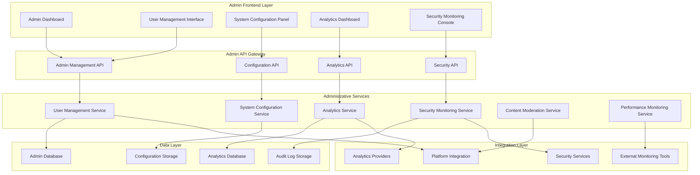
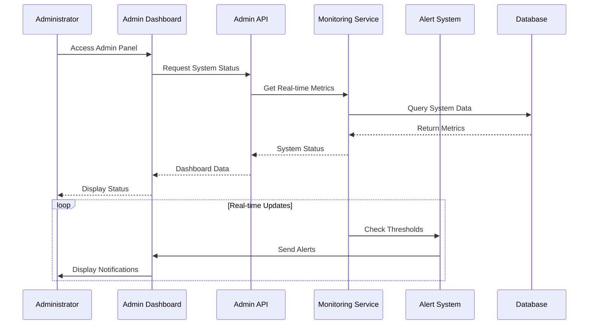

# Administrative Control Panel - Design Document

## Overview

The Administrative Control Panel is designed as a comprehensive platform management system that provides administrators with complete oversight and control over the MeAndMyDog platform. The design emphasizes security, efficiency, and comprehensive monitoring while providing intuitive interfaces for complex administrative tasks. The system follows a modular architecture that supports different administrative roles and provides real-time monitoring, automated alerting, and powerful analytics capabilities.

## Architecture

### System Architecture



### Real-time Monitoring Architecture



## Components and Interfaces

### 1. Comprehensive User Management and Moderation

#### User Management Dashboard
- **User Overview**: Comprehensive user listing with advanced filtering and search capabilities
- **User Profiles**: Detailed user information with activity history and behavioral analytics
- **Account Status Management**: User status controls with suspension, warning, and enforcement actions
- **Role and Permission Management**: Granular role assignment with permission inheritance
- **Bulk Operations**: Mass user operations for efficiency and administrative productivity

#### Moderation Tools
- **Report Management**: Structured user reporting system with investigation workflows
- **Policy Enforcement**: Automated and manual policy violation detection and enforcement
- **Communication History**: Complete user communication tracking and analysis
- **Behavioral Analytics**: Pattern recognition for suspicious or problematic behavior
- **Compliance Tracking**: GDPR compliance tools with data export and deletion capabilities

#### Investigation and Audit Tools
- **Activity Timeline**: Chronological view of user activities and interactions
- **Forensic Analysis**: Detailed investigation tools for complex user issues
- **Audit Trail Management**: Complete audit logs with tamper-proof storage
- **Evidence Collection**: Systematic evidence gathering and documentation tools
- **Resolution Tracking**: Case management with resolution workflows and outcomes

### 2. System Configuration and Feature Management

#### Configuration Management Interface
- **Centralized Settings**: Unified configuration management with environment-specific controls
- **Feature Flag Dashboard**: Real-time feature flag management with rollout controls
- **Integration Configuration**: Secure API key and third-party service management
- **Performance Tuning**: System parameter optimization with impact analysis
- **Environment Management**: Multi-environment configuration with promotion workflows

#### Feature Rollout Controls
- **Gradual Rollout**: Percentage-based feature rollouts with monitoring
- **A/B Testing Framework**: Comprehensive testing with statistical analysis
- **Rollback Capabilities**: Instant rollback with configuration versioning
- **Impact Monitoring**: Real-time monitoring of configuration changes
- **Change Management**: Approval workflows for critical configuration changes

#### System Parameter Management
- **Rate Limiting Controls**: Dynamic rate limiting with real-time adjustments
- **Timeout Configuration**: System timeout management with performance optimization
- **Resource Allocation**: Dynamic resource allocation and scaling controls
- **Cache Management**: Cache configuration and invalidation controls
- **Database Optimization**: Query optimization and connection pool management

### 3. Advanced Analytics and Reporting Dashboard

#### Business Intelligence Dashboard
- **Key Performance Indicators**: Real-time KPI tracking with customizable metrics
- **User Analytics**: Comprehensive user behavior analysis and segmentation
- **Revenue Analytics**: Financial performance tracking with trend analysis
- **Growth Metrics**: User acquisition, retention, and engagement analytics
- **Conversion Tracking**: Funnel analysis and conversion optimization insights

#### Custom Reporting Engine
- **Report Builder**: Drag-and-drop report creation with advanced visualization
- **Scheduled Reports**: Automated report generation and distribution
- **Data Export**: Multiple format support with customizable data selection
- **Interactive Dashboards**: Real-time dashboards with drill-down capabilities
- **Comparative Analysis**: Period-over-period and cohort analysis tools

#### Predictive Analytics
- **Trend Forecasting**: AI-powered trend prediction and scenario planning
- **User Behavior Prediction**: Churn prediction and engagement forecasting
- **Capacity Planning**: Resource usage forecasting and scaling recommendations
- **Revenue Forecasting**: Financial projection and growth modeling
- **Risk Assessment**: Automated risk identification and mitigation recommendations

### 4. Security Monitoring and Incident Management

#### Security Dashboard
- **Threat Detection**: Real-time threat monitoring with automated alerts
- **Vulnerability Scanning**: Continuous security scanning and assessment
- **Risk Assessment**: Comprehensive risk analysis and scoring
- **Compliance Monitoring**: Regulatory compliance tracking and reporting
- **Security Metrics**: Security KPIs and performance indicators

#### Incident Response System
- **Alert Management**: Prioritized alert system with escalation procedures
- **Incident Timeline**: Detailed incident tracking and timeline reconstruction
- **Forensic Tools**: Advanced forensic analysis and evidence collection
- **Response Automation**: Automated threat response and mitigation actions
- **Communication Tools**: Incident communication and stakeholder notification

#### Access Control Management
- **IP Management**: IP whitelisting, blacklisting, and geographic restrictions
- **Authentication Monitoring**: Login pattern analysis and anomaly detection
- **Session Management**: Active session monitoring and control
- **Permission Auditing**: Access permission tracking and compliance verification
- **Security Policy Enforcement**: Automated policy enforcement and violation tracking

### 5. Content Moderation and Quality Control

#### Content Moderation Dashboard
- **Content Queue**: Prioritized content review queue with bulk actions
- **Automated Filtering**: AI-powered content filtering and flagging
- **Manual Review Tools**: Comprehensive content review and approval workflows
- **Policy Management**: Content policy configuration and enforcement
- **Appeal System**: Content appeal processing and resolution tracking

#### Quality Control Tools
- **Content Analytics**: Content performance and quality metrics
- **Trend Analysis**: Content trend identification and analysis
- **Quality Scoring**: Automated content quality assessment
- **Improvement Recommendations**: AI-powered content improvement suggestions
- **Compliance Checking**: Content compliance verification and reporting

#### Community Management
- **User Reports**: User-generated content reporting and investigation
- **Community Guidelines**: Guideline management and enforcement
- **Escalation Procedures**: Structured escalation for complex content issues
- **Resolution Tracking**: Complete resolution workflow and outcome tracking
- **Community Health**: Community engagement and health metrics

### 6. Platform Performance and Health Monitoring

#### Performance Dashboard
- **System Health**: Real-time system health monitoring and alerting
- **Performance Metrics**: Response time, throughput, and resource utilization
- **Capacity Planning**: Resource forecasting and scaling recommendations
- **Bottleneck Identification**: Performance bottleneck detection and analysis
- **Optimization Recommendations**: AI-powered performance optimization suggestions

#### Infrastructure Monitoring
- **Server Monitoring**: Server health, resource usage, and performance tracking
- **Database Performance**: Database query optimization and performance analysis
- **Network Monitoring**: Network performance and connectivity monitoring
- **Application Performance**: Application-level performance monitoring and profiling
- **Third-party Service Monitoring**: External service health and performance tracking

#### Alerting and Notification System
- **Custom Alerts**: Configurable alerting with threshold management
- **Escalation Procedures**: Automated escalation with role-based notifications
- **Alert Correlation**: Intelligent alert correlation and noise reduction
- **Response Automation**: Automated response actions for common issues
- **Notification Channels**: Multi-channel notification delivery and tracking

## Data Models

### Administrative Entities

#### Admin User Entity
```typescript
interface AdminUser {
  id: string;
  username: string;
  email: string;
  role: AdminRole;
  permissions: AdminPermission[];
  lastLoginAt?: Date;
  isActive: boolean;
  mfaEnabled: boolean;
  sessionHistory: AdminSession[];
  auditLog: AdminAuditEntry[];
  createdAt: Date;
  updatedAt: Date;
}

enum AdminRole {
  SUPER_ADMIN = 'super_admin',
  PLATFORM_ADMIN = 'platform_admin',
  USER_MODERATOR = 'user_moderator',
  CONTENT_MODERATOR = 'content_moderator',
  SECURITY_ADMIN = 'security_admin',
  FINANCIAL_ADMIN = 'financial_admin',
  TECHNICAL_ADMIN = 'technical_admin'
}

interface AdminPermission {
  resource: string;
  actions: string[];
  conditions?: PermissionCondition[];
}
```

#### System Configuration Entity
```typescript
interface SystemConfiguration {
  id: string;
  category: ConfigCategory;
  key: string;
  value: any;
  dataType: ConfigDataType;
  environment: Environment;
  isEncrypted: boolean;
  description: string;
  validationRules: ValidationRule[];
  lastModifiedBy: string;
  lastModifiedAt: Date;
  version: number;
  changeHistory: ConfigChange[];
  createdAt: Date;
  updatedAt: Date;
}

enum ConfigCategory {
  SYSTEM = 'system',
  FEATURE_FLAGS = 'feature_flags',
  INTEGRATIONS = 'integrations',
  SECURITY = 'security',
  PERFORMANCE = 'performance',
  BUSINESS = 'business'
}

interface ConfigChange {
  version: number;
  previousValue: any;
  newValue: any;
  changedBy: string;
  changedAt: Date;
  reason: string;
}
```

#### Security Incident Entity
```typescript
interface SecurityIncident {
  id: string;
  type: IncidentType;
  severity: IncidentSeverity;
  status: IncidentStatus;
  title: string;
  description: string;
  detectedAt: Date;
  resolvedAt?: Date;
  assignedTo?: string;
  affectedUsers: string[];
  affectedSystems: string[];
  evidence: IncidentEvidence[];
  timeline: IncidentTimelineEntry[];
  responseActions: ResponseAction[];
  rootCause?: string;
  resolution?: string;
  createdAt: Date;
  updatedAt: Date;
}

enum IncidentType {
  SECURITY_BREACH = 'security_breach',
  DATA_LEAK = 'data_leak',
  UNAUTHORIZED_ACCESS = 'unauthorized_access',
  MALICIOUS_ACTIVITY = 'malicious_activity',
  SYSTEM_COMPROMISE = 'system_compromise',
  POLICY_VIOLATION = 'policy_violation'
}

enum IncidentSeverity {
  CRITICAL = 'critical',
  HIGH = 'high',
  MEDIUM = 'medium',
  LOW = 'low'
}
```

#### Platform Analytics Entity
```typescript
interface PlatformAnalytics {
  id: string;
  date: Date;
  period: AnalyticsPeriod;
  userMetrics: UserMetrics;
  businessMetrics: BusinessMetrics;
  performanceMetrics: PerformanceMetrics;
  securityMetrics: SecurityMetrics;
  contentMetrics: ContentMetrics;
  calculatedAt: Date;
}

interface UserMetrics {
  totalUsers: number;
  activeUsers: number;
  newUsers: number;
  churned Users: number;
  engagementRate: number;
  averageSessionDuration: number;
  retentionRates: RetentionRate[];
}

interface BusinessMetrics {
  totalRevenue: number;
  newRevenue: number;
  recurringRevenue: number;
  conversionRate: number;
  averageOrderValue: number;
  customerLifetimeValue: number;
  churnRate: number;
}

interface PerformanceMetrics {
  averageResponseTime: number;
  uptime: number;
  errorRate: number;
  throughput: number;
  resourceUtilization: ResourceUtilization;
  cacheHitRate: number;
}
```

#### Content Moderation Entity
```typescript
interface ContentModerationCase {
  id: string;
  contentId: string;
  contentType: ContentType;
  reportedBy?: string;
  reportReason: ReportReason;
  status: ModerationStatus;
  priority: ModerationPriority;
  assignedTo?: string;
  reviewedBy?: string;
  reviewedAt?: Date;
  decision: ModerationDecision;
  decisionReason: string;
  actions: ModerationAction[];
  appealStatus?: AppealStatus;
  appealReason?: string;
  createdAt: Date;
  updatedAt: Date;
}

enum ModerationStatus {
  PENDING = 'pending',
  IN_REVIEW = 'in_review',
  RESOLVED = 'resolved',
  ESCALATED = 'escalated',
  APPEALED = 'appealed'
}

enum ModerationDecision {
  APPROVED = 'approved',
  REJECTED = 'rejected',
  REQUIRES_EDIT = 'requires_edit',
  ESCALATED = 'escalated'
}
```

## Error Handling

### Administrative Security
- **Authentication Failures**: Multi-factor authentication and session management
- **Authorization Errors**: Role-based access control and permission validation
- **Audit Trail Integrity**: Tamper-proof audit logging and verification
- **Data Protection**: Encryption and secure data handling for sensitive information
- **Access Control**: IP restrictions and geographic access controls

### System Configuration Errors
- **Configuration Validation**: Comprehensive validation of system settings
- **Rollback Mechanisms**: Automatic rollback for failed configuration changes
- **Environment Consistency**: Configuration synchronization across environments
- **Change Impact Analysis**: Assessment of configuration change impacts
- **Dependency Management**: Configuration dependency tracking and validation

### Monitoring and Alerting Errors
- **Alert Fatigue Prevention**: Intelligent alert correlation and noise reduction
- **False Positive Management**: Machine learning-based false positive reduction
- **Escalation Failures**: Backup escalation procedures and notification channels
- **Data Collection Errors**: Robust data collection with error handling and recovery
- **Performance Impact**: Minimal performance impact from monitoring systems

## Testing Strategy

### Administrative Function Testing
- **User Management**: Comprehensive testing of user management and moderation features
- **System Configuration**: Testing of configuration management and feature flag systems
- **Security Monitoring**: Testing of security detection and incident response systems
- **Analytics and Reporting**: Testing of analytics calculations and report generation
- **Content Moderation**: Testing of content moderation workflows and decision systems

### Security Testing
- **Access Control**: Comprehensive testing of role-based access control
- **Authentication**: Multi-factor authentication and session management testing
- **Audit Logging**: Audit trail integrity and tamper-proof storage testing
- **Data Protection**: Encryption and data security testing
- **Incident Response**: Security incident detection and response testing

### Performance Testing
- **Dashboard Performance**: Load testing for administrative dashboards
- **Real-time Monitoring**: Testing of real-time monitoring and alerting systems
- **Large Dataset Handling**: Testing with large volumes of administrative data
- **Concurrent Administration**: Multi-administrator concurrent access testing
- **System Impact**: Testing administrative system impact on platform performance

### Integration Testing
- **Platform Integration**: Testing of administrative system integration with platform
- **External Tool Integration**: Testing of monitoring and security tool integrations
- **API Performance**: Administrative API performance and reliability testing
- **Data Synchronization**: Testing of data consistency across administrative systems
- **Backup and Recovery**: Testing of backup and disaster recovery procedures