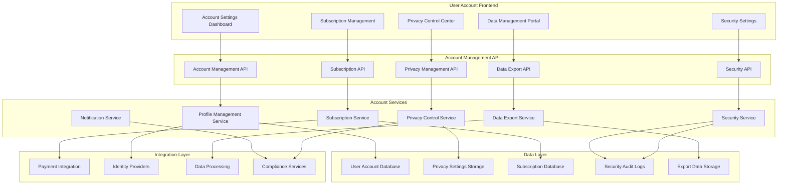
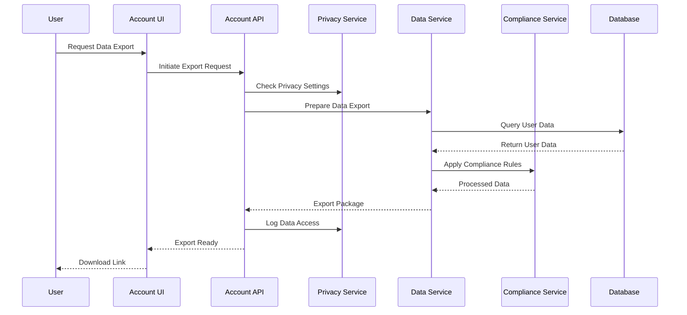

# Advanced User Account Management - Design Document

## Overview

The Advanced User Account Management system is designed as a comprehensive user-centric platform that empowers users with complete control over their accounts, privacy, data, and platform experience. The design emphasizes user autonomy, privacy compliance, and seamless account management while providing intuitive interfaces for complex account operations. The system follows privacy-by-design principles and provides transparent, user-friendly tools for managing all aspects of their platform presence.

## Architecture

### System Architecture



### Privacy and Data Flow Architecture



## Components and Interfaces

### 1. Comprehensive Account Settings and Profile Management

#### Account Settings Dashboard
- **Profile Overview**: Comprehensive profile summary with quick edit capabilities
- **Settings Navigation**: Organized navigation with search and quick access to common settings
- **Change History**: Complete history of account changes with rollback capabilities
- **Account Health**: Account security and completeness indicators with recommendations
- **Quick Actions**: Frequently used account management actions and shortcuts

#### Profile Management Interface
- **Personal Information**: Comprehensive profile editing with real-time validation
- **Contact Management**: Multiple contact methods with verification workflows
- **Preference Settings**: Theme, language, accessibility, and interface customization
- **Visibility Controls**: Profile visibility, search preferences, and privacy settings
- **Account Linking**: Social media integration and third-party account connections

#### Account Recovery Tools
- **Recovery Options**: Multiple recovery methods with security verification
- **Security Questions**: Security question management and verification
- **Emergency Access**: Emergency contact and access procedures
- **Account Verification**: Identity verification for sensitive operations
- **Recovery History**: Complete recovery attempt history and security monitoring

### 2. Advanced Privacy and Data Control Settings

#### Privacy Control Center
- **Privacy Dashboard**: Comprehensive privacy overview with control recommendations
- **Data Usage Controls**: Granular controls for personal information and activity data
- **Sharing Preferences**: Selective data sharing with service providers and integrations
- **Tracking Management**: Cookie preferences, analytics opt-out, and tracking controls
- **Consent Management**: Consent history, withdrawal options, and preference tracking

#### Data Rights Management
- **GDPR Rights Portal**: Complete GDPR rights management with request tracking
- **Data Access Requests**: Self-service data access with comprehensive reporting
- **Data Portability**: Standardized data export for service migration
- **Data Rectification**: Data correction requests with verification workflows
- **Data Erasure**: Right to be forgotten with selective deletion options

#### Marketing and Communication Privacy
- **Marketing Preferences**: Granular marketing communication controls
- **Communication Channels**: Channel-specific opt-out and frequency controls
- **Personalization Settings**: Personalization opt-out with experience impact explanation
- **Third-party Sharing**: Third-party data sharing controls and partner management
- **Privacy Impact**: Clear explanation of privacy setting impacts on user experience

### 3. Subscription and Billing Management

#### Subscription Overview Dashboard
- **Plan Comparison**: Side-by-side plan comparison with feature highlights
- **Usage Analytics**: Subscription usage tracking and optimization recommendations
- **Billing Timeline**: Visual billing history with payment tracking
- **Plan Recommendations**: AI-powered plan recommendations based on usage patterns
- **Subscription Health**: Subscription status monitoring and issue alerts

#### Payment and Billing Management
- **Payment Methods**: Secure payment method management with tokenization
- **Billing Preferences**: Billing address, invoice delivery, and notification settings
- **Invoice Management**: Detailed invoice history with download and dispute options
- **Payment History**: Complete payment tracking with transaction details
- **Billing Alerts**: Proactive billing alerts and payment failure notifications

#### Subscription Lifecycle Management
- **Plan Changes**: Seamless plan upgrades/downgrades with proration calculations
- **Cancellation Workflows**: Retention-focused cancellation with feedback collection
- **Pause and Resume**: Subscription pause options with automatic resumption
- **Family Sharing**: Family plan management with member allocation
- **Corporate Billing**: Business account billing with expense management integration

### 4. Enhanced Security and Authentication Management

#### Security Dashboard
- **Security Score**: Comprehensive security assessment with improvement recommendations
- **Threat Monitoring**: Real-time security threat detection and alerts
- **Device Management**: Trusted device management with security controls
- **Access History**: Detailed login history with geographic and device information
- **Security Recommendations**: Personalized security improvement suggestions

#### Authentication Management
- **Password Management**: Password strength validation and change workflows
- **Two-Factor Authentication**: Multiple 2FA methods with backup and recovery options
- **Biometric Authentication**: Biometric setup and management where supported
- **Security Keys**: Hardware security key registration and management
- **Recovery Codes**: Backup code generation and secure storage

#### Session and Device Security
- **Active Sessions**: Real-time session monitoring with remote logout capabilities
- **Device Registration**: Trusted device registration with security verification
- **Location Monitoring**: Geographic access monitoring with anomaly detection
- **Security Alerts**: Real-time security notifications with response options
- **Incident Response**: Security incident reporting and resolution tracking

### 5. Notification Preferences and Communication Settings

#### Notification Control Center
- **Notification Overview**: Comprehensive notification preference dashboard
- **Channel Management**: Multi-channel notification preferences with priority settings
- **Content Preferences**: Granular content-based notification controls
- **Timing Controls**: Quiet hours, timezone preferences, and scheduling
- **Delivery Confirmation**: Notification delivery tracking and failure handling

#### Communication Preferences
- **Email Management**: Email frequency, content preferences, and unsubscribe options
- **Push Notifications**: Device-specific push notification controls and settings
- **SMS Preferences**: SMS opt-in/opt-out with emergency notification exceptions
- **In-app Notifications**: In-app notification customization and history management
- **Marketing Communications**: Marketing preference management with granular controls

#### Advanced Notification Features
- **Smart Notifications**: AI-powered notification optimization and personalization
- **Notification Bundling**: Intelligent notification grouping and summarization
- **Priority Management**: Notification priority settings with VIP contacts
- **Digest Options**: Daily/weekly notification digests with customizable content
- **Emergency Notifications**: Emergency notification settings with override capabilities

### 6. Data Export and Account Portability

#### Data Export Portal
- **Export Dashboard**: Comprehensive data export overview with request history
- **Selective Export**: Granular data selection with category and date filtering
- **Format Options**: Multiple export formats with compatibility information
- **Large Export Handling**: Progress tracking and secure delivery for large exports
- **Export Scheduling**: Automated export scheduling with retention management

#### Data Portability Tools
- **Standardized Formats**: Industry-standard data formats for easy portability
- **Migration Assistance**: Tools and guidance for migrating to other services
- **Data Validation**: Export data validation and integrity verification
- **Compatibility Checking**: Destination service compatibility assessment
- **Transfer Tracking**: Data transfer monitoring and completion verification

#### Export Security and Compliance
- **Secure Downloads**: Encrypted downloads with access controls and expiration
- **Audit Logging**: Complete audit trail for all data export activities
- **Compliance Verification**: GDPR and regulatory compliance for data exports
- **Access Controls**: Multi-factor authentication for sensitive data exports
- **Data Minimization**: Privacy-preserving export options with data minimization

### 7. Account Deletion and Data Erasure

#### Deletion Management Interface
- **Deletion Wizard**: Step-by-step account deletion with impact explanation
- **Selective Deletion**: Partial account deletion with data retention options
- **Grace Period Management**: Deletion scheduling with cancellation options
- **Impact Assessment**: Clear explanation of deletion consequences and alternatives
- **Retention Options**: Legal and business retention requirements explanation

#### Data Erasure Tools
- **Comprehensive Erasure**: Complete data removal with verification
- **Cascading Deletion**: Automated handling of data dependencies and relationships
- **Compliance Erasure**: GDPR-compliant erasure with audit documentation
- **Selective Erasure**: Granular data removal with preservation options
- **Erasure Verification**: Deletion completion verification and certification

#### Deletion Recovery and Support
- **Deletion Cancellation**: Grace period cancellation with account restoration
- **Recovery Procedures**: Account recovery options during grace periods
- **Support Integration**: Customer support integration for deletion assistance
- **Feedback Collection**: Deletion reason collection for service improvement
- **Exit Surveys**: Comprehensive exit surveys with retention opportunities

## Data Models

### Account Management Entities

#### User Account Profile
```typescript
interface UserAccountProfile {
  id: string;
  userId: string;
  personalInfo: PersonalInformation;
  contactInfo: ContactInformation;
  preferences: UserPreferences;
  privacySettings: PrivacySettings;
  securitySettings: SecuritySettings;
  subscriptionInfo: SubscriptionInformation;
  accountStatus: AccountStatus;
  createdAt: Date;
  updatedAt: Date;
  lastLoginAt: Date;
}

interface PersonalInformation {
  firstName: string;
  lastName: string;
  displayName?: string;
  dateOfBirth?: Date;
  gender?: Gender;
  location?: Location;
  bio?: string;
  profileImage?: string;
  coverImage?: string;
}

interface UserPreferences {
  language: string;
  timezone: string;
  theme: ThemePreference;
  accessibility: AccessibilitySettings;
  notifications: NotificationPreferences;
  privacy: PrivacyPreferences;
}
```

#### Privacy Settings Entity
```typescript
interface PrivacySettings {
  id: string;
  userId: string;
  dataProcessing: DataProcessingSettings;
  dataSharing: DataSharingSettings;
  marketingPreferences: MarketingPreferences;
  cookieSettings: CookieSettings;
  consentHistory: ConsentRecord[];
  lastUpdated: Date;
}

interface DataProcessingSettings {
  personalDataProcessing: boolean;
  behavioralTracking: boolean;
  analyticsTracking: boolean;
  personalizationData: boolean;
  locationTracking: boolean;
  deviceTracking: boolean;
}

interface DataSharingSettings {
  serviceProviders: boolean;
  marketingPartners: boolean;
  analyticsProviders: boolean;
  socialMediaIntegration: boolean;
  thirdPartyIntegrations: ThirdPartyIntegration[];
}

interface ConsentRecord {
  id: string;
  consentType: ConsentType;
  granted: boolean;
  grantedAt: Date;
  withdrawnAt?: Date;
  ipAddress: string;
  userAgent: string;
}
```

#### Security Settings Entity
```typescript
interface SecuritySettings {
  id: string;
  userId: string;
  passwordSettings: PasswordSettings;
  twoFactorAuth: TwoFactorAuthSettings;
  trustedDevices: TrustedDevice[];
  securityAlerts: SecurityAlertSettings;
  loginHistory: LoginHistoryEntry[];
  securityIncidents: SecurityIncident[];
  lastSecurityReview: Date;
}

interface TwoFactorAuthSettings {
  enabled: boolean;
  methods: TwoFactorMethod[];
  backupCodes: BackupCode[];
  recoveryEmail?: string;
  recoveryPhone?: string;
}

interface TrustedDevice {
  id: string;
  deviceName: string;
  deviceType: DeviceType;
  fingerprint: string;
  firstSeen: Date;
  lastSeen: Date;
  location?: Location;
  isActive: boolean;
}

interface LoginHistoryEntry {
  id: string;
  timestamp: Date;
  ipAddress: string;
  location?: Location;
  device: DeviceInfo;
  success: boolean;
  failureReason?: string;
  riskScore: number;
}
```

#### Subscription Management Entity
```typescript
interface SubscriptionInformation {
  id: string;
  userId: string;
  currentPlan: SubscriptionPlan;
  billingInfo: BillingInformation;
  paymentMethods: PaymentMethod[];
  subscriptionHistory: SubscriptionHistoryEntry[];
  usageMetrics: UsageMetrics;
  nextBillingDate: Date;
  status: SubscriptionStatus;
}

interface BillingInformation {
  billingAddress: Address;
  invoiceDelivery: InvoiceDeliveryPreference;
  billingContact: ContactInformation;
  taxInformation?: TaxInformation;
  billingAlerts: BillingAlertSettings;
}

interface PaymentMethod {
  id: string;
  type: PaymentMethodType;
  last4Digits?: string;
  expiryDate?: Date;
  isDefault: boolean;
  isActive: boolean;
  addedAt: Date;
  lastUsed?: Date;
}

interface UsageMetrics {
  currentPeriodUsage: PeriodUsage;
  historicalUsage: PeriodUsage[];
  featureUsage: FeatureUsage[];
  recommendations: UsageRecommendation[];
}
```

#### Data Export Request Entity
```typescript
interface DataExportRequest {
  id: string;
  userId: string;
  requestType: ExportRequestType;
  dataCategories: DataCategory[];
  dateRange?: DateRange;
  format: ExportFormat;
  status: ExportStatus;
  requestedAt: Date;
  completedAt?: Date;
  downloadUrl?: string;
  downloadExpiry?: Date;
  fileSize?: number;
  downloadCount: number;
  lastDownloaded?: Date;
}

enum ExportRequestType {
  FULL_EXPORT = 'full_export',
  SELECTIVE_EXPORT = 'selective_export',
  GDPR_REQUEST = 'gdpr_request',
  PORTABILITY_REQUEST = 'portability_request'
}

enum DataCategory {
  PROFILE_DATA = 'profile_data',
  ACTIVITY_DATA = 'activity_data',
  COMMUNICATION_DATA = 'communication_data',
  FINANCIAL_DATA = 'financial_data',
  CONTENT_DATA = 'content_data',
  PREFERENCE_DATA = 'preference_data'
}

enum ExportFormat {
  JSON = 'json',
  CSV = 'csv',
  XML = 'xml',
  PDF = 'pdf'
}
```

#### Account Deletion Request Entity
```typescript
interface AccountDeletionRequest {
  id: string;
  userId: string;
  deletionType: DeletionType;
  scheduledDate?: Date;
  gracePeriodEnd?: Date;
  reason?: string;
  feedback?: string;
  dataRetention: DataRetentionSettings;
  status: DeletionStatus;
  requestedAt: Date;
  processedAt?: Date;
  completedAt?: Date;
  cancellationDeadline?: Date;
}

enum DeletionType {
  IMMEDIATE = 'immediate',
  SCHEDULED = 'scheduled',
  PARTIAL = 'partial'
}

interface DataRetentionSettings {
  retainFinancialRecords: boolean;
  retainLegalRecords: boolean;
  retainBusinessRecords: boolean;
  customRetentionPeriod?: number;
  retentionReason?: string;
}

enum DeletionStatus {
  REQUESTED = 'requested',
  SCHEDULED = 'scheduled',
  IN_PROGRESS = 'in_progress',
  COMPLETED = 'completed',
  CANCELLED = 'cancelled',
  FAILED = 'failed'
}
```

## Error Handling

### Account Management Errors
- **Profile Update Validation**: Comprehensive validation with user-friendly error messages
- **Privacy Setting Conflicts**: Intelligent conflict resolution with user guidance
- **Subscription Change Errors**: Clear error handling with alternative options
- **Security Setting Failures**: Secure error handling without information disclosure
- **Data Export Failures**: Robust error handling with retry mechanisms

### Privacy and Compliance Errors
- **GDPR Request Failures**: Compliant error handling with manual fallback procedures
- **Data Export Errors**: Secure error handling with data protection measures
- **Consent Management Errors**: Legal compliance with audit trail maintenance
- **Privacy Setting Validation**: User-friendly validation with impact explanation
- **Data Deletion Errors**: Comprehensive error handling with compliance verification

### Security and Authentication Errors
- **Authentication Failures**: Secure error handling with account protection measures
- **2FA Setup Errors**: User-friendly error handling with alternative methods
- **Device Trust Errors**: Security-focused error handling with verification options
- **Session Management Errors**: Secure session handling with automatic cleanup
- **Security Alert Failures**: Redundant alerting with multiple delivery channels

## Testing Strategy

### Account Management Testing
- **Profile Management**: Comprehensive testing of profile update and validation workflows
- **Privacy Controls**: Testing of privacy setting changes and impact verification
- **Subscription Management**: Testing of subscription lifecycle and billing operations
- **Security Features**: Testing of authentication, 2FA, and security monitoring
- **Data Export**: Testing of data export generation and delivery processes

### Privacy and Compliance Testing
- **GDPR Compliance**: Comprehensive testing of GDPR rights and request handling
- **Data Protection**: Testing of data encryption, access controls, and audit logging
- **Consent Management**: Testing of consent workflows and withdrawal procedures
- **Privacy Impact**: Testing of privacy setting impacts on user experience
- **Compliance Reporting**: Testing of compliance documentation and audit trails

### Security Testing
- **Authentication Security**: Comprehensive security testing of authentication flows
- **Session Management**: Testing of session security and device management
- **Data Protection**: Testing of sensitive data handling and encryption
- **Access Controls**: Testing of role-based access and permission management
- **Incident Response**: Testing of security incident detection and response

### User Experience Testing
- **Interface Usability**: Comprehensive UX testing for account management interfaces
- **Mobile Responsiveness**: Testing of mobile-optimized account management features
- **Accessibility Compliance**: WCAG compliance testing for all account features
- **Cross-browser Compatibility**: Testing across different browsers and devices
- **Performance Testing**: Load testing for account management operations