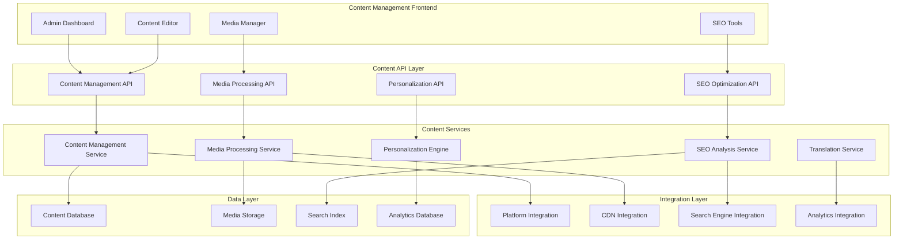
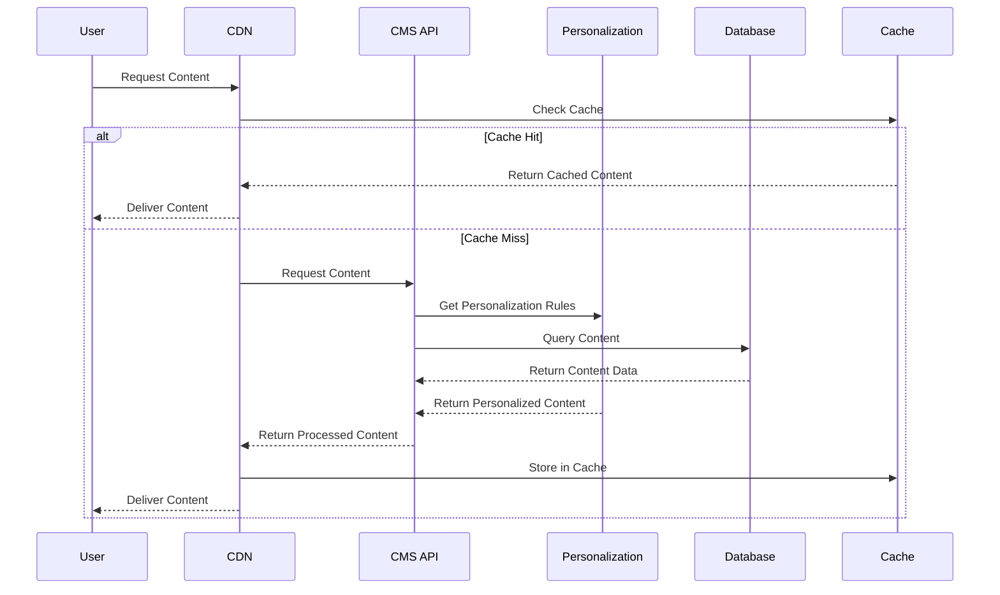

# Content Management System - Design Document

## Overview

The Content Management System (CMS) for MeAndMyDog is designed as a comprehensive content platform that empowers administrators, content creators, and marketing teams to create, manage, and optimize digital content experiences. The system emphasizes ease of use, performance optimization, and seamless integration with the existing platform ecosystem. The design follows modern headless CMS principles while providing a rich administrative interface and powerful content delivery capabilities.

## Architecture

### System Architecture



### Content Delivery Architecture



## Components and Interfaces

### 1. Content Management Dashboard

#### Visual Page Builder
- **Drag-and-Drop Interface**: Intuitive component-based page construction
- **Template Library**: Pre-built templates for common page types and layouts
- **Component Marketplace**: Extensible component system with custom component support
- **Real-time Preview**: Live preview with responsive design testing
- **Version Control**: Complete revision history with branching and merging capabilities

#### Content Organization System
- **Hierarchical Structure**: Tree-based content organization with unlimited nesting
- **Content Taxonomy**: Flexible tagging and categorization system
- **Search and Filtering**: Advanced content discovery with full-text search
- **Bulk Operations**: Mass content operations for efficiency
- **Content Relationships**: Automated and manual content linking and references

#### Workflow Management Interface
- **Approval Workflows**: Customizable multi-stage approval processes
- **Role-based Permissions**: Granular access control with inheritance
- **Task Assignment**: Content production task management and tracking
- **Collaboration Tools**: Real-time collaborative editing and commenting
- **Quality Assurance**: Automated and manual quality checking systems

### 2. Blog and Article Publishing Platform

#### Rich Content Editor
- **WYSIWYG Editor**: Advanced rich text editing with custom styling
- **Markdown Support**: Native markdown editing with live preview
- **Media Embedding**: Seamless integration of images, videos, and interactive content
- **Code Highlighting**: Syntax highlighting for technical content
- **Collaborative Editing**: Real-time multi-user editing with conflict resolution

#### Content Organization Tools
- **Category Management**: Hierarchical category system with custom taxonomies
- **Tag System**: Flexible tagging with auto-suggestions and tag clouds
- **Series Management**: Content series organization with automatic navigation
- **Content Calendar**: Editorial calendar with scheduling and planning tools
- **Archive Management**: Automated content archiving and organization

#### Publishing and Distribution
- **Scheduled Publishing**: Future publishing with timezone support
- **Social Media Integration**: Automated social media posting and promotion
- **Email Newsletter**: Automated newsletter generation and distribution
- **RSS/Atom Feeds**: Customizable feed generation for content syndication
- **Content Syndication**: Multi-platform content distribution

### 3. Advanced Media Library and Asset Management

#### Media Upload and Processing
- **Bulk Upload Interface**: Drag-and-drop bulk media upload with progress tracking
- **Automatic Optimization**: Image compression, format conversion, and size optimization
- **Metadata Extraction**: Automatic extraction of EXIF data, alt text generation
- **Format Support**: Comprehensive support for images, videos, documents, and audio
- **Cloud Storage Integration**: Seamless integration with Azure Blob Storage and CDN

#### Asset Organization System
- **Folder Structure**: Hierarchical folder organization with permissions
- **Advanced Tagging**: Multi-dimensional tagging system with auto-tagging
- **Search and Discovery**: AI-powered asset search with visual similarity
- **Usage Tracking**: Asset usage monitoring across the platform
- **Rights Management**: Copyright and licensing information tracking

#### Media Optimization Tools
- **Responsive Images**: Automatic generation of multiple image sizes
- **WebP/AVIF Support**: Modern format support with fallbacks
- **Lazy Loading**: Automatic lazy loading implementation
- **CDN Integration**: Global content delivery optimization
- **Performance Analytics**: Media performance monitoring and optimization

### 4. SEO Optimization and Performance Tools

#### SEO Analysis Dashboard
- **Real-time SEO Scoring**: Live SEO analysis with actionable recommendations
- **Keyword Optimization**: Keyword density analysis and optimization suggestions
- **Content Readability**: Readability scoring with improvement recommendations
- **Technical SEO Audit**: Comprehensive technical SEO analysis
- **Competitor Analysis**: SEO performance comparison with competitors

#### Metadata Management
- **Meta Tag Editor**: Comprehensive meta tag management interface
- **Open Graph Optimization**: Social media sharing optimization
- **Structured Data**: Schema.org markup generation and validation
- **XML Sitemap**: Automatic sitemap generation and submission
- **Robots.txt Management**: Robots.txt editor with validation

#### Performance Monitoring
- **Page Speed Analysis**: Core Web Vitals monitoring and optimization
- **Search Console Integration**: Google Search Console data integration
- **Ranking Tracking**: Keyword ranking monitoring and reporting
- **Traffic Analysis**: Organic traffic analysis and trend reporting
- **Conversion Tracking**: SEO-driven conversion measurement

### 5. Multi-language Content Support

#### Translation Management System
- **Translation Workflow**: Structured translation process with status tracking
- **Translator Assignment**: Translator management and assignment system
- **Translation Memory**: Reusable translation database for consistency
- **Quality Assurance**: Translation review and approval workflows
- **Progress Tracking**: Real-time translation progress monitoring

#### Localization Tools
- **Cultural Adaptation**: Region-specific content customization tools
- **Date/Time Formatting**: Locale-specific formatting and display
- **Currency and Numbers**: Regional number and currency formatting
- **RTL Language Support**: Right-to-left language layout support
- **Font Management**: Language-specific font selection and optimization

#### Multilingual SEO
- **Hreflang Implementation**: Automatic hreflang tag generation
- **Localized Keywords**: Language-specific keyword research and optimization
- **Regional Search Optimization**: Country-specific search optimization
- **Multilingual Sitemaps**: Language-specific sitemap generation
- **International Analytics**: Multi-language performance tracking

### 6. Content Personalization and Targeting

#### Personalization Engine
- **User Segmentation**: Advanced audience segmentation with behavioral data
- **Dynamic Content**: Real-time content personalization based on user attributes
- **A/B Testing Framework**: Comprehensive content testing and optimization
- **Recommendation System**: AI-powered content recommendations
- **Behavioral Triggers**: Event-based content delivery and personalization

#### Targeting and Rules Engine
- **Geographic Targeting**: Location-based content delivery
- **Demographic Targeting**: Age, gender, and interest-based personalization
- **Behavioral Targeting**: User behavior-based content customization
- **Time-based Delivery**: Scheduled and time-sensitive content delivery
- **Device Optimization**: Device-specific content optimization

#### Analytics and Optimization
- **Personalization Analytics**: Detailed personalization performance metrics
- **Engagement Tracking**: User engagement measurement and analysis
- **Conversion Attribution**: Personalization impact on conversions
- **Lift Analysis**: Statistical analysis of personalization effectiveness
- **Optimization Recommendations**: AI-powered optimization suggestions

## Data Models

### Content Management Entities

#### Content Page Entity
```typescript
interface ContentPage {
  id: string;
  title: string;
  slug: string;
  content: ContentBlock[];
  metaData: PageMetaData;
  status: ContentStatus;
  publishedAt?: Date;
  scheduledAt?: Date;
  authorId: string;
  categoryId?: string;
  tags: string[];
  translations: Translation[];
  seoData: SEOData;
  personalizationRules: PersonalizationRule[];
  analytics: ContentAnalytics;
  createdAt: Date;
  updatedAt: Date;
}

interface ContentBlock {
  id: string;
  type: BlockType;
  content: any;
  settings: BlockSettings;
  order: number;
}

enum ContentStatus {
  DRAFT = 'draft',
  REVIEW = 'review',
  APPROVED = 'approved',
  PUBLISHED = 'published',
  ARCHIVED = 'archived'
}

enum BlockType {
  TEXT = 'text',
  IMAGE = 'image',
  VIDEO = 'video',
  GALLERY = 'gallery',
  FORM = 'form',
  CUSTOM = 'custom'
}
```

#### Blog Post Entity
```typescript
interface BlogPost {
  id: string;
  title: string;
  slug: string;
  excerpt: string;
  content: string;
  featuredImage?: MediaAsset;
  authorId: string;
  categoryIds: string[];
  tags: string[];
  status: ContentStatus;
  publishedAt?: Date;
  scheduledAt?: Date;
  seoData: SEOData;
  readingTime: number;
  viewCount: number;
  shareCount: number;
  comments: Comment[];
  translations: Translation[];
  relatedPosts: string[];
  createdAt: Date;
  updatedAt: Date;
}

interface Comment {
  id: string;
  authorId: string;
  content: string;
  status: CommentStatus;
  parentId?: string;
  replies: Comment[];
  createdAt: Date;
  updatedAt: Date;
}

enum CommentStatus {
  PENDING = 'pending',
  APPROVED = 'approved',
  REJECTED = 'rejected',
  SPAM = 'spam'
}
```

#### Media Asset Entity
```typescript
interface MediaAsset {
  id: string;
  filename: string;
  originalName: string;
  mimeType: string;
  size: number;
  dimensions?: ImageDimensions;
  url: string;
  cdnUrl: string;
  thumbnails: Thumbnail[];
  altText?: string;
  caption?: string;
  description?: string;
  tags: string[];
  folderId?: string;
  uploadedBy: string;
  usageCount: number;
  metadata: MediaMetadata;
  createdAt: Date;
  updatedAt: Date;
}

interface ImageDimensions {
  width: number;
  height: number;
}

interface Thumbnail {
  size: string;
  url: string;
  dimensions: ImageDimensions;
}

interface MediaMetadata {
  exifData?: any;
  colorPalette?: string[];
  dominantColor?: string;
  faces?: FaceDetection[];
  objects?: ObjectDetection[];
}
```

#### SEO Data Entity
```typescript
interface SEOData {
  metaTitle?: string;
  metaDescription?: string;
  metaKeywords?: string[];
  canonicalUrl?: string;
  openGraph: OpenGraphData;
  twitterCard: TwitterCardData;
  structuredData?: any;
  focusKeyword?: string;
  seoScore: number;
  recommendations: SEORecommendation[];
  lastAnalyzed: Date;
}

interface OpenGraphData {
  title?: string;
  description?: string;
  image?: string;
  type?: string;
  url?: string;
}

interface TwitterCardData {
  card?: string;
  title?: string;
  description?: string;
  image?: string;
  creator?: string;
}

interface SEORecommendation {
  type: RecommendationType;
  priority: Priority;
  message: string;
  action?: string;
}
```

#### Personalization Rule Entity
```typescript
interface PersonalizationRule {
  id: string;
  name: string;
  description: string;
  conditions: PersonalizationCondition[];
  actions: PersonalizationAction[];
  priority: number;
  isActive: boolean;
  startDate?: Date;
  endDate?: Date;
  targetAudience: AudienceSegment;
  performance: PersonalizationPerformance;
  createdAt: Date;
  updatedAt: Date;
}

interface PersonalizationCondition {
  field: string;
  operator: ConditionOperator;
  value: any;
  logicalOperator?: LogicalOperator;
}

interface PersonalizationAction {
  type: ActionType;
  target: string;
  value: any;
  weight?: number;
}

enum ActionType {
  SHOW_CONTENT = 'show_content',
  HIDE_CONTENT = 'hide_content',
  REPLACE_CONTENT = 'replace_content',
  MODIFY_STYLE = 'modify_style',
  REDIRECT = 'redirect'
}
```

## Error Handling

### Content Management Errors
- **Content Validation**: Comprehensive validation of content structure and data
- **Publishing Workflow Errors**: Handling of approval workflow failures and conflicts
- **Version Control Conflicts**: Resolution of concurrent editing conflicts
- **Media Processing Failures**: Graceful handling of media upload and processing errors
- **Translation Workflow Errors**: Management of translation process failures

### Performance and Scalability Errors
- **CDN Failures**: Fallback mechanisms for CDN outages
- **Cache Invalidation Issues**: Proper cache management and invalidation
- **Database Performance**: Query optimization and connection management
- **Search Index Errors**: Search functionality fallback and recovery
- **High Traffic Handling**: Load balancing and performance degradation management

### Integration Errors
- **Platform Integration Failures**: Graceful degradation when platform services are unavailable
- **Third-party Service Errors**: Handling of external service failures
- **API Rate Limiting**: Intelligent retry mechanisms for external APIs
- **Data Synchronization Errors**: Conflict resolution for data sync issues
- **Analytics Integration Failures**: Fallback analytics and error reporting

## Testing Strategy

### Content Management Testing
- **Content Creation Workflows**: End-to-end testing of content creation and publishing
- **Media Management**: Comprehensive testing of media upload, processing, and delivery
- **SEO Optimization**: Testing of SEO analysis and optimization features
- **Personalization Engine**: Testing of personalization rules and content delivery
- **Multi-language Support**: Testing of translation workflows and localization

### Performance Testing
- **Content Delivery Performance**: Load testing for content delivery and CDN performance
- **Database Performance**: Query optimization and large dataset handling
- **Media Processing Performance**: Testing of media processing and optimization
- **Search Performance**: Search functionality performance and accuracy testing
- **Concurrent User Testing**: Multi-user content management and editing scenarios

### Integration Testing
- **Platform Integration**: Testing of CMS integration with existing platform features
- **Third-party Integrations**: Testing of external service integrations
- **API Performance**: Comprehensive API testing and performance benchmarking
- **Security Testing**: Content security and access control testing
- **Cross-browser Compatibility**: CMS interface testing across different browsers

### User Experience Testing
- **Content Editor Usability**: Comprehensive UX testing for content creation interfaces
- **Mobile Responsiveness**: Mobile-optimized content management testing
- **Accessibility Compliance**: WCAG compliance testing for all CMS interfaces
- **Workflow Efficiency**: Testing of content production workflows and efficiency
- **Collaborative Features**: Testing of multi-user collaboration and workflow features