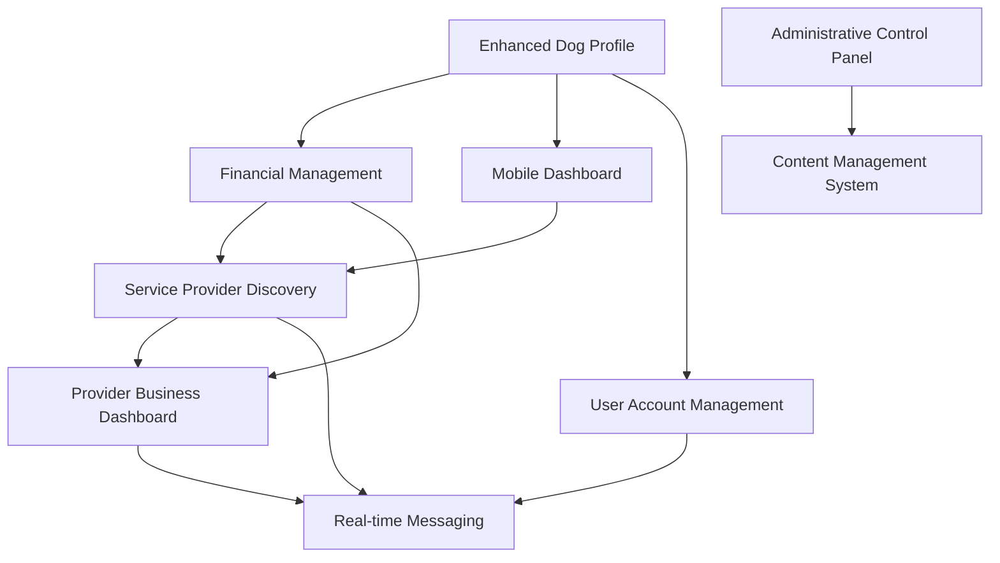

# MeAndMyDog Platform - Complete Implementation Priority Matrix

## Executive Summary

This comprehensive priority matrix analyzes all 9 major system specifications for the MeAndMyDog platform, providing a strategic roadmap for implementation based on business impact, technical complexity, user value, and resource requirements. The matrix considers dependencies, risk factors, and optimal sequencing to maximize platform success and minimize implementation risks.

## Specification Overview

### Existing Interface Specifications (4)
1. **Enhanced Dog Profile Management** - Core user data foundation
2. **Service Provider Discovery** - Revenue-generating marketplace
3. **Mobile-First Dashboard** - Personalized user experience hub
4. **Real-time Messaging Interface** - Communication platform

### New Business System Specifications (5)
5. **Financial Management System** - Invoicing and expense tracking
6. **Service Provider Business Dashboard** - Business analytics and tools
7. **Content Management System** - Dynamic content and SEO
8. **Administrative Control Panel** - Platform management and oversight
9. **Advanced User Account Management** - Privacy and account control

## Priority Matrix Analysis

### Scoring Methodology

Each specification is evaluated across 8 key dimensions (1-5 scale):

- **Business Impact** (25%): Revenue generation, user retention, competitive advantage
- **User Value** (20%): Direct user benefit, problem-solving capability
- **Technical Complexity** (15%): Implementation difficulty, infrastructure requirements
- **Resource Requirements** (10%): Development time, team size, cost
- **Risk Level** (10%): Technical risk, business risk, compliance risk
- **Dependencies** (10%): Reliance on other systems, blocking factors
- **Time to Market** (5%): Speed of implementation and deployment
- **Strategic Alignment** (5%): Alignment with long-term platform vision

### Detailed Scoring Matrix

| Specification | Business Impact | User Value | Tech Complexity | Resource Req | Risk Level | Dependencies | Time to Market | Strategic Align | **Weighted Score** | **Priority Rank** |
|---------------|----------------|------------|-----------------|--------------|------------|--------------|----------------|-----------------|-------------------|-------------------|
| **Enhanced Dog Profile Management** | 4 | 5 | 3 | 3 | 2 | 2 | 4 | 5 | **3.85** | **1** |
| **Financial Management System** | 5 | 4 | 4 | 4 | 3 | 2 | 3 | 4 | **4.05** | **2** |
| **Service Provider Discovery** | 5 | 5 | 5 | 5 | 4 | 3 | 2 | 5 | **4.45** | **3** |
| **Mobile-First Dashboard** | 4 | 5 | 4 | 4 | 3 | 3 | 3 | 5 | **4.00** | **4** |
| **Advanced User Account Management** | 3 | 4 | 3 | 3 | 2 | 2 | 4 | 4 | **3.25** | **5** |
| **Service Provider Business Dashboard** | 4 | 4 | 4 | 4 | 3 | 4 | 2 | 4 | **3.70** | **6** |
| **Administrative Control Panel** | 3 | 2 | 4 | 4 | 3 | 2 | 3 | 3 | **3.05** | **7** |
| **Content Management System** | 3 | 3 | 4 | 4 | 3 | 2 | 3 | 4 | **3.35** | **8** |
| **Real-time Messaging Interface** | 4 | 4 | 5 | 5 | 5 | 4 | 1 | 4 | **4.05** | **9** |

## Strategic Implementation Phases

### Phase 1: Foundation & Core Value (Months 1-6)
**Priority 1-2: Essential Foundation Systems**

#### 🥇 **Enhanced Dog Profile Management** (Month 1-2)
- **Why First**: Lowest risk, highest user value, foundational data model
- **Business Rationale**: Core user engagement, data foundation for all other features
- **Technical Rationale**: Establishes user data models, file storage, and basic AI integration
- **Resource Allocation**: 2 backend developers, 2 frontend developers, 1 designer
- **Success Metrics**: >85% profile completion rate, <2s load times

#### 🥈 **Financial Management System** (Month 3-6)
- **Why Second**: High business impact, moderate complexity, revenue enabler
- **Business Rationale**: Enables service provider monetization, platform revenue growth
- **Technical Rationale**: Builds on existing payment infrastructure, adds business intelligence
- **Resource Allocation**: 3 backend developers, 2 frontend developers, 1 financial analyst
- **Success Metrics**: >90% invoice automation, <24h payment processing

### Phase 2: Marketplace & Discovery (Months 7-12)
**Priority 3-4: Revenue Generation Systems**

#### 🥉 **Service Provider Discovery** (Month 7-10)
- **Why Third**: Highest business impact but complex, requires solid foundation
- **Business Rationale**: Core marketplace functionality, primary revenue driver
- **Technical Rationale**: Complex search, booking, and payment integration
- **Resource Allocation**: 4 backend developers, 3 frontend developers, 1 UX designer
- **Success Metrics**: >15% search-to-booking conversion, <500ms search response

#### 4️⃣ **Mobile-First Dashboard** (Month 9-12)
- **Why Fourth**: High user value, can leverage existing data from previous phases
- **Business Rationale**: User retention, engagement, and platform stickiness
- **Technical Rationale**: Integrates data from profiles, financial, and discovery systems
- **Resource Allocation**: 3 frontend developers, 2 backend developers, 1 AI specialist
- **Success Metrics**: >70% daily active users, <2s dashboard load time

### Phase 3: User Experience & Control (Months 13-18)
**Priority 5-6: User Empowerment Systems**

#### 5️⃣ **Advanced User Account Management** (Month 13-15)
- **Why Fifth**: Important for compliance and user trust, moderate complexity
- **Business Rationale**: GDPR compliance, user trust, premium feature differentiation
- **Technical Rationale**: Privacy-by-design, data portability, security enhancements
- **Resource Allocation**: 2 backend developers, 2 frontend developers, 1 compliance specialist
- **Success Metrics**: >95% GDPR compliance, <5% account deletion rate

#### 6️⃣ **Service Provider Business Dashboard** (Month 16-18)
- **Why Sixth**: Builds on financial system, enhances provider experience
- **Business Rationale**: Provider retention, business growth, competitive differentiation
- **Technical Rationale**: Leverages financial and discovery data for analytics
- **Resource Allocation**: 3 backend developers, 2 frontend developers, 1 business analyst
- **Success Metrics**: >80% provider retention, >25% revenue per provider increase

### Phase 4: Platform Management & Content (Months 19-24)
**Priority 7-8: Operational Excellence Systems**

#### 7️⃣ **Administrative Control Panel** (Month 19-21)
- **Why Seventh**: Internal tool, lower user impact but essential for operations
- **Business Rationale**: Operational efficiency, platform security, compliance monitoring
- **Technical Rationale**: Requires mature platform data for effective monitoring
- **Resource Allocation**: 3 backend developers, 2 frontend developers, 1 security specialist
- **Success Metrics**: >99.9% uptime monitoring, <1h incident response time

#### 8️⃣ **Content Management System** (Month 22-24)
- **Why Eighth**: Marketing and SEO benefits, but not core to user experience
- **Business Rationale**: SEO improvement, marketing efficiency, content scalability
- **Technical Rationale**: Independent system, can be developed in parallel
- **Resource Allocation**: 2 backend developers, 2 frontend developers, 1 content strategist
- **Success Metrics**: >50% organic traffic increase, <3s page load times

### Phase 5: Advanced Communication (Months 25-30)
**Priority 9: Complex Integration System**

#### 9️⃣ **Real-time Messaging Interface** (Month 25-30)
- **Why Last**: Highest complexity, requires all other systems for full value
- **Business Rationale**: User engagement, service coordination, community building
- **Technical Rationale**: Complex real-time infrastructure, WebRTC, security requirements
- **Resource Allocation**: 4 backend developers, 3 frontend developers, 1 security specialist
- **Success Metrics**: <100ms message delivery, >80% video call success rate

## Dependency Analysis

### Critical Path Dependencies

### Shared Infrastructure Requirements

#### Phase 1 Infrastructure Setup
- **Authentication & Authorization**: Enhanced JWT with role-based permissions
- **File Storage**: Azure Blob Storage with CDN integration
- **Database**: Extended user and dog data models
- **Caching**: Redis implementation for performance
- **Monitoring**: Application Insights and logging infrastructure

#### Phase 2 Infrastructure Expansion
- **Search Infrastructure**: Elasticsearch for provider discovery
- **Payment Processing**: Multi-provider payment system enhancement
- **Real-time Systems**: SignalR foundation for live updates
- **AI/ML Services**: Google Gemini integration for recommendations

#### Phase 3 Infrastructure Maturation
- **Advanced Security**: Enhanced audit logging and compliance tools
- **Performance Optimization**: Advanced caching and CDN strategies
- **Scalability**: Auto-scaling and load balancing implementation
- **Analytics**: Advanced business intelligence and reporting

## Resource Allocation Strategy

### Team Structure by Phase

#### Phase 1 Team (8-10 people)
- **Backend Developers**: 3-4 (ASP.NET Core, Entity Framework, Azure)
- **Frontend Developers**: 3-4 (Vue.js, TypeScript, Tailwind CSS)
- **UX/UI Designer**: 1 (Mobile-first design, accessibility)
- **DevOps Engineer**: 1 (Azure, CI/CD, monitoring)
- **Product Manager**: 1 (Feature coordination, user feedback)

#### Phase 2 Team (10-12 people)
- **Backend Developers**: 4-5 (Add search specialist, payment expert)
- **Frontend Developers**: 4-5 (Add mobile specialist, performance expert)
- **UX/UI Designers**: 2 (Add conversion optimization specialist)
- **DevOps Engineers**: 2 (Add security specialist)
- **Product Manager**: 1
- **QA Engineers**: 2 (Automated testing, performance testing)

#### Phase 3-5 Team (12-15 people)
- **Backend Developers**: 5-6 (Add AI/ML specialist, security expert)
- **Frontend Developers**: 5-6 (Add accessibility specialist)
- **UX/UI Designers**: 2
- **DevOps Engineers**: 2
- **Product Manager**: 1
- **QA Engineers**: 3 (Add security testing specialist)
- **Specialists**: 2-3 (Compliance, business analyst, content strategist)

### Budget Estimation

#### Development Costs (30 months)
- **Phase 1** (6 months): $480,000 - $600,000
- **Phase 2** (6 months): $600,000 - $720,000
- **Phase 3** (6 months): $720,000 - $864,000
- **Phase 4** (6 months): $720,000 - $864,000
- **Phase 5** (6 months): $720,000 - $864,000
- **Total Development**: $3.24M - $3.91M

#### Infrastructure Costs (Monthly)
- **Phase 1**: $2,000 - $3,000/month
- **Phase 2**: $4,000 - $6,000/month
- **Phase 3-5**: $6,000 - $10,000/month
- **Total Infrastructure** (30 months): $150,000 - $240,000

## Risk Assessment & Mitigation

### High-Risk Areas

#### Technical Risks
1. **Real-time Infrastructure Scaling** (Phase 5)
   - **Risk**: WebSocket and WebRTC complexity
   - **Mitigation**: Phased rollout, extensive load testing, fallback mechanisms

2. **Payment Security & Compliance** (Phase 1-2)
   - **Risk**: PCI compliance, fraud prevention
   - **Mitigation**: Security audits, compliance specialists, gradual rollout

3. **AI/ML Accuracy** (Phase 2-4)
   - **Risk**: Recommendation quality, personalization effectiveness
   - **Mitigation**: A/B testing, user feedback loops, continuous model improvement

#### Business Risks
1. **User Adoption** (All Phases)
   - **Risk**: Low feature adoption rates
   - **Mitigation**: User research, beta testing, gradual feature rollouts

2. **Competitive Response** (Phase 2-3)
   - **Risk**: Competitors copying features
   - **Mitigation**: Rapid iteration, unique value propositions, patent protection

3. **Regulatory Changes** (Phase 3)
   - **Risk**: Privacy law changes affecting user management
   - **Mitigation**: Compliance monitoring, flexible architecture, legal consultation

### Mitigation Strategies

#### Technical Mitigation
- **Feature Flags**: Gradual rollouts with instant rollback capability
- **Comprehensive Testing**: Automated testing at all levels
- **Performance Monitoring**: Real-time monitoring and alerting
- **Security Audits**: Regular security assessments and penetration testing

#### Business Mitigation
- **User Feedback Loops**: Continuous user feedback collection and iteration
- **Market Research**: Ongoing competitive analysis and market monitoring
- **Flexible Architecture**: Modular design allowing for rapid changes
- **Stakeholder Communication**: Regular updates and expectation management

## Success Metrics & KPIs

### Phase 1 Success Metrics
- **Profile Completion Rate**: >85%
- **Invoice Automation**: >90%
- **User Satisfaction**: >4.2/5
- **System Performance**: <2s load times

### Phase 2 Success Metrics
- **Search-to-Booking Conversion**: >15%
- **Daily Active Users**: >70%
- **Revenue Growth**: >40%
- **Provider Satisfaction**: >4.0/5

### Phase 3 Success Metrics
- **GDPR Compliance**: >95%
- **Provider Retention**: >80%
- **Account Deletion Rate**: <5%
- **Business Dashboard Usage**: >60%

### Phase 4 Success Metrics
- **System Uptime**: >99.9%
- **Incident Response**: <1 hour
- **Organic Traffic Growth**: >50%
- **Content Engagement**: >3 minutes average

### Phase 5 Success Metrics
- **Message Delivery**: <100ms
- **Video Call Success**: >80%
- **User Engagement**: >25% increase
- **Platform Stickiness**: >80% monthly retention

## Conclusion & Recommendations

### Strategic Recommendations

1. **Start with Foundation**: Begin with Enhanced Dog Profile Management to establish core data models and user engagement
2. **Prioritize Revenue**: Implement Financial Management System early to enable business growth
3. **Build Incrementally**: Each phase builds on previous phases, creating compound value
4. **Invest in Infrastructure**: Early infrastructure investment pays dividends in later phases
5. **Monitor and Adapt**: Use feature flags and analytics to adapt strategy based on real user behavior

### Critical Success Factors

1. **User-Centric Development**: Continuous user feedback and testing throughout all phases
2. **Quality Over Speed**: Maintain high quality standards to avoid technical debt
3. **Security First**: Implement security and compliance from the beginning
4. **Performance Focus**: Optimize for mobile and performance from day one
5. **Team Scaling**: Gradually scale team capabilities to match increasing complexity

### Long-term Vision

By following this implementation priority matrix, MeAndMyDog will evolve from a basic pet services platform into a comprehensive ecosystem that:
- **Empowers pet owners** with intelligent tools and insights
- **Enables service providers** to build and grow successful businesses
- **Creates network effects** through community and communication features
- **Maintains competitive advantage** through advanced technology and user experience
- **Scales globally** with robust infrastructure and localization capabilities

This strategic approach ensures sustainable growth, user satisfaction, and business success while managing technical complexity and implementation risks effectively.