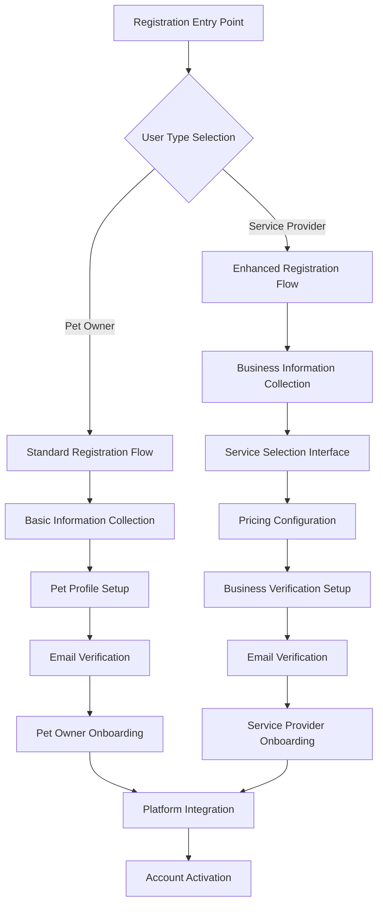
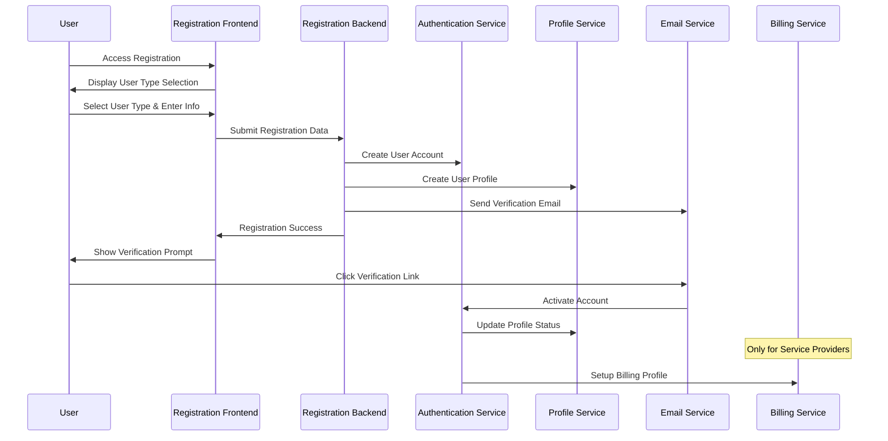

# User Registration and Onboarding System - Design Document

## Overview

The User Registration and Onboarding System is designed as a comprehensive, conversion-optimized registration experience that handles two distinct user types with different complexity requirements. The system uses progressive disclosure, intelligent form design, and seamless integration with existing platform systems to provide an optimal user experience while collecting necessary business information.

### Recent Updates (Implementation Phase)

- **UK English Localization**: All text uses UK English spelling (e.g., "Organisation" instead of "Organization")
- **Enhanced Service Selection UI**: Redesigned with icons, card-based layouts, and improved visual feedback
- **Comprehensive Form Validation**: Real-time validation with clear error messages and UK-specific format validation
- **Password Strength Indicators**: Visual feedback for password requirements on all registration forms
- **Improved Typography**: Consistent font family across all form elements including textareas

## Architecture

### System Components



### Data Flow Architecture



## Components and Interfaces

### 1. Registration Entry Point Component

**Purpose**: Initial user type selection and registration initiation

**Key Features**:
- Clear user type differentiation with visual cues
- Benefit-focused messaging for each user type
- Social proof and trust indicators
- Mobile-responsive design

**Interface Design**:
```typescript
interface RegistrationEntryProps {
  onUserTypeSelect: (userType: 'pet_owner' | 'service_provider') => void;
  marketingData?: MarketingMetrics;
  testimonials?: Testimonial[];
}

interface UserTypeOption {
  type: 'pet_owner' | 'service_provider';
  title: string;
  description: string;
  benefits: string[];
  icon: string;
  ctaText: string;
}
```

### 2. Standard Registration Form Component

**Purpose**: Streamlined registration for pet owners

**Key Features**:
- Single-page form with progressive enhancement
- Real-time validation with helpful messaging
- Pet information collection with photo upload
- Location-based service suggestions

**Interface Design**:
```typescript
interface StandardRegistrationForm {
  personalInfo: {
    firstName: string;
    lastName: string;
    email: string;
    password: string;
    confirmPassword: string;
    phone?: string;
  };
  location: {
    address: string;
    city: string;
    postcode: string;
    coordinates?: [number, number];
  };
  pets: PetProfile[];
  marketingConsent: boolean;
  termsAccepted: boolean;
}

interface PetProfile {
  name: string;
  breed: string;
  age: number;
  size: 'small' | 'medium' | 'large';
  photo?: File;
  specialNeeds?: string;
}
```

### 3. Enhanced Service Provider Registration Component

**Purpose**: Comprehensive registration for service providers with service selection

**Key Features**:
- Multi-step wizard with progress indication
- Service category selection with sub-services
- Flexible pricing configuration interface
- Business verification document upload
- Wider layout to accommodate complex information

**Interface Design**:
```typescript
interface ServiceProviderRegistrationForm {
  businessInfo: {
    businessName: string;
    businessType: 'individual' | 'company';
    firstName: string;
    lastName: string;
    email: string;
    password: string;
    phone: string;
    businessPhone?: string;
  };
  location: {
    serviceAddress: string;
    city: string;
    postcode: string;
    serviceRadius: number;
    coordinates?: [number, number];
  };
  services: ServiceConfiguration[];
  businessDetails: {
    description: string;
    experience: string;
    qualifications: string[];
    insurance: InsuranceInfo;
    licenses: LicenseInfo[];
  };
  availability: AvailabilitySchedule;
  verification: {
    requiresVerification: boolean;
    verificationStatus: 'pending' | 'in_progress' | 'verified' | 'rejected';
  };
}

interface ServiceConfiguration {
  categoryId: string;
  categoryName: string;
  subServices: SubServiceConfig[];
}

interface SubServiceConfig {
  serviceId: string;
  serviceName: string;
  enabled: boolean;
  pricing: PricingConfig;
  description?: string;
  requirements?: string[];
}

interface PricingConfig {
  type: 'hourly' | 'flat_rate' | 'package' | 'custom';
  basePrice: number;
  currency: 'GBP';
  additionalFees?: AdditionalFee[];
  packages?: ServicePackage[];
}
```

### 4. Service Selection Interface Component

**Purpose**: Intuitive service and pricing configuration

**Key Features**:
- Categorized service display with search/filter
- Market rate guidance and pricing suggestions
- Bulk pricing operations for similar services
- Visual pricing preview and validation
- **Card-based UI with icons**: Each service category and sub-service displayed as interactive cards
- **Visual selection feedback**: Cards highlight with brand colors when selected
- **Improved pricing inputs**: Clear currency symbols and unit indicators
- **Click-to-expand categories**: Intuitive accordion-style interaction

**Interface Design**:
```typescript
interface ServiceSelectionInterface {
  categories: ServiceCategory[];
  selectedServices: SelectedService[];
  pricingGuidance: PricingGuidance;
  onServiceToggle: (serviceId: string, enabled: boolean) => void;
  onPricingUpdate: (serviceId: string, pricing: PricingConfig) => void;
}

interface ServiceCategory {
  id: string;
  name: string;
  description: string;
  icon: string;
  services: Service[];
  marketData: {
    averagePrice: number;
    priceRange: [number, number];
    demand: 'low' | 'medium' | 'high';
  };
}

interface Service {
  id: string;
  name: string;
  description: string;
  requirements?: string[];
  suggestedPrice: number;
  priceRange: [number, number];
  popular: boolean;
}
```

### 5. Email Verification System

**Purpose**: Secure account activation with user-friendly experience

**Key Features**:
- Branded email templates with clear CTAs
- Secure token generation with expiration
- Resend functionality with rate limiting
- Mobile-optimized verification pages

**Interface Design**:
```typescript
interface EmailVerificationSystem {
  sendVerificationEmail: (userId: string, email: string) => Promise<void>;
  verifyToken: (token: string) => Promise<VerificationResult>;
  resendVerification: (email: string) => Promise<void>;
  checkVerificationStatus: (userId: string) => Promise<boolean>;
}

interface VerificationResult {
  success: boolean;
  userId?: string;
  error?: string;
  redirectUrl?: string;
}
```

### 6. Onboarding Flow Component

**Purpose**: Guided post-registration setup and platform introduction

**Key Features**:
- Role-specific onboarding paths
- Interactive tutorials and feature highlights
- Progress tracking with skip options
- Personalized recommendations

**Interface Design**:
```typescript
interface OnboardingFlow {
  userType: 'pet_owner' | 'service_provider';
  steps: OnboardingStep[];
  currentStep: number;
  completedSteps: string[];
  onStepComplete: (stepId: string) => void;
  onSkipStep: (stepId: string) => void;
}

interface OnboardingStep {
  id: string;
  title: string;
  description: string;
  component: React.ComponentType;
  required: boolean;
  estimatedTime: number;
}
```

## Data Models

### User Account Model

```typescript
interface UserAccount {
  id: string;
  email: string;
  passwordHash: string;
  userType: 'pet_owner' | 'service_provider';
  subscriptionTier: 'free' | 'premium'; // Only premium for service providers
  status: 'pending_verification' | 'active' | 'suspended' | 'deleted';
  emailVerified: boolean;
  createdAt: Date;
  updatedAt: Date;
  lastLoginAt?: Date;
  profile: PetOwnerProfile | ServiceProviderProfile;
}

interface PetOwnerProfile {
  firstName: string;
  lastName: string;
  phone?: string;
  location: LocationInfo;
  pets: PetProfile[];
  preferences: UserPreferences;
  onboardingCompleted: boolean;
}

interface ServiceProviderProfile {
  businessName: string;
  businessType: 'individual' | 'company';
  firstName: string;
  lastName: string;
  phone: string;
  businessPhone?: string;
  location: LocationInfo;
  serviceRadius: number;
  services: ServiceOffering[];
  businessDetails: BusinessDetails;
  verification: VerificationStatus;
  availability: AvailabilitySchedule;
  onboardingCompleted: boolean;
  profileCompleteness: number;
}
```

### Service Configuration Model

```typescript
interface ServiceOffering {
  categoryId: string;
  categoryName: string;
  serviceId: string;
  serviceName: string;
  description?: string;
  pricing: PricingConfiguration;
  requirements?: string[];
  enabled: boolean;
  createdAt: Date;
  updatedAt: Date;
}

interface PricingConfiguration {
  type: 'hourly' | 'flat_rate' | 'package' | 'custom';
  basePrice: number;
  currency: 'GBP';
  minimumBooking?: number;
  additionalFees: AdditionalFee[];
  packages: ServicePackage[];
  discounts: Discount[];
}

interface ServicePackage {
  id: string;
  name: string;
  description: string;
  price: number;
  duration?: number;
  sessions?: number;
  popular?: boolean;
}
```

## Error Handling

### Validation Strategy

1. **Client-Side Validation**:
   - Real-time field validation with debouncing
   - Progressive validation as user completes sections
   - Clear, actionable error messages
   - Visual indicators for field status
   - **UK-specific format validation**: Postcodes, phone numbers
   - **Password strength meter**: Real-time visual feedback
   - **Service pricing validation**: Ensures positive numbers with proper decimal formatting
   - **Comprehensive form-level validation**: Prevents progression without completing required fields

2. **Server-Side Validation**:
   - Comprehensive data validation and sanitization
   - Business rule enforcement
   - Duplicate detection and prevention
   - Security validation for uploads

3. **Error Recovery**:
   - Auto-save functionality for long forms
   - Session recovery after interruptions
   - Graceful degradation for network issues
   - Clear paths to resolution for all errors

### Error Message Design

```typescript
interface ValidationError {
  field: string;
  message: string;
  type: 'required' | 'format' | 'business_rule' | 'security';
  suggestion?: string;
  helpUrl?: string;
}

interface ErrorDisplayConfig {
  showInline: boolean;
  showSummary: boolean;
  autoFocus: boolean;
  preventSubmission: boolean;
}
```

## Testing Strategy

### Unit Testing
- Form validation logic
- Service selection algorithms
- Pricing calculation functions
- Email verification token handling

### Integration Testing
- Registration flow end-to-end
- Email delivery and verification
- Platform system integration
- Payment system integration (service providers)

### User Experience Testing
- A/B testing for conversion optimization
- Usability testing for form completion
- Mobile experience validation
- Accessibility compliance testing

### Performance Testing
- Form submission performance
- File upload handling
- Database query optimization
- Email delivery performance

## Security Considerations

### Data Protection
- Encryption of sensitive data in transit and at rest
- Secure password hashing with salt
- PII data handling compliance (GDPR)
- Secure file upload with virus scanning

### Authentication Security
- Strong password requirements
- Rate limiting for registration attempts
- CAPTCHA for suspicious activity
- Secure session management

### Business Logic Security
- Input validation and sanitization
- SQL injection prevention
- XSS protection
- CSRF token implementation

## Performance Optimization

### Frontend Performance
- Code splitting for registration flows
- Lazy loading of service selection components
- Image optimization for uploads
- Progressive web app capabilities

### Backend Performance
- Database query optimization
- Caching for service categories and pricing guidance
- Asynchronous email processing
- CDN for static assets

### Scalability Considerations
- Horizontal scaling for registration endpoints
- Database sharding for user data
- Queue-based email processing
- Load balancing for file uploads

## UI/UX Implementation Details

### Service Selection Interface Improvements

1. **Visual Design**:
   - Card-based layout for service categories with hover effects
   - Font Awesome icons for each service type (dog, home, cut, graduation-cap)
   - Custom checkbox styling with smooth transitions
   - Yellow accent color (#f1c232) for selected states
   - Shadow effects for depth and interactivity

2. **Interaction Patterns**:
   - Click anywhere on category header to expand/collapse
   - Sub-service cards are fully clickable (except price input)
   - Visual feedback on hover and selection
   - Smooth accordion animations

3. **Pricing Interface**:
   - Clear currency symbols (£) and unit indicators
   - Real-time decimal formatting
   - Inline validation for positive numbers
   - Market rate guidance with gradient background

### Form Validation Enhancements

1. **Field-Level Validation**:
   - Name fields: 2-50 characters, letters/spaces/hyphens/apostrophes only
   - Email: Standard email format with clear error messaging
   - UK Phone: Validates landline and mobile formats
   - UK Postcode: Proper format validation (e.g., SW1A 1AA)
   - Password: Minimum 8 characters with mixed requirements

2. **User Experience**:
   - Non-intrusive real-time validation
   - Success (green) and error (red) visual states
   - Helpful error messages with specific guidance
   - Smooth scrolling to first error field
   - Form submission prevention on validation failure

## Monitoring and Analytics

### Key Metrics
- Registration conversion rates by user type
- Form abandonment points
- Email verification rates
- Onboarding completion rates
- Time to first booking (service providers)

### Error Monitoring
- Registration failure tracking
- Email delivery monitoring
- File upload error rates
- Integration failure alerts

### User Behavior Analytics
- Form interaction patterns
- Service selection preferences
- Pricing configuration analysis
- Mobile vs desktop usage patterns